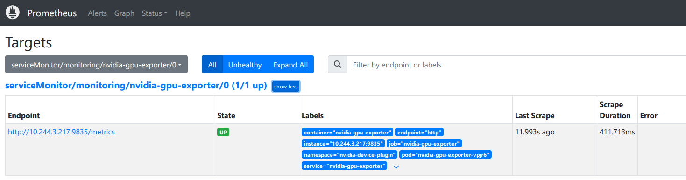

# 管理GPU节点

> 分类: Kubernetes > 日常维护
> 更新时间: 2026-01-10T23:33:29.833948+08:00

---

# GPU 节点配置
## 安装GPU驱动
开始之前，请确保您没有任何现有的 NVIDIA 驱动程序，可以使用以下命令卸载它们，并重新启动计算机。

```plain
apt-get autoremove cuda* nvidia* nouveau* --purge
```

也可以使用官方提供的卸载脚本卸载

```bash
/usr/bin/nvidia-uninstall
dpkg -r nvidia-fabricmanager
dpkg --purge nvidia-fabricmanager
dpkg -l | grep nvidia-fabricmanager
```

浏览官网[https://www.nvidia.com/en-us/drivers/unix/](https://www.nvidia.com/en-us/drivers/unix/)，下载合适版本的驱动。

```bash
wget https://in.download.nvidia.com/XFree86/Linux-x86_64/550.54.14/NVIDIA-Linux-x86_64-550.54.14.run
chmod +x NVIDIA-Linux-x86_64-550.54.14.run
./NVIDIA-Linux-x86_64-550.54.14.run -no-x-check -no-nouveau-check -no-opengl-files
```

重启并通过运行以下命令确保驱动程序正常工作:

```bash
# nvidia-smi 
Wed Oct 16 14:56:01 2024       
+-----------------------------------------------------------------------------------------+
| NVIDIA-SMI 550.54.14              Driver Version: 550.54.14      CUDA Version: 12.4     |
|-----------------------------------------+------------------------+----------------------+
| GPU  Name                 Persistence-M | Bus-Id          Disp.A | Volatile Uncorr. ECC |
| Fan  Temp   Perf          Pwr:Usage/Cap |           Memory-Usage | GPU-Util  Compute M. |
|                                         |                        |               MIG M. |
|=========================================+========================+======================|
|   0  NVIDIA A100-SXM4-80GB          On  |   00000000:3F:00.0 Off |                    0 |
| N/A   32C    P0             54W /  400W |       0MiB /  81920MiB |      0%      Default |
|                                         |                        |             Disabled
```

## 安装nvidia-fabricmanager
专门用于管理多 GPU 系统中的 GPU 间通信优化，适合具有 NVLink 或 NVSwitch 互联的高性能计算集群，确保GPU间的连接和通信的稳定性。

浏览官网：[https://developer.download.nvidia.cn/compute/cuda/repos/](https://developer.download.nvidia.cn/compute/cuda/repos/)，下载合适版本的软件包。   

```bash
wget https://developer.download.nvidia.cn/compute/cuda/repos/ubuntu2004/x86_64/nvidia-fabricmanager-550_550.54.14-1_amd64.deb
apt --fix-broken install -y
apt purge nvidia-fabricmanager-515 -y 
apt-get install ./nvidia-fabricmanager-550_550.54.14-1_amd64.deb
systemctl enable nvidia-fabricmanager
systemctl restart nvidia-fabricmanager
systemctl status nvidia-fabricmanager
```

## 安装容器工具包
容器环境使用 GPU 需要配置 NVIDIA runtime，具体可参考文档：[https://docs.nvidia.com/datacenter/cloud-native/container-toolkit/latest/install-guide.html](https://docs.nvidia.com/datacenter/cloud-native/container-toolkit/latest/install-guide.html)

我们首先配置容器工具包软件仓库

```bash
curl -fsSL https://nvidia.github.io/libnvidia-container/gpgkey | sudo gpg --dearmor -o /usr/share/keyrings/nvidia-container-toolkit-keyring.gpg \
  && curl -s -L https://nvidia.github.io/libnvidia-container/stable/deb/nvidia-container-toolkit.list | \
    sed 's#deb https://#deb [signed-by=/usr/share/keyrings/nvidia-container-toolkit-keyring.gpg] https://#g' | \
    sudo tee /etc/apt/sources.list.d/nvidia-container-toolkit.list
```

安装`nvidia-container-toolkit`

```bash
apt-get update
apt-get install nvidia-container-toolkit -y
```

## 配置 containerd 运行时环境
备份现有的`containerd`配置，以防接下来的步骤出错

```bash
sudo cp /etc/containerd/config.toml /etc/containerd/config.toml.bak
```

然后，我们可以根据k8s-device-plugin 自述文件手动配置`containerd`，或者运行

```bash
sudo nvidia-ctk runtime configure --runtime=containerd
```

来将`nvidia-container-runtime`设置为`containerd`的默认底层运行时环境。

# k8s配置
要想让 kubelet 能够感知到节点上的 GPU 设备，以便进行 GPU 资源调度和管理，需要安装 k8s-device-plugin，具体可参考文档：[https://github.com/NVIDIA/k8s-device-plugin](https://github.com/NVIDIA/k8s-device-plugin)

## 安装NVIDIA 设备插件
GPU 节点添加标签

```bash
kubectl label nodes ${node} nvidia.com/gpu.present=true
```

安装工作的 CUDA 驱动程序、设置 NVIDIA 容器工具包和将 containerd 配置为使用 NVIDIA 运行时环境，我们现在可以使用其 Helm chart 来应用 NVIDIA 设备插件。

```bash
helm repo add nvdp https://nvidia.github.io/k8s-device-plugin
helm repo update
helm search repo nvdp --devel
helm upgrade -i nvdp nvdp/nvidia-device-plugin \
  --namespace nvidia-device-plugin \
  --create-namespace \
  --version 0.17.1
```

查看是否已经识别 gpu 资源

```bash
# kubectl describe node | grep nvidia.com/gpu                   
                    nvidia.com/gpu.present=true
                    management.cattle.io/pod-limits: {"cpu":"22890m","ephemeral-storage":"8Gi","memory":"75780Mi","nvidia.com/gpu":"1"}
                    management.cattle.io/pod-requests: {"cpu":"11842m","ephemeral-storage":"200Mi","memory":"39990Mi","nvidia.com/gpu":"1","pods":"24"}
  nvidia.com/gpu:     8
  nvidia.com/gpu:     8
  nvidia.com/gpu     0             0
```

## 测试验证
通过启动一个请求 GPU 资源的 pod 来使用 GPU。

```yaml
apiVersion: v1
kind: Pod
metadata:
  name: gpu-pod
spec:
  restartPolicy: Never
  containers:
    - name: cuda-container
      image: nvcr.io/nvidia/k8s/cuda-sample:vectoradd-cuda12.5.0
      resources:
        limits:
          nvidia.com/gpu: "1" # 需要一张1GPU显卡资源
  tolerations:
  - key: nvidia.com/gpu
    operator: Exists
    effect: NoSchedule
kubectl apply -f cuda-vectoradd.yaml
```

如果一切顺利，工作负载的日志应该显示:

```plain
kubectl logs -n cuda-test cuda-vectoradd
[Vector addition of 50000 elements]
... Test PASSED
```

查看请求 GPU 资源的 pod 内部，我们也会发现两个与 NVIDIA 相关的环境变量:

```bash
kubectl exec -it <pod> -- env | grep NVIDIA
NVIDIA_DRIVER_CAPABILITIES=compute，video，utility
NVIDIA_VISIBLE_DEVICES=GPU-<UUID>
```

这表明我们在 pod 中有可用的 GPU 加速计算和视频编码/解码。

# GPU 共享访问
NVIDIA 设备插件的默认行为是将整个 GPU 分配给单个 pod，这意味着如果有多个 pod 请求 GPU 时间，每次只会调度一个 pod。NVIDIA 设备插件通过其配置文件中一组扩展选项允许 GPU 的超额分配。有两种可用的共享方式：时间切片和 MPS，具体可参考文档：[https://github.com/NVIDIA/k8s-device-plugin?tab=readme-ov-file#shared-access-to-gpus](https://github.com/NVIDIA/k8s-device-plugin?tab=readme-ov-file#shared-access-to-gpus)。

注意：CUDA 时间切片和 MPS 的使用是互斥的。

+ 在时间切片的情况下，CUDA 时间切片用于允许共享 GPU 的工作负载相互交错。然而，并未采取特殊措施来隔离从同一底层 GPU 获得副本的工作负载，每个工作负载都可以访问 GPU 内存，并在与其他所有工作负载相同的故障域中运行（这意味着如果一个工作负载崩溃，它们全部都会崩溃）。
+ 在 MPS 的情况下，使用控制守护程序来管理对共享 GPU 的访问。与时间切片相反，MPS 进行空间分区，并允许内存和计算资源被显式地分区，并对每个工作负载强制执行这些限制。

## 使用 CUDA  timeslice
首先创建一个`ConfigMap`，配置最大 10 个副本来配置时间切片。也就是说将一个 GPU 显卡拆分成了 10 个资源，假设一台服务器原本是 8 张 GPU 显卡，则现在可以使用的资源为 80 个。

```yaml
# cm-time-slicing.yaml
apiVersion: v1
kind: ConfigMap
metadata:
  name: cm-time-slicing
  namespace: nvidia-device-plugin
data:
  time-slicing: |-
    version: v1
    sharing:
      timeSlicing:
        resources:
          - name: nvidia.com/gpu
            replicas: 10
```

然后应用`ConfigMap`，并更新`nvidia-device-plugin`使用它。

```bash
kubectl apply -f cm-time-slicing.yaml

helm upgrade nvdp nvdp/nvidia-device-plugin \
  --reuse-values \
  --set config.name=cm-time-slicing \
  --set config.default=time-slicing
```

通过运行下面的命令看到每个节点每个 GPU 有 10 个`nvidia.com/gpu`的容量：

```bash
kubectl get node -o 'jsonpath={.items[*].status.capacity}' | jq
{
  ...
  "nvidia.com/gpu": "10",
  ...
}
```

请注意，工作负载从同一 GPU 获取副本，每个工作负载都可以访问相同的 GPU 内存，并在同一故障域中运行，这意味着如果一个工作负载崩溃，它们都会崩溃。

有关配置设备插件的更多详细信息，请参阅[GitHub 上的自述文件](https://link.zhihu.com/?target=https%3A//github.com/NVIDIA/k8s-device-plugin%3Ftab%3Dreadme-ov-file%23configuring-the-device-plugins-helm-chart)。

## 使用 CUDA MPS
> 目前在启用了 MIG 的设备上不支持使用 MPS 进行共享
>

1. 创建配置文件

```yaml
cat << EOF > mps-config.yaml
version: v1
sharing:
  mps:
    resources:
    - name: nvidia.com/gpu
      replicas: 10
EOF
```

如果将此配置应用于具有 8 个 GPU 的节点，则该插件现在将向`nvidia.com/gpu`Kubernetes 通告 80 个资源，而不是 8 个。每块卡会按照 10 分之一的资源来作为 `nvidia.com/gpu: 1` 受用。

2. 添加节点标签

```yaml
kubectl label nodes ${node} nvidia.com/mps.capable=true
```

3. 更新 NVIDIA-K8s-Device-Plugin插件

```bash
helm upgrade nvidia-device-plugin nvdp/nvidia-device-plugin \
  --namespace nvidia-device-plugin \
  --create-namespace \
  --set-file config.map.config=mps-config.yaml
```

4. 验证

```bash
kubectl describe node miaohua-a-w-69 | grep nvidia.com/gpu
                    nvidia.com/gpu.present=true
                    management.cattle.io/pod-limits: {"cpu":"35270m","memory":"341212Mi","nvidia.com/gpu":"0"}
                    management.cattle.io/pod-requests: {"cpu":"35212m","memory":"341242Mi","nvidia.com/gpu":"0","pods":"15"}
  nvidia.com/gpu:     80
  nvidia.com/gpu:     80
  nvidia.com/gpu     0               0
```

# CUDA MIG
## 功能介绍
多实例GPU（MIG）功能允许将NVIDIA A卡或者H卡安全地划分为多个独立的GPU实例，供CUDA应用程序使用。例如，NVIDIA A100支持最多七个独立的GPU实例。

MIG为多个用户提供了独立的GPU资源，以实现最佳的GPU利用率。该功能对于未能充分利用GPU计算能力的工作负载特别有益，因此用户可能希望并行运行不同的工作负载，以最大化资源的利用。

## 技术对比
| 特性 | Time-Slicing | MPS | MIG |
| --- | --- | --- | --- |
| 资源分配方式 | 按时间动态分配 | 动态共享 | 静态划分 |
| 资源隔离 | 无资源隔离 | 无资源隔离 | 硬件级资源隔离 |
| 性能开销 | 上下文切换开销 | 较小（减少上下文切换） | 无上下文切换开销 |
| 硬件支持 | 所有 CUDA GPU | 所有 CUDA GPU | 仅支持 MIG 的 GPU |
| 适用任务 | 非关键任务 | 高性能计算、多进程任务 | 多租户环境、实时推理任务 |
| 配置复杂度 | 无需配置，默认启用 | 需要配置 MPS 服务 | 需要显式创建 MIG 实例 |


## 部署MIG
### 启用 MIG 模式 
 在宿主机上运行以下命令来启用 MIG 模式，如果启用失败多半是因为资源占用，可以停止相关 gpu 资源然后执行 `nvidia-smi -r`或者重启服务器。

```bash
# nvidia-smi -mig 1
Enabled MIG Mode for GPU 00000000:3F:00.0
Enabled MIG Mode for GPU 00000000:44:00.0
Enabled MIG Mode for GPU 00000000:62:00.0
Enabled MIG Mode for GPU 00000000:68:00.0
Enabled MIG Mode for GPU 00000000:A9:00.0
Enabled MIG Mode for GPU 00000000:AD:00.0
Enabled MIG Mode for GPU 00000000:D2:00.0
Enabled MIG Mode for GPU 00000000:D5:00.0
All done.
```

除了将所有显卡都启用 mig 模式外，也可以指定显卡启用 mig，例如只开启 GPU 0 的 mig。

```bash
# nvidia-smi -i 0 -mig 1
```

### 创建GI实例
启用 MIG 模式后，你需要为每个 GPU 创建 **MIG 实例**，<font style="color:rgb(25, 27, 31);">创建GI实例，即我们所需要的子GPU，首先我们产看一下可以创建些什么样的子GPU</font>

**查看 0 号 GPU 显卡支持的 MIG 规格**

```bash
# nvidia-smi mig -i 0 -lgip
+-----------------------------------------------------------------------------+
| GPU instance profiles:                                                      |
| GPU   Name             ID    Instances   Memory     P2P    SM    DEC   ENC  |
|                              Free/Total   GiB              CE    JPEG  OFA  |
|=============================================================================|
|   0  MIG 1g.10gb       19     0/7        9.50       No     14     0     0   |
|                                                             1     0     0   |
+-----------------------------------------------------------------------------+
|   0  MIG 1g.10gb+me    20     0/1        9.50       No     14     1     0   |
|                                                             1     1     1   |
+-----------------------------------------------------------------------------+
|   0  MIG 1g.20gb       15     0/4        19.50      No     14     1     0   |
|                                                             1     0     0   |
+-----------------------------------------------------------------------------+
|   0  MIG 2g.20gb       14     0/3        19.50      No     28     1     0   |
|                                                             2     0     0   |
+-----------------------------------------------------------------------------+
|   0  MIG 3g.40gb        9     0/2        39.25      No     42     2     0   |
|                                                             3     0     0   |
+-----------------------------------------------------------------------------+
|   0  MIG 4g.40gb        5     0/1        39.25      No     56     2     0   |
|                                                             4     0     0   |
+-----------------------------------------------------------------------------+
|   0  MIG 7g.80gb        0     0/1        78.75      No     98     5     0   |
|                                                             7     1     1   |
+-----------------------------------------------------------------------------+
```

**创建 GI 实例**

可以看到 0 号显卡最多支持 7g.80gb 资源，我们可以对资源进行拆分，只要总和不超过这个最大值既可。

例如在第 0 块显卡创建 GPU 的计算核心数量为 3g，显存 40gb 的资源和一个计算核心 4g，显存为 40gb 的资源。

```bash
# nvidia-smi mig -cgi 3g.40gb,4g.40gb -i 0
Successfully created GPU instance ID  1 on GPU  0 using profile MIG 3g.40gb (ID  9)
Successfully created GPU instance ID  2 on GPU  0 using profile MIG 4g.40gb (ID  5)
```

**验证实例创建情况：**

```bash
# nvidia-smi mig -lgi
+-------------------------------------------------------+
| GPU instances:                                        |
| GPU   Name             Profile  Instance   Placement  |
|                          ID       ID       Start:Size |
|=======================================================|
|   0  MIG 3g.40gb          9        1          4:4     |
+-------------------------------------------------------+
|   0  MIG 4g.40gb          5        2          0:4     |
+-------------------------------------------------------+
```

如需清除创建的 mig 实例

```bash
# nvidia-smi mig -dgi -i 0  # 删除GPU0上的所有 GPU 实例
```

### <font style="color:rgb(25, 27, 31);">创建CI实例</font>
<font style="color:rgb(25, 27, 31);">上述操作只创建了GI，这些GI并不能直接使用，</font>

<font style="color:rgb(25, 27, 31);">查看物理卡的状态</font>

```bash
# nvidia-smi -i 0
Tue Jan  7 13:31:24 2025       
+-----------------------------------------------------------------------------------------+
| NVIDIA-SMI 550.54.14              Driver Version: 550.54.14      CUDA Version: 12.4     |
|-----------------------------------------+------------------------+----------------------+
| GPU  Name                 Persistence-M | Bus-Id          Disp.A | Volatile Uncorr. ECC |
| Fan  Temp   Perf          Pwr:Usage/Cap |           Memory-Usage | GPU-Util  Compute M. |
|                                         |                        |               MIG M. |
|=========================================+========================+======================|
|   0  NVIDIA A100-SXM4-80GB          On  |   00000000:3F:00.0 Off |                   On |
| N/A   28C    P0             53W /  400W |      87MiB /  81920MiB |     N/A      Default |
|                                         |                        |              Enabled |
+-----------------------------------------+------------------------+----------------------+

+-----------------------------------------------------------------------------------------+
| MIG devices:                                                                            |
+------------------+----------------------------------+-----------+-----------------------+
| GPU  GI  CI  MIG |                     Memory-Usage |        Vol|      Shared           |
|      ID  ID  Dev |                       BAR1-Usage | SM     Unc| CE ENC DEC OFA JPG    |
|                  |                                  |        ECC|                       |
|==================+==================================+===========+=======================|
|  No MIG devices found                                                                   |
+-----------------------------------------------------------------------------------------+
                                                                                         
+-----------------------------------------------------------------------------------------+
| Processes:                                                                              |
|  GPU   GI   CI        PID   Type   Process name                              GPU Memory |
|        ID   ID                                                               Usage      |
|=========================================================================================|
|  No running processes found                                                             |
+-----------------------------------------------------------------------------------------+
```

<font style="color:rgb(25, 27, 31);">显示No MIG devices found，因为它没有创建对应的计算实例CI，因此还需要创建 CI。</font>

<font style="color:rgb(25, 27, 31);">查看CI的profile 信息</font>

```bash
# nvidia-smi mig -i 0 -lcip
+--------------------------------------------------------------------------------------+
| Compute instance profiles:                                                           |
| GPU     GPU       Name             Profile  Instances   Exclusive       Shared       |
|       Instance                       ID     Free/Total     SM       DEC   ENC   OFA  |
|         ID                                                          CE    JPEG       |
|======================================================================================|
|   0      1       MIG 1c.3g.40gb       0      3/3           14        2     0     0   |
|                                                                      3     0         |
+--------------------------------------------------------------------------------------+
|   0      1       MIG 2c.3g.40gb       1      1/1           28        2     0     0   |
|                                                                      3     0         |
+--------------------------------------------------------------------------------------+
|   0      1       MIG 3g.40gb          2*     1/1           42        2     0     0   |
|                                                                      3     0         |
+--------------------------------------------------------------------------------------+
|   0      2       MIG 1c.4g.40gb       0      4/4           14        2     0     0   |
|                                                                      4     0         |
+--------------------------------------------------------------------------------------+
|   0      2       MIG 2c.4g.40gb       1      2/2           28        2     0     0   |
|                                                                      4     0         |
+--------------------------------------------------------------------------------------+
|   0      2       MIG 4g.40gb          3*     1/1           56        2     0     0   |
|                                                                      4     0         |
+--------------------------------------------------------------------------------------+
```

在 GPU 0 的 GPU Instance 1 和 2 上分别创建 Compute Instances（CI），指定了两个 CI Profiles：`0` 和 `1`。  也就是1c.3g.40gb 和2c.3g.40gb 

```bash
# nvidia-smi mig -i 0 -cci 0,1 -gi 1
Successfully created compute instance ID  0 on GPU  0 GPU instance ID  1 using profile MIG 1c.3g.40gb (ID  0)
Successfully created compute instance ID  1 on GPU  0 GPU instance ID  1 using profile MIG 2c.3g.40gb (ID  1)
# nvidia-smi mig -i 0 -cci 0,1 -gi 2
Successfully created compute instance ID  0 on GPU  0 GPU instance ID  2 using profile MIG 1c.4g.40gb (ID  0)
Successfully created compute instance ID  1 on GPU  0 GPU instance ID  2 using profile MIG 2c.4g.40gb (ID  1)
```

查看创建的设备信息

```bash
# nvidia-smi -i 0
Tue Jan  7 13:45:24 2025       
+-----------------------------------------------------------------------------------------+
| NVIDIA-SMI 550.54.14              Driver Version: 550.54.14      CUDA Version: 12.4     |
|-----------------------------------------+------------------------+----------------------+
| GPU  Name                 Persistence-M | Bus-Id          Disp.A | Volatile Uncorr. ECC |
| Fan  Temp   Perf          Pwr:Usage/Cap |           Memory-Usage | GPU-Util  Compute M. |
|                                         |                        |               MIG M. |
|=========================================+========================+======================|
|   0  NVIDIA A100-SXM4-80GB          On  |   00000000:3F:00.0 Off |                   On |
| N/A   28C    P0             53W /  400W |      87MiB /  81920MiB |     N/A      Default |
|                                         |                        |              Enabled |
+-----------------------------------------+------------------------+----------------------+

+-----------------------------------------------------------------------------------------+
| MIG devices:                                                                            |
+------------------+----------------------------------+-----------+-----------------------+
| GPU  GI  CI  MIG |                     Memory-Usage |        Vol|      Shared           |
|      ID  ID  Dev |                       BAR1-Usage | SM     Unc| CE ENC DEC OFA JPG    |
|                  |                                  |        ECC|                       |
|==================+==================================+===========+=======================|
|  0    1   0   0  |              37MiB / 40192MiB    | 14      0 |  3   0    2    0    0 |
|                  |                 0MiB / 65535MiB  |           |                       |
+------------------+                                  +-----------+-----------------------+
|  0    1   1   1  |                                  | 28      0 |  3   0    2    0    0 |
|                  |                                  |           |                       |
+------------------+----------------------------------+-----------+-----------------------+
|  0    2   0   2  |              49MiB / 40192MiB    | 14      0 |  4   0    2    0    0 |
|                  |                 0MiB / 65535MiB  |           |                       |
+------------------+                                  +-----------+-----------------------+
|  0    2   1   3  |                                  | 28      0 |  4   0    2    0    0 |
|                  |                                  |           |                       |
+------------------+----------------------------------+-----------+-----------------------+
                                                                                         
+-----------------------------------------------------------------------------------------+
| Processes:                                                                              |
|  GPU   GI   CI        PID   Type   Process name                              GPU Memory |
|        ID   ID                                                               Usage      |
|=========================================================================================|
|  No running processes found                                                             |
+-----------------------------------------------------------------------------------------+
```

查看资源规格列表

```bash
# nvidia-smi -L
GPU 0: NVIDIA A100-SXM4-80GB (UUID: GPU-59227d3b-92c1-9394-2694-e5d2d09d7ca6)
  MIG 1c.3g.40gb  Device  0: (UUID: MIG-ea8d189c-bcdb-519a-a97e-8a2e7848bc1c)
  MIG 2c.3g.40gb  Device  1: (UUID: MIG-28722365-8992-5bc1-bc81-c8bd010e507c)
  MIG 1c.4g.40gb  Device  2: (UUID: MIG-54f0f6f3-0c7c-5087-b810-9770732e8591)
  MIG 2c.4g.40gb  Device  3: (UUID: MIG-b8753643-33b5-589f-bc5f-da5995b5674c)
```

如需清除创建的 ci 实例

```bash
# nvidia-smi mig -dci -i 0  # 删除GPU0上的所有CI实例
```

### 同时创建 CI+GI 实例
<font style="color:rgb(25, 27, 31);">如果要直接创建一个子GPU 并且将其可用的运算单元都挂载上，在创建GI的时候添加-C参数即可完成。</font>

```bash
# nvidia-smi mig -i 1 -cgi 2g.20gb,2g.20gb,1g.10gb -C
Successfully created GPU instance ID  3 on GPU  1 using profile MIG 2g.20gb (ID 14)
Successfully created compute instance ID  0 on GPU  1 GPU instance ID  3 using profile MIG 2g.20gb (ID  1)
Successfully created GPU instance ID  5 on GPU  1 using profile MIG 2g.20gb (ID 14)
Successfully created compute instance ID  0 on GPU  1 GPU instance ID  5 using profile MIG 2g.20gb (ID  1)
Successfully created GPU instance ID  9 on GPU  1 using profile MIG 1g.10gb (ID 19)
Successfully created compute instance ID  0 on GPU  1 GPU instance ID  9 using profile MIG 1g.10gb (ID  0)
```

查看资源规格列表

```bash
# nvidia-smi -L                                                                                                                                                                            
GPU 0: NVIDIA A100-SXM4-80GB (UUID: GPU-59227d3b-92c1-9394-2694-e5d2d09d7ca6)                                                                                                                                   
  MIG 1c.3g.40gb  Device  0: (UUID: MIG-ea8d189c-bcdb-519a-a97e-8a2e7848bc1c)                                                                                                                                   
  MIG 2c.3g.40gb  Device  1: (UUID: MIG-28722365-8992-5bc1-bc81-c8bd010e507c)                                                                                                                                   
  MIG 1c.4g.40gb  Device  2: (UUID: MIG-54f0f6f3-0c7c-5087-b810-9770732e8591)                                                                                                                                   
  MIG 2c.4g.40gb  Device  3: (UUID: MIG-b8753643-33b5-589f-bc5f-da5995b5674c)                                                                                                                                   
GPU 1: NVIDIA A100-SXM4-80GB (UUID: GPU-13d510f6-4f49-f720-697a-91908f12e2d6)                                                                                                                                   
  MIG 2g.20gb     Device  0: (UUID: MIG-593bb78a-c62d-51f5-970b-5056771ec6fb)                                                                                                                                   
  MIG 2g.20gb     Device  1: (UUID: MIG-658e3359-4288-54e8-bb01-98ae7c9448ea)                                                                                                                                   
  MIG 1g.10gb     Device  2: (UUID: MIG-6b765df0-e1a2-54ab-9525-224e8d14ce0a)
```

### 更新 nvidia-device-plugin 配置
migStrategy策略分为以下几种：

none策略禁用 MIG

single策略 每个 GPU 只能创建一个 MIG 实例。

mixed策略 允许创建多个不同的 MIG 实例。

```bash
# helm upgrade nvdp -n nvidia-device-plugin . -f values.yaml --set migStrategy=mixed
```

### 验证 Kubernetes识别 MIG 实例
执行以下命令，确认 Kubernetes 节点上已经注册了 GPU 资源，如果数据未更新，可重启nvidia-device-plugin 后再次查看。

```bash
# kubectl describe node gpu-1 | grep mig
  nvidia.com/mig-1g.10gb:  1
  nvidia.com/mig-2g.20gb:  2
  nvidia.com/mig-3g.40gb:  2
  nvidia.com/mig-4g.40gb:  2
  nvidia.com/mig-1g.10gb:  1
  nvidia.com/mig-2g.20gb:  2
  nvidia.com/mig-3g.40gb:  2
  nvidia.com/mig-4g.40gb:  2
```

## 配置 Pod 使用 MIG 实例
编写一个 Pod 配置文件来使用 MIG 资源：

```yaml
apiVersion: v1
kind: Pod
metadata:
  name: mig-demo-pod
spec:
  containers:
  - name: cuda-container
    image: nvidia/cuda:11.8.0-base
    resources:
      limits:
        nvidia.com/mig-3g.40gb: 1
    command: ["nvidia-smi"]
```

# DCGM exporter 部署
参考文档：[https://github.com/NVIDIA/dcgm-exporter](https://github.com/NVIDIA/dcgm-exporter)

## 安装 exporter
helm 部署 exporter

```bash
# helm repo add gpu-helm-charts https://nvidia.github.io/dcgm-exporter/helm-charts
# helm pull gpu-helm-charts/dcgm-exporter --untar
# cd dcgm-exporter/
# vim values.yaml
nodeSelector:  # 添加nvidia节点标签调度
  nvidia.com/gpu.present: "true"
kubernetes: # 包含pod标签和uuid
  enablePodLabels: true
  enablePodUID: true
# helm install dcgm-exporter -n nvidia-device-plugin . -f values.yaml 
NAME: dcgm-exporter
LAST DEPLOYED: Wed Aug 27 15:33:29 2025
NAMESPACE: nvidia-device-plugin
STATUS: deployed
REVISION: 1
TEST SUITE: None
NOTES:
1. Get the application URL by running these commands:
  export POD_NAME=$(kubectl get pods -n nvidia-device-plugin -l "app.kubernetes.io/name=dcgm-exporter,app.kubernetes.io/instance=dcgm-exporter" -o jsonpath="{.items[0].metadata.name}")
  kubectl -n nvidia-device-plugin port-forward $POD_NAME 8080:9400 &
  echo "Visit http://127.0.0.1:8080/metrics to use your application"
```

查看验证

```bash
# kubectl get pod -n nvidia-device-plugin
NAME                              READY   STATUS    RESTARTS   AGE
nvdp-nvidia-device-plugin-6mnv4   1/1     Running   0          20m
dcgm-exporter-8d2db               1/1     Running   0          2m53s
# kubectl get svc -n nvidia-device-plugin 
NAME            TYPE        CLUSTER-IP      EXTERNAL-IP   PORT(S)    AGE
dcgm-exporter   ClusterIP   10.107.116.236   <none>        9400/TCP   36s
```

## 创建ServiceMonitor
```yaml
apiVersion: monitoring.coreos.com/v1
kind: ServiceMonitor
metadata:
  name: dcgm-exporter
  namespace: monitoring
spec:
  jobLabel: dcgm-exporter
  endpoints:
  - interval: 30s
    port: metrics
    path: /metrics
    scheme: http
    relabelings: # 新增ip标签方便关联查询
    - action: replace
      regex: (.*)
      replacement: $1
      sourceLabels:
      - __meta_kubernetes_pod_host_ip
      targetLabel: ip
  selector: # svc标签选择器，匹配service的labels
    matchLabels:
      app.kubernetes.io/component: dcgm-exporter
      app.kubernetes.io/instance: dcgm-exporter
      app.kubernetes.io/name: dcgm-exporter
  namespaceSelector: # namespace选择
    matchNames:
    - nvidia-device-plugin
```

查看 prometheus targets



## 导入 dashboard
参考 dashboard：[https://grafana.com/grafana/dashboards/12239-nvidia-dcgm-exporter-dashboard/](https://grafana.com/grafana/dashboards/12239-nvidia-dcgm-exporter-dashboard/)


## 常用 promql
GPU 常用指标可参考文档：[https://help.aliyun.com/zh/ack/ack-managed-and-ack-dedicated/user-guide/introduction-to-metrics#section-ts3-5l7-lwm](https://help.aliyun.com/zh/ack/ack-managed-and-ack-dedicated/user-guide/introduction-to-metrics#section-ts3-5l7-lwm)

+ 总 GPU 数

```bash
count(DCGM_FI_DEV_DEC_UTIL)
```

+ 空闲 GPU 数

```bash
DCGM_FI_DEV_DEC_UTIL{exported_namespace=""}
```

+ 各 deployment 资源使用量

```bash
count(DCGM_FI_DEV_DEC_UTIL{})by(exported_namespace)
```

+ 各 deployment 资源使用率

```bash
avg by (exported_namespace, deployment) (
  label_replace(
    DCGM_FI_DEV_GPU_UTIL{},
    "deployment",
    "$1",
    "exported_pod",
    "^(.*)-[^-]+-[^-]+$"
  )
)
```

# 禁用GPU
如果单个 GPU 硬件出现故障，为了避免将资源调度到异常 GPU 运行，可以将故障 GPU 禁用。

```bash
1. 查询 GPU 的编号
# nvidia-smi
2. 将指定的 GPU（0000:D0:00.0）设置为排空状态，并在 1 秒内完成该操作。
# nvidia-smi drain -p 0000:D0:00.0 -m 1
3. 此命令将指定的 PCI 设备（0000:d0:00.0）从系统中移除。
echo "1" | sudo tee /sys/bus/pci/devices/0000:d0:00.0/remove
3. 启用指定的 PCI 设备（0000:d0:00.0）。重新启用设备并恢复其工作状态。
echo "0" | sudo tee /sys/bus/pci/devices/0000:d0:00.0/enable
4. 将指定的 PCI 设备（0000:d0:00.0）从 NVIDIA 驱动程序中解绑。
echo -n "0000:d0:00.0" | sudo tee /sys/bus/pci/drivers/nvidia/unbind
```

