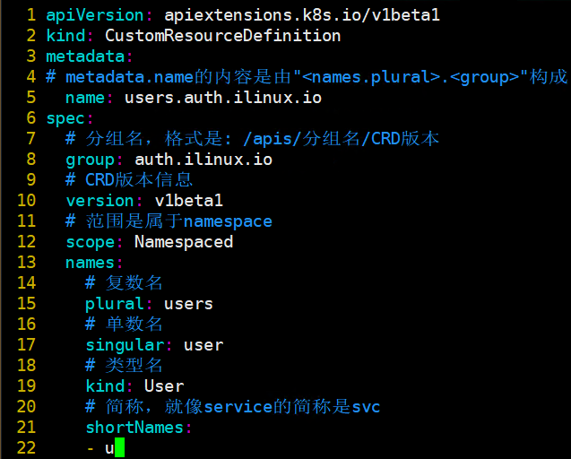
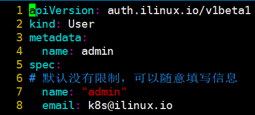
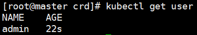
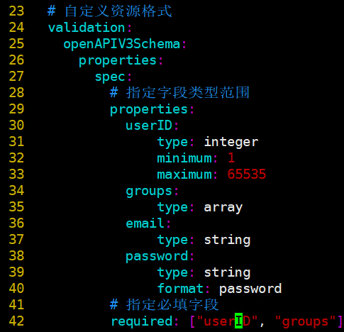
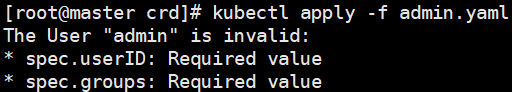

# 自定义资源类型（CRD）

> 分类: Kubernetes > 系统扩展
> 更新时间: 2026-01-10T23:33:26.178466+08:00

---

# 一、简介

1. 扩展Kubernetes  
API的常用方式有三种：使用CRD（CustomResourceDefinitions）自定义资源类型、开发自定义的API  
Server并聚合至主API Server，以及定制扩展Kubernetes源码。
2. CRD无须修改Kubernetes源代码就能扩展它支持使用API资源类型。CRD本身也是一种资源类型，隶属于集群级别，实例化出特定的对象之后，它会在API上注册生成GVR类型URL端点，并能够作为一种资源类型被使用并实例化相应的对象。自定义资源类型之前，选定其使用的API群组名称、版本及新建的资源类型名称，根据这些信息即可创建自定义资源类型，并创建自定义类型的资源对象。

# 二、创建CRD对象

1. 定义了一个名为users.auth.ilinux.io的CRD资源对象，它的群组名称为auth.ilinux.io，仅支持一个版本级别v1beta1，复数形式为users，隶属于名称空间级别。

2. 列出集群上的CRD对象

3. users已经是一个名称空间级别的可用资源类型，用户可按需创建出任意数量的users类型的对象。

4. 获取user类型资源信息

5. 删除自定义的students对象object-student  
`# kubectl delete users admin` 

# 三、自定义资源格式验证

1. 对象配置的变动在存入etcd之前还需要经由准入控制器的核验，尤其是验证型（validation）控制器使用OpenAPI模式声明验证规则，检查传入的对象格式是否符合有效格式。
2. 为CRD对象users.auth.ilinux.io，在spec字段定义了userID、groups、email和password字段的数据类型，并指定了userID字段的取值范围，以及password字段的数据格式，而且指定userID和groups是必选字段

3. 使用原admin资源清单时报错

