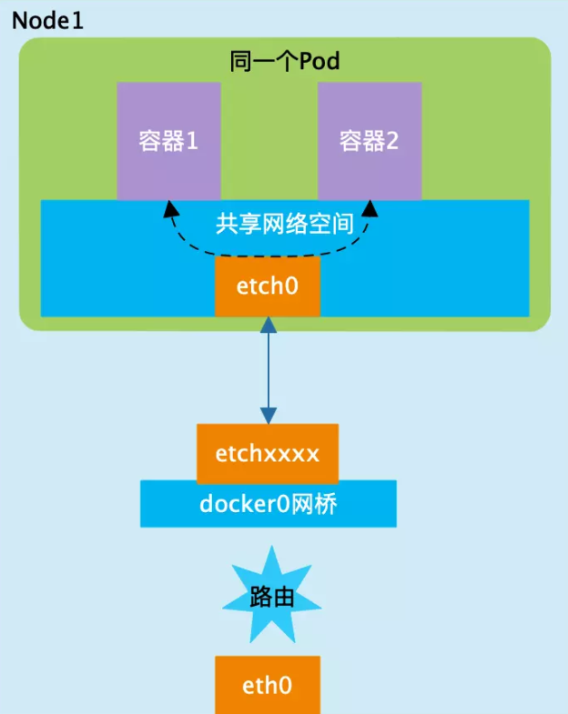
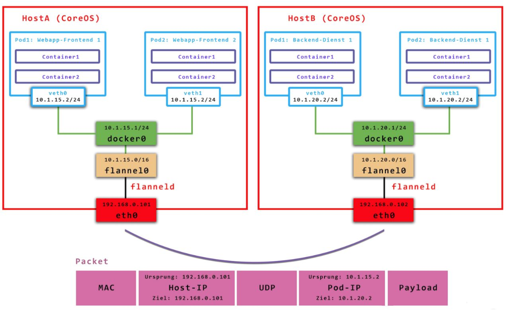
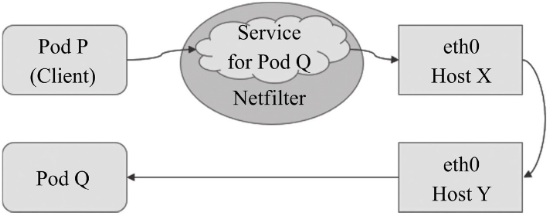

# 网络类型
# 一、Pod内容器之间的通信：localhost

1. 在 Kubernetes 的世界里，IP 是以 Pod 为单位进行分配的。一个 Pod内部的所有容器共享一个网络堆栈（实际上就是一个网络命名空间，包括它们的 IP  
地址、网络设备、配置等都是共享的）。
2. 在同一个pod内由pause镜像启动的容器。所有运行于同一个Pod内的容器与同一主机上的多个进程类似，彼此之间可通过lo接口完成交互。

# 二、同一node上的Pod之间的通信：overlay network

1. 同一个Node内的不同Pod之间可以直接采用对方Pod的IP地址通信，而且不需要使用其他发现机制，例如DNS、Consul或者etcd。
2. Pod1和Pod2都是通信veth  
pair连接到同一个docker0网桥上，它们的IP地址IP1、IP2都是从docker0网段上动态获取的，它们和网桥本身的IP3是同一个网段的。由于Pod1和Pod2处于同一局域网内，它们之间可以通过docker0作为路由量进行通信。

# 三、不同node上的Pod之间的通信：iptables规则

1. 在Kubernetes的网络世界中，Pod之间假设是通过访问对方的Pod IP进行通信的，而不同Node之间的通信只能通过Node的物理网卡进行，Pod的IP地址是由各Node上的docker0网桥动态分配的。我们想要实现跨Node的Pod之间的通信，至少需要满足下面三个条件：
+ 知道Pod IP 和Node IP之间的映射关系，通过Node IP转发到Pod IP；
+ 在整个Kubernetes集群中对Pod的IP分配不能出现冲突；
+ 从Pod中发出的数据包不应该进行NAT地址转换。
2. Kubernetes会记录所有正在运行的Pod的IP分配信息，并将这些信息保存到etcd中（作为Service的Endpoint），这样我们就可以知道Pod  
IP和Node IP之间的映射关系。
3. 以Flannel为例，Flannel实现的容器的跨主机通信通过如下过程实现：
+ 每个主机上安装并运行etcd和flannel；
+ 在etcd中规划配置所有主机的docker0子网范围；
+ 每个主机上的flanneld根据etcd中的配置，为本主机的docker0分配子网，保证所有主机上的docker0网段不重复，并将结果（即本主机上的docker0子网信息和本主机IP的对应关系）存入etcd库中，这样etcd库中就保存了所有主机上的docker子网信息和本主机IP的对应关系；
+ 当需要与其他主机上的容器进行通信时，查找etcd数据库，找到目的容器的子网所对应的outip（目的宿主机的IP）；
+ 将原始数据包封装在VXLAN或UDP数据包中，IP层以outip为目的IP进行封装；
+ 由于目的IP是宿主机IP，因此路由是可达的；
+ VXLAN或UDP数据包到达目的宿主机解封装，解出原始数据包，最终到达目的容器。

# 四、Service与Pod间的通信：iptables规则

1. 集群网络需要在启动kube-apiserver时经由“--service-cluster-ip-range”选项进行指定，如10.96.0.0/12，而每个Service对象在此网络中均拥一个称为Cluster-IP的固定地址。
2. 管理员或用户对Service对象的创建或更改操作由API Server存储完成后触发各节点上的kube-proxy，并根据代理模式的不同将其定义为相应节点上的iptables规则或ipvs规则，借此完成从Service的Cluster-IP与Pod-IP之间的报文转发

# 五、集群外部到Pod对象之间的通信

1. 将集群外部的流量引入到Pod对象的方式有受限于Pod所在的工作节点范围的节点端口（nodePort）和主机网络（hostNetwork）两种，以及工作于集群级别的NodePort或LoadBalancer类型的Service对象。
2. 即便是四层代理的模式也要经由两级转发才能到达目标Pod资源：请求流量首先到达外部负载均衡器，由其调度至某个工作节点之上，而后再由工作节点的netfilter（kube-proxy）组件上的规则（iptables或ipvs）调度至某个目标Pod对象。

