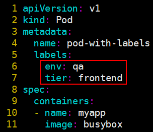
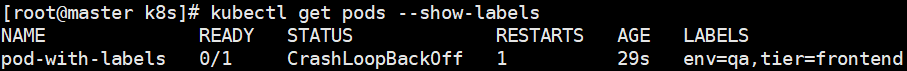
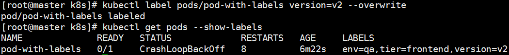

# 标签与标签选择器

> 分类: Kubernetes > 资源对象
> 更新时间: 2026-01-10T23:33:19.936368+08:00

---

# 一、标签概述


1. 标签就是“键值”类型的数据，它们可于资源创建时直接指定，也可随时按需添加于活动对象中，而后即可由标签选择器进行匹配度检查从而完成资源挑选。一个对象可拥有不止一个标签，而同一个标签也可被添加至多个资源之上。
2. 为资源附加多个不同纬度的标签以实现灵活的资源分组管理功能，例如，版本标签、环境标签、分层架构标签等，用于交叉标识同一个资源所属的不同版本、环境及架构层级等


# 二、管理标签资源


1. 创建资源时，可直接在其metadata中嵌套使用“labels”字段以定义要附加的标签项。



2. 在“kubectl get pods”命令中使用“--show-labels”选项，以额外显示对象的标签信息：  
$ kubectl get pods --show-labels



3. 按需进行添加标签操作。  
$ kubectl label pods/pod-with-labels version=v1


4. 对于已经附带了指定键名的标签，使用“--overwrite”命令以强制覆盖原有的键值  
$ kubectl label pods/pod-with-labels version=v2 --overwrite



5. 删除指定键名的标签，使用“标签名-”，即可删除


# 三、标签选择器


1. Kubernetes API目前支持两个选择器：基于等值关系（equality-based）以及基于集合关系（set-based）。
2. 基于等值关系的标签选择器的可用操作符有“=”“==”和“!=”三种，其中前两个意义相同，都表示“等值”关系，最后一个表示“不等”关系
3. “kubectl get”命令的“-l”选项能够指定使用标签选择器，例如，显示键名env的值不为qa的所有Pod对象：  
$ kubectl get pods -l "env! =qa" -L env
4. 基于集合关系的标签选择器，它们的使用格式及意义具体如下。
+ KEY in (VALUE1, VALUE2, …)：指定的键名的值存在于给定的列表中即满足条件。
+ KEY notin (VALUE1, VALUE2, …)：指定的键名的值不存在于给定的列表中即满足条件。
+ KEY：所有存在此键名标签的资源。
+ ! KEY：所有不存在此键名标签的资源。  
例如，显示标签键名env的值为production或dev的所有Pod对象：  
`$ kubectl get pods -l "env in (production, dev)" -L env` 
5. Kubernetes的诸多资源对象必须以标签选择器的方式关联到Pod资源对象，例如Service、Deployment和ReplicaSet类型的资源等，它们在spec字段中嵌套使用嵌套的“selector”字段，通过“matchLabels”来指定标签选择器，有的甚至还支持使用“matchExpressions”构造复杂的标签选择机制。
+ matchLabels：通过直接给定键值对来指定标签选择器。
+ matchExpressions：基于表达式指定的标签选择器列表，每个选择器都形如“{key:KEY_NAME,operator: OPERATOR, values: [VALUE1, VALUE2,…]}”，选择器列表间为“逻辑与”关系；使用In或NotIn操作符时，其values不强制要求为非空的字符串列表，而使用Exists或DostNotExist时，其values必须为空。


# 四、Pod节点选择器nodeSelector


1. Pod节点选择器是标签及标签选择器的一种应用，它能够让Pod对象基于集群中工作节点的标签来挑选倾向运行的目标节点。
2. Pod对象的spec.nodeSelector可用于定义节点标签选择器，用户事先为特定部分的Node资源对象设定好标签，而后配置Pod对象通过节点标签选择器进行匹配检测，从而完成节点亲和性调度。
3. 为Node资源对象附加标签的方法同Pod资源，使用“kubectl label nodes/NODE”命令即可。
+ 例如，可为node2节点设置“disktype=ssd”标签以标识其拥有SSD设备：  
$ kubectl label nodes node2 disktype=ssd
+ 查看具有键名SSD的标签的Node资源：  
$ kubectl get nodes -l 'disktype' -L disktype


4. 如果某Pod资源需要调度至这些具有SSD设备的节点之上，那么只需要为其使用spec.nodeSelector标签选择器即可，例如下面的资源清单文件pod-with-nodeselector.yaml示例：

```yaml
apiVersion: v1
kind: Pod
metadata:
	name: pod-with-nodeselector
	labels:
		env: testing
spec:
	containers:
	- name: myapp
		image: busybox
	nodeSelector:
		disktype: ssd
```


