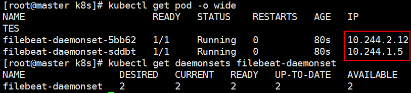
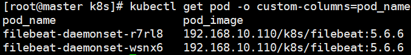

# DaemonSet控制器

> 分类: Kubernetes > 资源控制器
> 更新时间: 2026-01-10T23:33:20.823986+08:00

---

# 一、简介

1. 用于在集群中的全部节点上同时运行一份指定的Pod资源副本，后续新加入集群的工作节点也会自动创建一个相关的Pod对象，当从集群移除节点时，此类Pod对象也将被自动回收而无须重建。管理员也可以使用节点选择器及节点标签指定仅在部分具有特定特征的节点上运行指定的Pod对象。
2. DaemonSet是一种特殊的控制器，它有特定的应用场景，通常运行那些执行系统级操作任务的应用，其应用场景具体如下。
+ 运行集群存储的守护进程，如在各个节点上运行glusterd或ceph。
+ 在各个节点上运行日志收集守护进程，如fluentd和logstash。
+ 在各个节点上运行监控系统的代理守护进程，如Prometheus Node Exporter、collectd、Datadog agent、New Relic agent或Ganglia gmond等。

# 二、创建DaemonSet资源对象

1. 下面的资源清单，定义一个DaemonSet资源：

+ DaemonSet必须使用selector来匹配Pod模板中指定的标签，而且它也支持matchLabels和matchExpressions两种标签选择器。
1. 创建资源对象  
`$ kubectl apply -f filebeat-ds.yaml` 
2. 查看资源信息

# 三、更新DaemonSet对象

> DaemonSet支持更新机制，相关配置定义在spec.update-Strategy嵌套字段中。目前，它支持RollingUpdate（滚动更新）和OnDelete（删除时更新）两种更新策略，滚动更新为默认的更新策略，工作逻辑类似于Deployment控制，不过仅支持使用maxUnavailabe属性定义最大不可用Pod资源副本数（默认值为1），而删除时更新的方式则是在删除相应节点的Pod资源后重建并更新为新版本。
>

1. 将此前创建的filebeat-ds中Pod模板中的容器镜像升级  
`$ kubectl set image daemonsets filebeat-daemonset filebeat=192.168.10.110/k8s/filebeat:5.6.6` 
2. 查看镜像信息  
`$ kubectl get pod -o custom-columns=pod_name:metadata.name,pod_image:spec.containers[0].image` 

