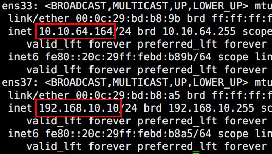
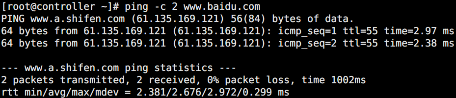
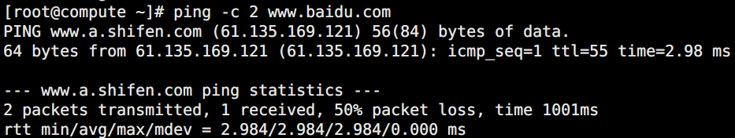
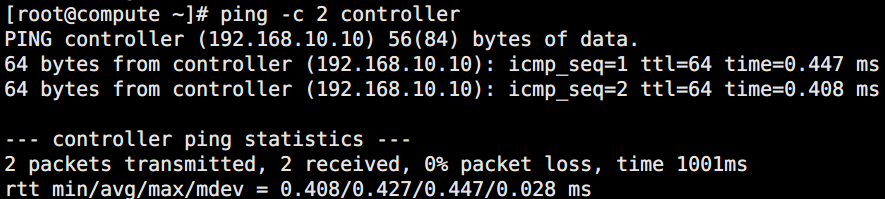
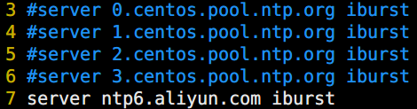
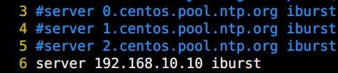
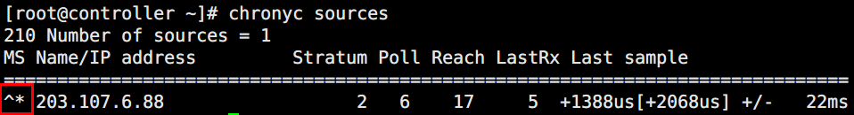
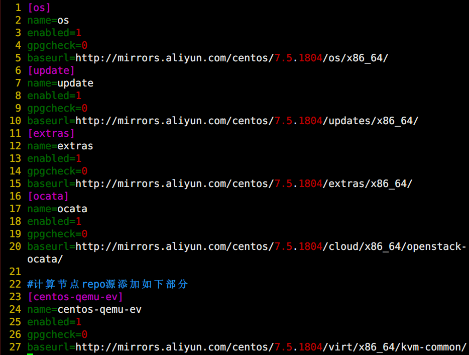

# OpenStack环境搭建

> 分类: Linux > OpenStack
> 更新时间: 2026-01-10T23:35:00.775496+08:00

---

+ [官方文档中文版](https://docs.openstack.org/zh_CN/)
+ [OpenStack-ocata](https://docs.openstack.org/ocata/install-guide-rdo/common/conventions.html)

# 一、环境规划
1. 硬件设置

| 角色 | 处理器 | 内存 | 存储 |
| --- | --- | --- | --- |
| 控制器节点controller+网络节点neutron+存储节点cinder | 8 | 8 | 10 |
| 计算节点compute | 8 | 4 | 10 |

1. 网络设置（均设置为静态ip）

|   | 控制器 | 计算 |
| --- | --- | --- |
| 内网（ens37）（管理目的） | ip：192.168.10.10 gw：不设置 | ip：192.168.10.20 gw：不设置 |
| 外网（ens33）(实例提供Internet访问、软件包安装) | ip：10.10.64.164 gw:10.10.64.1   | ip：10.10.64.180 gw:10.10.64.1 |

# 二、网络配置
1. 控制节点（controller）服务器
+ ip配置

+ 主机名设置

controller ~# hostname controller

controller ~# hostnamectl set-hostname controller

+ host设置

controller ~# vim /etc/hosts

3 192.168.10.10 controller

4 192.168.10.20 compute

1. 计算节点（compute）服务器
+ ip配置

+ 主机名设置

compute ~# hostname compute

compute ~# hostnamectl set-hostname compute

+ 域名配置

compute ~# vim /etc/hosts

3 192.168.10.10 controller

4 192.168.10.20 compute

1. 验证连通性
+ controller联通外网

+ controller联通compute

+ compute联通外网

+ compute联通controller

# 三、时间同步
1. 控制节点服务器（controller）
+ 安装软件包

controller ~# yum -y install chrony

+ 编辑/etc/chrony.conf文件

controller ~# vim /etc/chrony.conf

控制节点服务器，阿里ntp服务器ip

内网ip网段

+ 启动ntp服务

controller ~# systemctl enable chronyd.service

controller ~# systemctl start chronyd.service

1. 其他节点服务器
+ 安装软件包

~# yum install chrony

+ 编辑/etc/chrony.conf文件

注释其他ntf服务器，设置controller的ip地址

+ 启动ntp服务

 ~# systemctl enable chronyd.service

 ~# systemctl start chronyd.service

1. 验证操作
+ 控制节点服务器执行命令，将网络时间同步至本地

+ 其他节点执行命令，同步控制节点服务器时间

# 四、OpenStack包安装
1. 修改repo源

<<base.repo>>

+ 修改镜像站点为阿里云站点

+ 加载源

controller ~# yum clean all

controller ~# yum makecache

controller ~# yum repolist

1. 升级软件包并重启

controller ~# yum -y upgrade

1. 安装 OpenStack 客户端

controller ~# yum -y install python-openstackclient

1. 安装 openstack-selinux 软件包以便自动管理      OpenStack 服务的安全策略

controller ~# yum -y install openstack-selinux

# 五、sql数据库
1. 安装软件包

controller ~# yum -y install mariadb mariadb-server python2-PyMySQL

1. 创建并编辑配置文件

controller ~# vim /etc/my.cnf.d/openstack.cnf

+ 在 [mysqld] 部分，设置 [``](https://docs.openstack.org/mitaka/zh_CN/install-guide-rdo/environment-sql-database.html#id1)bind-address``值为控制节点的管理网络IP地址以使得其它节点可以通过管理网络访问数据库：  
          [mysqld]  
          bind-address = 192.168.10.10
+ 设置如下键值来启用一起有用的选项和 UTF-8 字符集：  
          default-storage-engine =      innodb  
          innodb_file_per_table  =  on  
          max_connections = 4096  
          collation-server = utf8_general_ci  
          character-set-server = utf8
1. 启动数据库

controller ~# systemctl enable mariadb.service

controller ~# systemctl start mariadb.service

1. 运行脚本设置root用户密码

controller ~# mysql_secure_installation

# 六、消息队列
1. 安全并配置组件

controller ~# yum -y install rabbitmq-server

1. 使用开启网页管理界面

controller ~# rabbitmq-plugins enable rabbitmq_management

1. 启动消息队列服务

controller ~# systemctl enable rabbitmq-server.service

controller ~# systemctl start rabbitmq-server.service

1. 在浏览器中输入[http://127.0.0.1:15672/](http://127.0.0.1:15672/)输入用户名和密码（默认为guest）
2. 添加OpenStack用户

controller ~# rabbitmqctl add_user openstack 1111

1. 给OpenStack用户配置读写权限

controller ~# rabbitmqctl set_permissions openstack ".*" ".*" ".*"

# 七、memcached缓存
1. 安装软件包

controller ~# yum -y install memcached python-memcached

1. 编辑/etc/sysconfig/memcached文件，末尾添加controller

controller ~# vim /etc/sysconfig/memcached

+ OPTIONS="-l      127.0.0.1,::1,controller"
1. 启动memcached服务

controller ~# systemctl enable memcached.service

controller ~# systemctl start memcached.service

 

 

