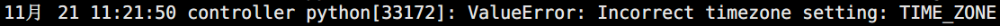

# OpenStack界面服务

> 分类: Linux > OpenStack
> 更新时间: 2026-01-10T23:35:01.315265+08:00

---

# 一、安全并配置组件
1. 安装软件包：

controller ~# yum -y install openstack-dashboard

1. 编辑文件     /etc/openstack-dashboard/local_settings 并完成如下动作：

controller ~#  vim /etc/openstack-dashboard/local_settings

+ 修改在 controller 节点上配置仪表盘以使用 OpenStack 服务：

OPENSTACK_HOST = "controller"

+ 修改允许所有主机访问仪表板：

ALLOWED_HOSTS = ['*']

+ 添加配置 memcached 会话存储服务：

CACHES = {

    'default': {

         'BACKEND': 'django.core.cache.backends.memcached.MemcachedCache',

         'LOCATION': 'controller:11211',

    }

}

+ 启用第3版认证API:

OPENSTACK_KEYSTONE_URL = "[http://%s:5000/v3](http://%25s:5000/v3)" % OPENSTACK_HOST

+ 启用对域的支持

OPENSTACK_KEYSTONE_MULTIDOMAIN_SUPPORT = True

+ 配置API版本:

OPENSTACK_API_VERSIONS = {

    "identity": 3,

    "image": 2,

    "volume": 2,

}

+ 通过仪表盘创建用户时的默认域配置为 default :

OPENSTACK_KEYSTONE_DEFAULT_DOMAIN = "default"

+ 通过仪表盘创建的用户默认角色配置为 user ：

OPENSTACK_KEYSTONE_DEFAULT_ROLE = "user"

+ 可以选择性地配置时区：

TIME_ZONE = "TIME_ZONE"

+ httpd服务无法启动

改为UTC，启动服务

# 二、完成安装
1. 重启web服务器以及会话存储服务：

controller ~# systemctl restart httpd.service memcached.service

# 三、验证操作
1. 在浏览器中输入      ``http://controller/dashboard``访问仪表盘。
2. 验证使用 admin      或者``demo``用户凭证和``default``域凭证。

 

 

 

