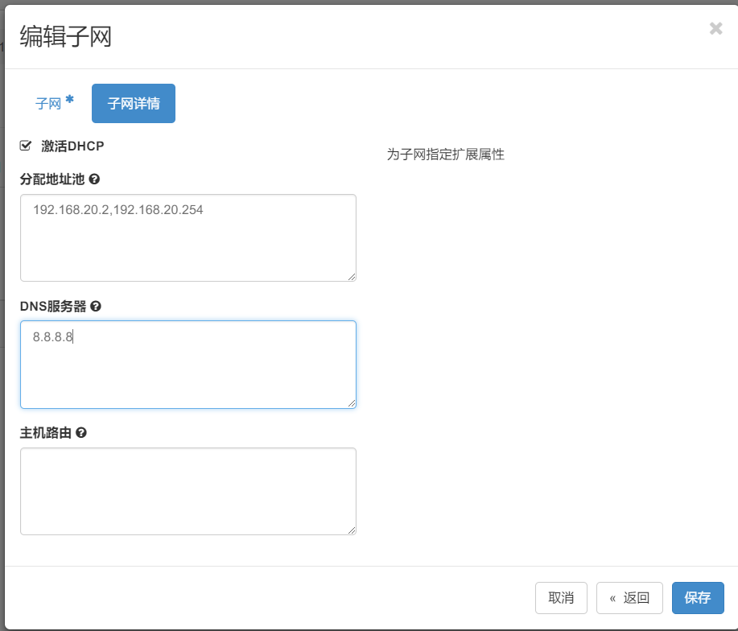
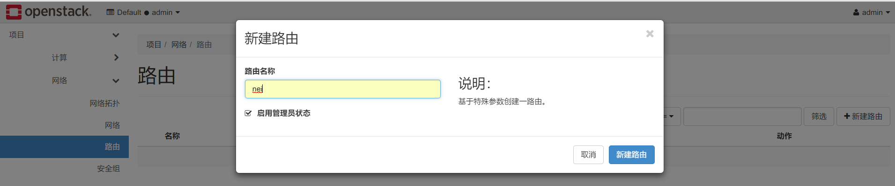
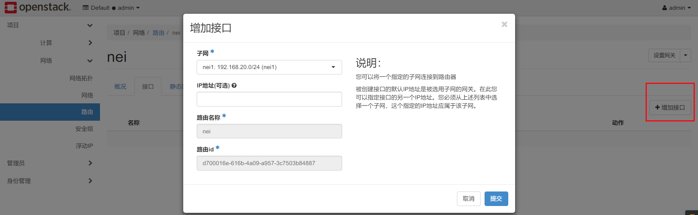
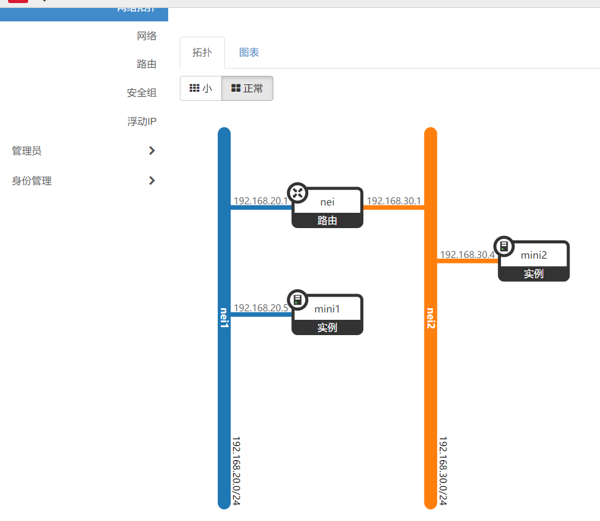
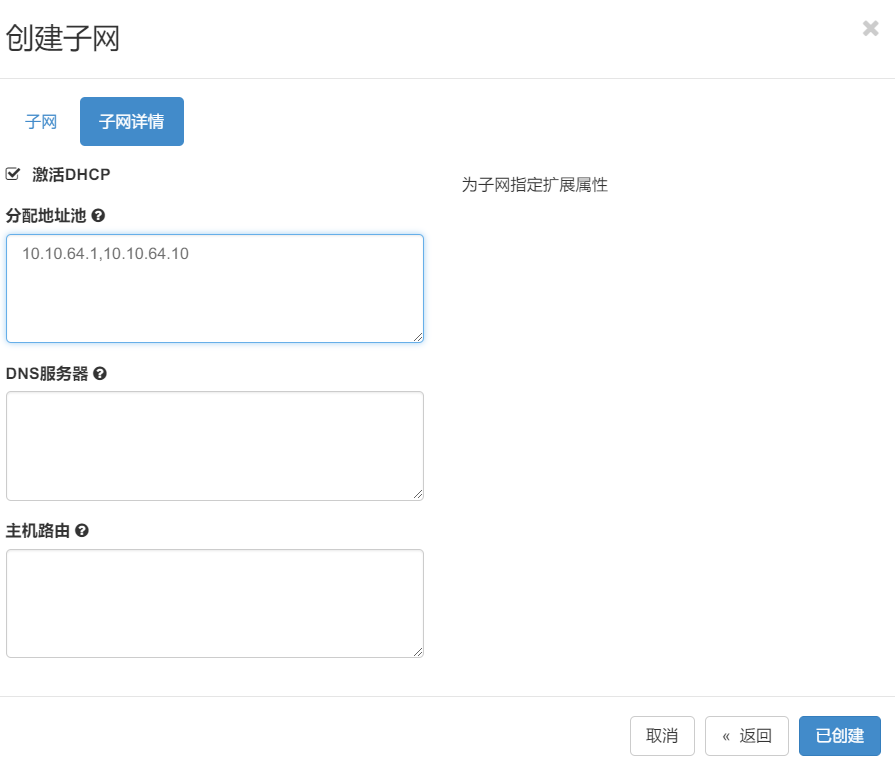
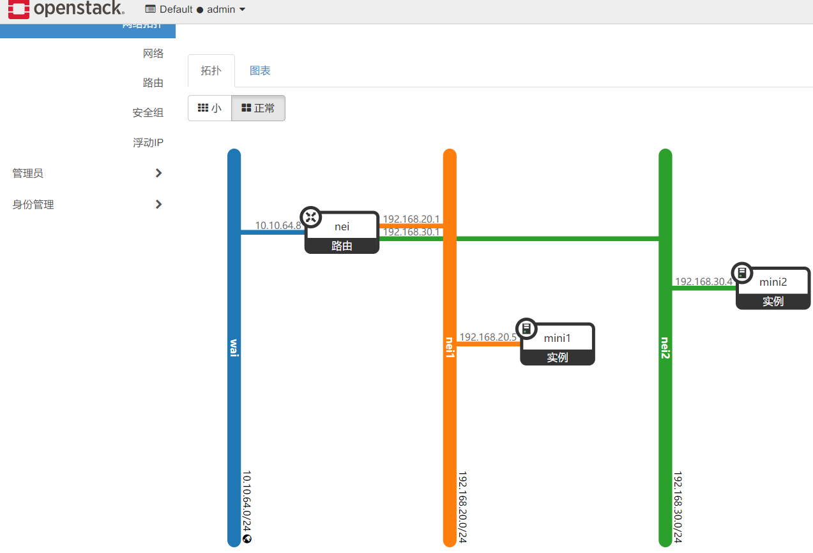
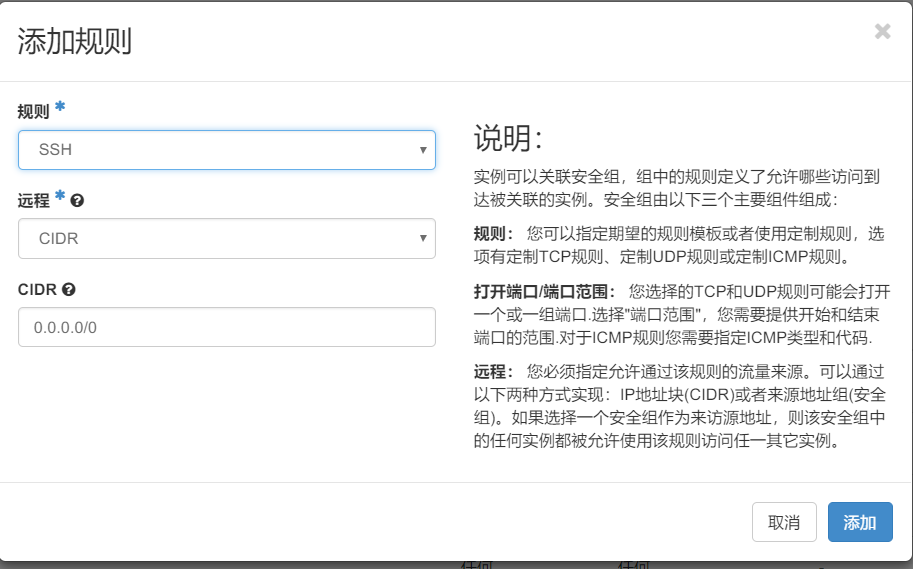
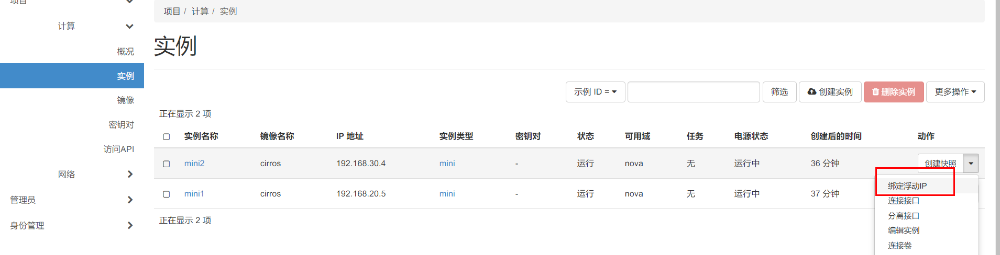

# OpenStack网络配置
# 一、两个不通网段相互通信
1. 创建网段1网络

1. 设置网段ip

 

1. 如上方法创建网段2

1. 分别创建两个虚拟机连接不同网段

1. 分别查看主机ip地址
2. 创建路由器

1. 路由器配置

1. 查看拓扑图并ping验证

# 二、虚拟机连通外网
1. 创建网络

1. 编辑网络

 

 

 

1. 将网络设置为网关

1. 查看验证

 

# 三、外网连接虚拟机
1. 编辑安全组策略

 

 

1. 设置浮动ip

1. 绑定浮动ip

1. 访问浮动ip验证

 

# 四、免密登录虚拟机
1. 远程机创建密钥

 

