# OpenStack面试问题
# 一、OpenStack创建虚拟机流程
+ 
    - **用户登录认证阶段**
    1. 用户通过dashboard、命令行、api使用用户名/密码或者用户名/API       key 作为凭证，调用keystone的rest api做身份验证，
    2. keystone，对用户信息进行验证，通过验证后，会给产生一个token供该用户后续的请求使用。
    - **nova****准备创建虚拟机阶段**
    3. Dashboard 或者 CLI 将创建虚机的       REST请求发送到nova-api 的 REST 接口。
    4. nova-api 接到请求，先向 keystone       发送token校验和权限认证请求。
    5. Keystone 校验 token，并返回信息，它包括了       roles 和 permissions（权限）。
    6. nova-api将请求写入到nova db后，向Messaging（RabbitMQ）发送了一条消息：“让       Scheduler 创建一个虚机”
    7. Scheduler（nova-scheduler）从       Messaging 获取到 API 发给它的消息，然后执行调度算法，通过Messaging 向       Conductor（nova-conductor）发送消息，Conductor 访问数据库读取nova-database中节点信息和状态，从若干计算节点中选出某一节点       A
    8. Scheduler 向 Messaging       发送了一条消息：“在计算节点 A 上创建这个虚机”
    9. 计算节点 A 的       Compute（nova-compute）从 Messaging 中获取到 Scheduler发给它的消息，然后在本节点通过该libvirt创建虚机。
    - **nova****虚拟机使用****glance****镜像**
    10. 在虚机创建的过程中，nova-compute 调用       glance-api 的 REST API，传入-token，去根据镜像 ID 获取镜像 URI，从镜像存储中下载镜像
    11. glance-api 向 keystone       校验token。
    12. nova-compute 获取 image       的元数据。
    - **nava****虚拟机使用****neutron****网络**
    13. nova-compute 调用 Neutron       API ，传入token，去分配和配置网络，比如虚机的IP地址。
    14. neutron-server 通过       keystone 校验 token。
    15. nova-compute 获得网络信息。
    - **nava****虚拟机使用Cinder存储**
    16. nova-compute 调用 Cinder       API，传入 auth-token，去将 volume 挂接到实例。
    17. cinder-api 通过 keystone       校验 token。
    18. nova-compute 获得块存储信息。
    19. nova-compute 为       hypervisor driver 产生数据，并调用 Hypersior 执行请求（通过 libvirt 或者 api）。
+ 

# 二、OpenStack创建租户网络vxlan网络过程
    1. 创建网络前，控制节点和计算节点都无其他设备信息
+ 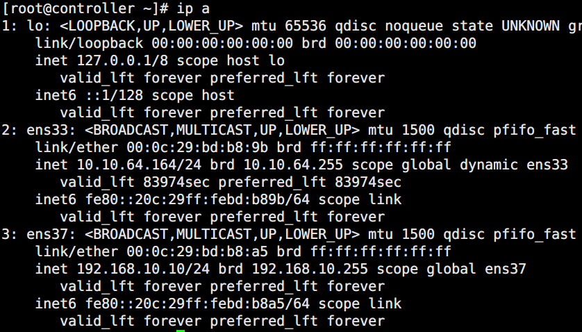
    1. 创建完成后，在网络节点（控制节点）产生了新设备（tap、vxlan、brq）
+ 
    1. tap设备创建后自动连接到桥设备上
+ 
    1. tap设备是vxlan这个网络dhcp创建的端口
+ 
    1. dhcp网络空间里边的ns设备和brq网络空间里面的tap设备是一对veth       pair。实现了两个命名空间的连接，在一端输入数据，另一端就能读到数据
+ 

# 三、创建实例选择网络vxlan过程
    1. 当创建虚拟机使用网络时。neutron会在该子网络中创建一个端口，分配ip和mac地址给vxlan
+ 
    1. 当虚拟机启动时，计算节点宿主机neutron-linuxbridge-agent根据port信息创建一个新的tap设备，并连接到vxlan网络所在的bridge,同时tap会映射成虚拟机的虚拟网卡vif
+ 
+ 
+  
+ 
+ 
    1. 虚拟机的eth0端口就是宿主机tap设备在虚拟机网卡tap设备上的映射
+ 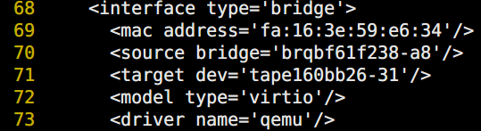
+ 

# 四、dhcp内容
    1. dhcp agent会为每个网络创建一个目录，用来存放该network的dnsmasq配置文件
+ 
+ 
    1. host信息文件，dnsmasq从该文件获取host的ip与mac对应关系
+ 
    1. Interface接口信息文件，dnsmasq会在该接口监听dhcp请求
+ 

# 五、虚拟机获取dhcp过程
    1. 创建虚拟机后，neutron会为该虚拟机创建一个端口，里面包含mac和ip信息
+ 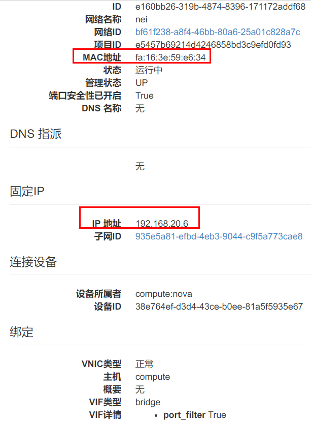
    1. 这些信息会同步更新到dnsmasq的host文件
+ 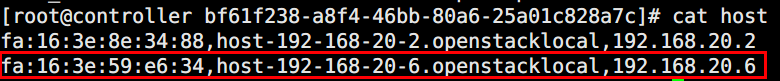
    1. 虚拟机开机，发送广播，当广播到达veth tap，传输到veth pair另一端ns。dnsmasq       在它上面监听，dnsmasq 检查其 host 文件，发现有对应项，于是dnsmasq 以  DHCPOFFER 消息将       IP、子网掩码）、地址租用期限等信息发送给虚拟机，虚拟机发送 DHCPREQUEST 消息确认接受此 DHCPOFFER。dnsmasq       发送确认消息 DHCPACK，整个过程结束。
+ 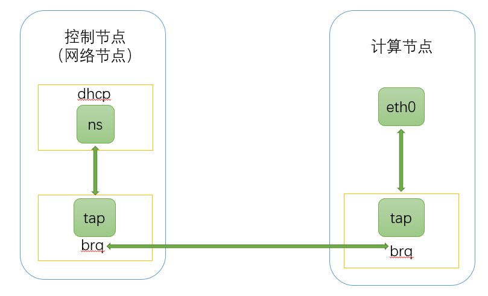

# 六、虚拟router原理
    1. 创建路由器并添加两个端口
+ 
    1. 两个brq桥上分别增加了两个tap设备，即路由器端口
+ 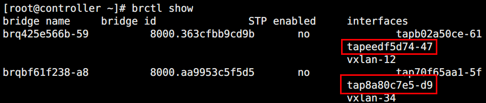
    1. I3 agent为每个router创建一个namespace，通过veth pair与tap相连，将网关ip配置在namespace的veth interface上
+ 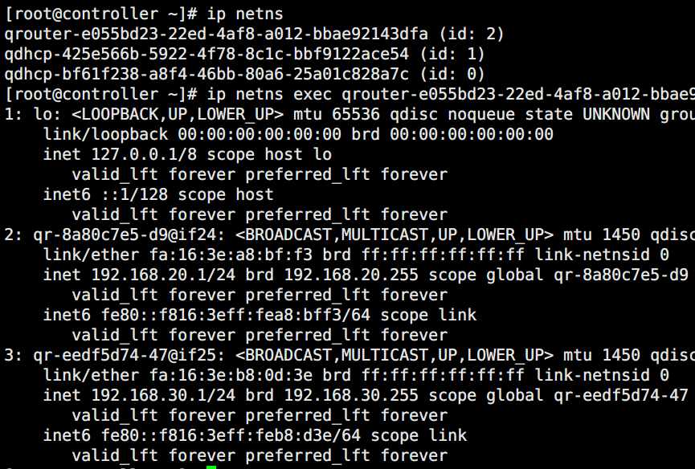
    1. router空间内的设备与宿主机网络，通过veth pair相连，同时创建路由表
+ 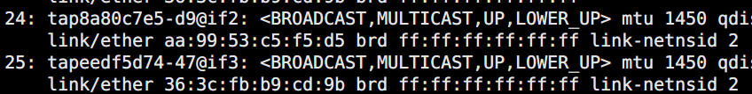
+  
+ 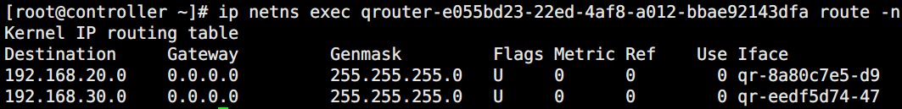

# 七、虚拟机与外网通信
    1. 创建外部网络，并连接到虚拟路由器
+ 
+  
+ 
    1. bridge上多了连接router的tap设备
+ 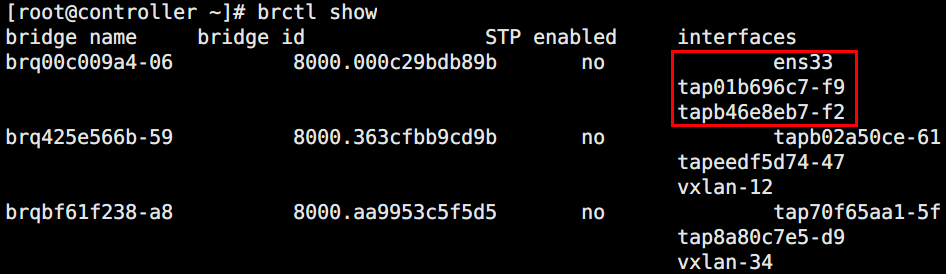
    1. 在route的namespace中生成atp设备，与宿主机tap设备构成veth pair
+ 
+  
+ 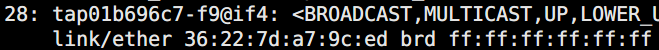
    1. 当数据包从router连接外网的接口qg发出时，做一次source nat，修改源地址为route的接口地址
+ 

# 八、从外界通过浮动ip访问虚拟机
    1. 创建一个浮动ip并绑定到实例上
+ 
    1. 在虚拟路由器的namespace的qg端口，中，添加了一条ip信息
+ 
    1. 在router上做了nat地址转换
+ 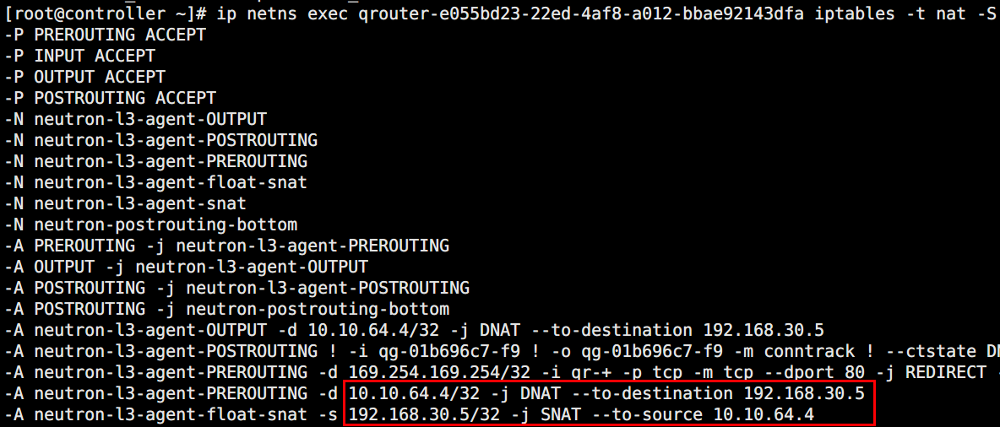
+  

