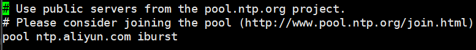
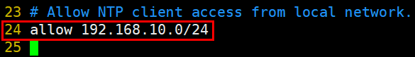
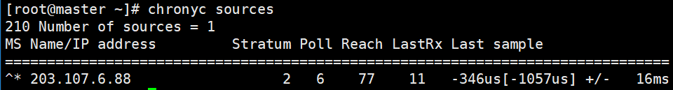

# 时间同步

> 分类: Linux > RHEL8/9
> 更新时间: 2026-01-10T23:35:03.322070+08:00

---

# 一、rhel8与7的区别
1. ntp：将系统时钟和世界协调时UTC同步，精度在局域网内可达0.1ms，在互联网上绝大多数的地方精度可以达到1-50ms。
2. chrony：实现NTP协议的的自由软件。可使系统时钟与NTP服务器，参考时钟（例如GPS接收器）以及使用手表和键盘的手动输入进行同步。通过Internet同步的两台机器之间的典型精度在几毫秒之内，在LAN上，精度通常为几十微秒。利用硬件时间戳或硬件参考时钟，可实现亚微秒的精度
3. 在CentOS8.0中默认不再支持ntp软件包，时间同步将由chrony来实现

# 二、chrony基本使用
1. 安装软件包

```bash
dnf -y install chrony
```

2. 修改配置文件

```bash
vim /etc/chrony.conf 
```



3. 启动服务

```bash
systemctl start chronyd
systemctl enable chronyd
```

4. 状态查看

```bash
chronyc sources
```

# 三、chrony服务配置
1. 基本环境


| 主机名 | IP地址 | 角色 |
| --- | --- | --- |
| chrony-server | 192.168.10.100 | chrony服务端 |
| chrony-client | 192.168.10.101 | chrony客户端 |


2. 服务端配置

```bash
dnf -y install chrony
vim /etc/chrony.conf 
```




```bash
systemctl start chronyd    #启动chronyd服务，需要等待1分钟左右才能正常同步
systemctl enable chronyd  #加入开机自启动
chronyc sources  #查看使用了哪个时间服务器同步，星号的为正在同步的时间服务器
```



3. 客户端配置

```bash
yum -y install chrony
vim /etc/chrony.conf
```


```bash
systemctl start chronyd
systemctl enable chronyd
timedatectl set-timezone Asia/Shanghai
chronyc sources
```


4. 有关时间的相关命令

```bash
timedatectl set-timezone Asia/Shanghai    #设置时区
chronyc tracking #校准硬件时间
```


 

 

