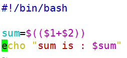

# Bash变量-位置参数变量
# 一、位置参数变量
| 位置参数变量  | 作 用 |
| --- | --- |
| $n | n为数字，$0代表命令本身，$1-$9代表第一到第九个参数，十以上的参数需要用大括号包含，如${10}. |
| $* | 这个变量代表命令行中所有的参数，$*把所有的参数看成一个整体 |
| $@ | 这个变量也代表命令行中所有的参数，不过$@把每个参数区分对待 |
| $# | 这个变量代表命令行中所有参数的个数 |

1. 变量sum的和是$1加$2

1. 打印参数

1. $*与$@的区别

#!/bin/bash

for i in "$*"

#$*中的所有参数看成是一个整体，所以这个for循环只会循环一次

do

echo "The parameters is: $i"

done

x=1

for y in "$@"

#$@中的每个参数都看成是独立的，所以“$@”中有几个参数，就会循环几次

do

echo "The parameter$x is: $y"

x=$(( $x +1 ))

done

 

