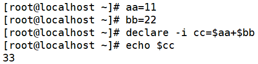
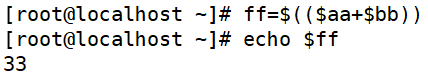
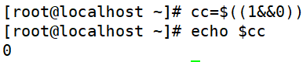

# Bash变量-数值运算与运算符

> 分类: Linux > bash
> 更新时间: 2026-01-10T23:34:55.237709+08:00

---

# 一、declare声明变量类型
[root@localhost ~]# declare [+/-][选项]变量名

1. 选项：

| -： | 给变量设定类型属性 |
| --- | --- |
| +：  | 取消变量的类型属性 |
| i： | 将变量声明为整数型（integer） |
| --x： | 将变量声明为环境变量 |
| -p： | 显示指定变量的被声明的类型 |

# 二、数值运算
1. 将变量声明为整数型

1. expr或let数值运算工具

+ dd的值是aa和bb的和。注意“+”号左右两

侧必须有空格

1. “$((运算式))”或“$[运算式]”

# 三、运算符
| 优先级  | 运算符  | 说明 |
| --- | --- | --- |
| 13 | -, +  | 单目负、单目正 |
| 12  | !, ~  | 逻辑非、按位取反或补码 |
| 11  | * , / , %  | 乘、除、取模 |
| 10  | +, -  | 加、减 |
| 9  | << ,   >>  | 按位左移、按位右移 |
| 8  | < =,   > =, < , >  | 小于或等于、大于或等于、小于、大于 |
| 7  | == , !=  | 等于、不等于 |
| 6  | &  | 按位与 |
| 5  | ^  | 按位异或 |
| 4  | |  | 按位或 |
| 3  | &&    | 逻辑与 |
| 2  | ||  | 逻辑或 |
| 1 | =,+=,-   =,*=,/=,%=,&=, ^=,|=, <<=, >>=  | 赋值、运算且赋值 |

 

+ 虽然乘和除的优先级高于加，但是通过小括号可以调整运算优先级

+ 14不能被3整除，余数是2

+ 逻辑与运算只有想与的两边都是1，与的结果才是1，否则

与的结果是0

 

