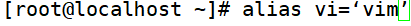
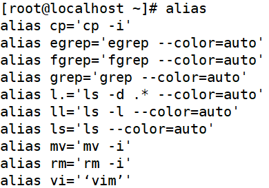
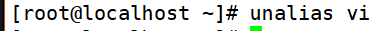

# Bash基本功能-别名与快捷键
# 一、命令别名
1. 设定命令别名

1. 查询命令别名

1. 命令执行时顺序
2. 第一顺位执行用绝对路径或相对路径执行的命令。
3. 第二顺位执行别名。
4. 第三顺位执行Bash的内部命令。
5. 第四顺位执行按照$PATH环境变量定义的目录查找顺序找到的第一个命令。
6. 让别名永久生效

1. 删除别名

[root@localhost ~]# unalias 别名

# 二、Bash常用快捷键
| 快捷键 | 作 用 |
| --- | --- |
| ctrl+a | 把光标移动到命令行开头。如果我们输入的命令过长，想要把光标移动到命令行开头时使用。 |
| ctrl+e | 把光标移动到命令行结尾。 |
| ctrl+c | 强制终止当前的命令。 |
| ctrl+l | 清屏，相当于clear命令。 |
| ctrl+u | 删除或剪切光标之前的命令。我输入了一行很长的命令，不用使用退格键一个一个字符的删除，使用这个快捷键会更加方便 |
| ctrl+k | 删除或剪切光标之后的内容。 |
| curl+y | 粘贴ctrl+U或ctrl+K剪切的内容。 |
| ctrl+r | 在历史命令中搜索，按下ctrl+R之后，就会出现搜索界面，只要输入搜索内容，就会从历史命令中搜索。 |
| ctrl+d | 退出当前终端。 |
| ctrl+z | 暂停，并放入后台。这个快捷键牵扯工作管理的内容，我们在系统管理章节详细介绍。 |
| ctrl+s | 暂停屏幕输出。 |
| ctrl+q | 恢复屏幕输出。 |

 

 

