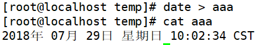
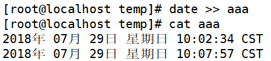
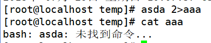

# Bash基本功能-输入输出重定向
# 一、标准输入输出
| 设备 | 设备文件名 | 文件描述符 | 类型 |
| --- | --- | --- | --- |
| 键盘 | /dev/stdin | 0 | 标准输入 |
| 显示器 | /dev/sdtout | 1 | 标准输出 |
| 显示器 | /dev/sdterr | 2 | 标准错误输出 |

# 二、输出重定向
| 类 型 | 作用 |
| --- | --- |
| 标准输出重定向 |   |
| 标准错误输出重定向 |   |
| 正确输出和错误输出同时保存 |   |

# 三、输入重定向
1. [root@localhost ~]#      wc [选项] [文件名]
2. 选项：

| -c  | 统计字节数 |
| --- | --- |
| -w  | 统计单词数 |
| -l  | 统计行数 |

1. 命令<文件 把文件作为命令的输入
2. 命令<< 标识符 … 标识符      把标识符之间内容作为 命令的输入

# 四、操作实例
1. 覆盖方式标准输出重定向

1. 追加方式标准输出重定向

1. 覆盖方式标准错误输出重定向

1. 追加方式标准错误输出重定向

1. 追加的方式把正确输出和错误输出都保存到同一个文件当中。

1. 正确的输出追加到文件1中，错误的输出追加到文件2中

 

 

 

 

 

 

 

 

 

 

 

