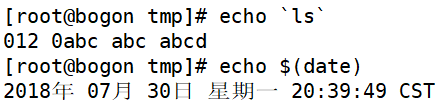
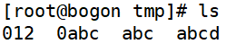
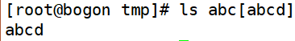
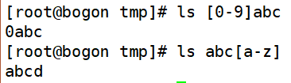
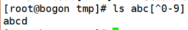

# Bash基本功能-通配符和其他特殊符号
# 一、通配符
| 通配符  | 作 用 |
| --- | --- |
| ?  | 匹配一个任意字符 |
| *  | 匹配0个或任意多个任意字符，也就是可以匹配任何内容 |
| [] | 匹配中括号中任意一个字符。例如：[abc]代表一定匹配一个字符，或者是a，或者是b，或者是c。 |
| [-] | 匹配中括号中任意一个字符，-代表一个范围。例如：[a-z]代表匹配一个**大小写字母**。 |
| [^] | 逻辑非，表示匹配不是中括号内的一个字符。例如：[^0-9]代表匹配一个不是数字的字符。 |

| [[:upper:]] | 大写字母 |
| --- | --- |
| [[:lower:]] | 小写字母 |
| [[:alpha:]] | 所有字母 |
| [[:digit:]] | 所有数字 |
| [[:alnum:]] | 字母+数字 |
| [[:space:]] | 空格 |
| [[:punct:]] | 标点符号 |

# 二、Bash中其他特殊符号
| 符 号  | 作 用 |
| --- | --- |
| '' | 单引号。在单引号中所有的特殊符号，如“$”和“`”(反引号)都没有特殊含义。 |
| "" | 双引号。在双引号中特殊符号都没有特殊含义，但是“$”、“`”和“\”是例外，拥有“调用变量的值”、“引用命令”和“转义符”的特殊含义。 |
| `` | 反引号。反引号括起来的内容是系统命令，在Bash中会先执行它。和$()作用一样，不过推荐使用$()，因为反引号非常容易看错。 |
| $()    | 和反引号作用一样，用来引用系统命令。 |
| #    | 在Shell脚本中，#开头的行代表注释。 |
| $ | 用于调用变量的值，如需要调用变量name的值时，需要用$name的方式得到变量的值。 |
| \ | 转义符，跟在\之后的特殊符号将失去特殊含义，变为普通字符。如\$将输出“$”符号，而不当做是变量引用。反引号与$() |

1. 单引号与双引号区别
+ 单引号中特殊字符没有特殊含义，双引号中特殊字符有特殊含义

1. 反引号与$()
+ 作用一样，推荐使用$()，不易看错

# 三、操作实例
1. 删除tmp下的所有文件

1. 通配符操作

+ ？通配符（匹配一个任意字符）

+ *通配符（匹配0个或多个任意字符）

+ []匹配括号中的任意一个

+ [-]匹配括号范围中的任意一个

+ [^]匹配不是括号中的任意一个

 

