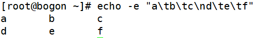
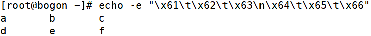
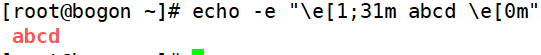
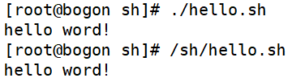

# 脚本执行方式

> 分类: Linux > bash
> 更新时间: 2026-01-10T23:34:54.150594+08:00

---

# 一、echo输出命令
1. [root@localhost ~]#      echo [选项] [输出内容]

选项：

-e： 支持反斜线控制的字符转换

| 控制字符 | 作 用 |
| --- | --- |
| \\ | 输出\本身 |
| \a | 输出警告音 |
| \b | 退格键，也就是向左删除键 |
| \c | 取消输出行末的换行符。和“-n”选项一致 |
| \e | ESCAPE键 |
| \f | 换页符 |
| \n | 换行符 |
| \r | 回车键 |
| \t | 制表符，也就是Tab键 |
| \v | 垂直制表符 |
| \0nnn | 按照八进制ASCII码表输出字符。其中0为数字零，nnn是三位八进制数 |
| \xhh | 按照十六进制ASCII码表输出字符。其中hh是两位十六进制数 |

1. 删除左侧字符

1. 制表符与换行符

1. 按照十六进制ASCII码也同样可以输出

1. 输出颜色

#30m=黑色，31m=红色，32m=绿色，33m=黄色

#34m=蓝色，35m=洋红，36m=青色，37m=白色

# 二、第一个脚本
1. 打开vim编辑脚本

1. 编写脚本

# 三、脚本执行
1. 赋予执行权限

1. 执行脚本

1. 通过bash直接调用执行脚本

