# KVM网络配置
# 一、创建桥接网络
+ 参考链接[网址](https://www.linuxidc.com/Linux/2013-02/79934.htm)
1. 创建桥接网卡br0（相当于vmnet1桥接器）

cd /etc/sysconfig/network-scripts/

cp ifcfg-ens33 ifcfg-br0

1. 修改br0参数

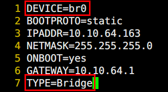

1. 修改ens33参数

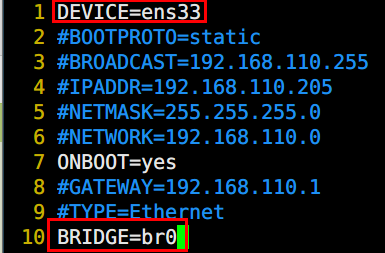

1. 重启宿主机网络服务，查看ip

1. 查看当前桥接情况

brctl show

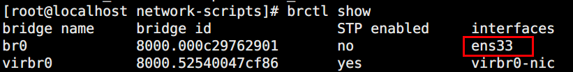

1. 将虚拟机接口桥接到桥接器

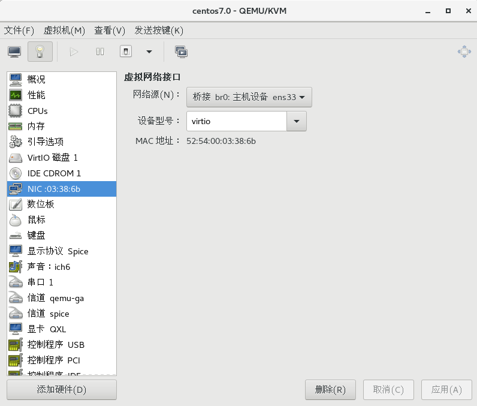

+ 或者编辑配置文件

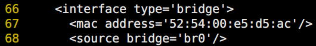

1. 查看验证

# 二、创建自定义NET网络
1. 创建自定义define网络

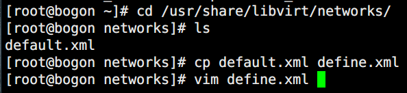

1. 编辑define网络配置文件

1. 加载自定义网络配置文件

1. 启动自定义网络配置

1. 设置自定义网络配置文件自启动

1. 查看当前连接情况

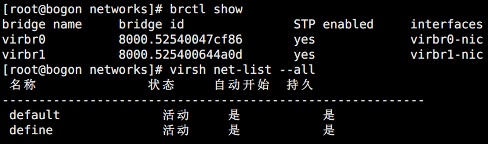

1. 在kvm虚拟机上配置

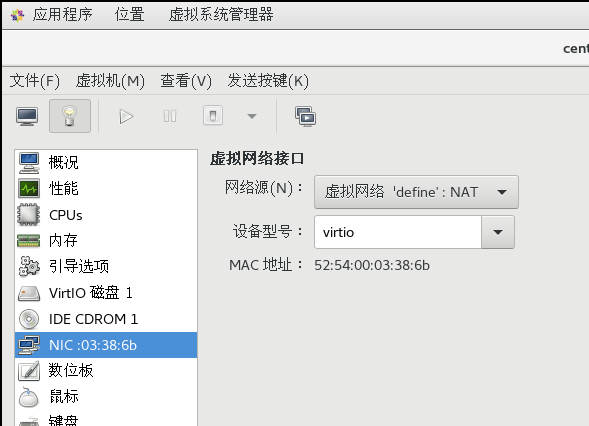

1. 虚拟机查看验证

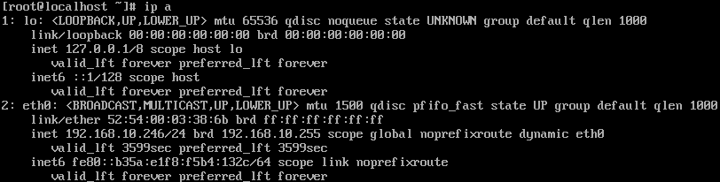

# 三、使用linux bridge配置vlan隔离
1. epel源安装vconfig

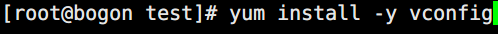

1. 加载802.1q模块来支持vlan

1. 创建两个vlan

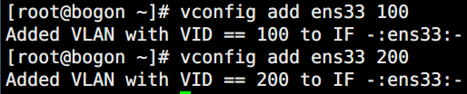

1. 创建两个网桥

1. 指定网桥ip地址

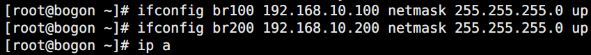

1. 连接网桥和vlan

1. 添加虚拟机到vlan

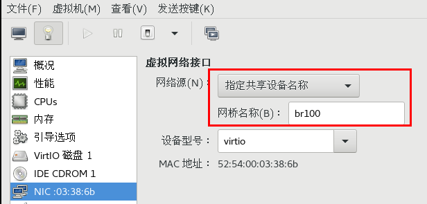

+ 或者使用命令

brctl delif virbr0 vnet0

brctl addif br100 vnet0

1. 设置虚拟机ip（10.10,10.20属于vlan100、10.110，10.120属于vlan200）

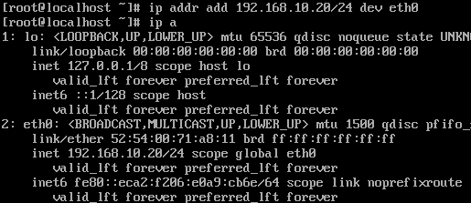

1. 访问测试

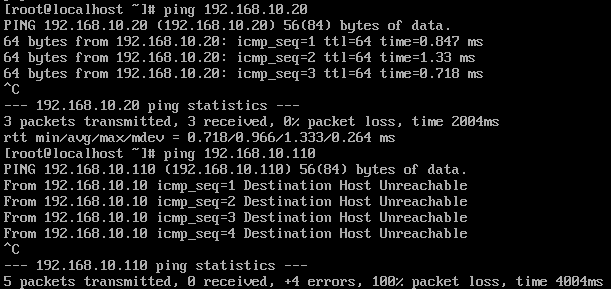

 

