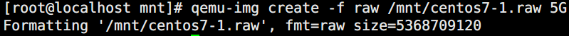
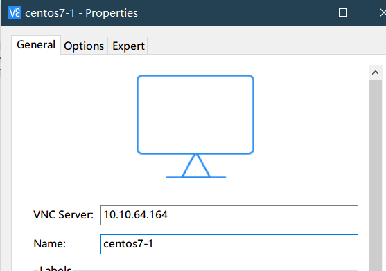
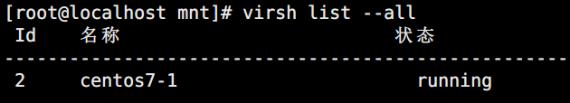

# kvm虚拟机创建

> 分类: Linux > kvm虚拟化
> 更新时间: 2026-01-10T23:35:00.213812+08:00

---

# 一、准备工作
1. 配备网络yum源
2. 确定处理器有 VT

grep vmx /proc/cpuinfo (INTEL 芯片)

grep svm /proc/cpuinfo (AMD 芯片)

+ 不知道芯片的生产厂商则输入：

egrep '(vmx|svm)' /proc/cpuinfo

如果flags: 里有 vmx 或者 svm 就说明支持 VT ；如果没有任何的输出，说明你的 cpu 不支持，将无法成功安装 KVM 虚拟机。

+ 如果是硬件，确保 BIOS 里开启 VTIntel(R)      Virtualization Tech [Enabled]
+ 如果是在vmware workstation里，在虚拟机的“设置”-处理器选项-勾选“虚拟化 Intel-VT/EPT或AMD-V/RVI”
1. 内核版本需2.6.20以上，检查内核版本

uname -r

# 二、安装kvm
1. YUM 安装 KVM( 图形操作 )

yum -y install kvm virt-manager libvirt*

或者yum install (qemu-kvm/qemu-kvm-tools

/libvirt/virt-manager/virt-install)

1. YUM安装KVM（命令操作）

yum  -y install kvm qemu-kvm virt-install libvirt*

| libvirt:kvm | 管理工具 |
| --- | --- |
| qemu-kvm | 提供用户级 KVM 环境 |
| qemu-img | VMs 磁盘管理 |
| virt-manager | 图形化kvm管理软件 |
| virt-install | 命令行kvm管理软件 |

1. 启动 KVM

modprobe kvm   加载 kvm 模块

lsmod | grep kvm  查看加载成功

systemctl start libvirtd

1. 启动并检测 KVM

virsh -c qemu:///system list

如出现

Id Name State

# 三、图形化界面创建虚拟机
1. 上传cirros测试镜像到kvm宿主机（使用winscp）
2. 使用virt-manager图形化创建虚机
3. 创建过程中网络默认为NAT(virbr0)

# 四、命令行安装kvm虚拟机
1. 准备安装镜像文件

1. 创建虚拟机磁盘文件

1. 安装虚拟机（raw格式）

virt-install --name=centos7-1 --ram 1024 --vcpus=1 --disk path=/mnt/centos7-1.raw --cdrom=/mnt/centos-7.iso --graphics vnc,listen=0.0.0.0 --network=default --noautoconsole

+ 安装虚拟机（qcow2格式）

virt-install --name=centos7-1 --ram 1024 --vcpus=1 --disk path=/mnt/centos7-1.qcow2,format=qcow2 --cdrom=/mnt/centos-7.iso --graphics vnc,listen=0.0.0.0 --network=default --noautoconsole

1. 使用vnc远程操作安装

1. 查看虚拟机状态

1. 开启虚拟机

# 五、使用nfs共享存储创建kvm虚拟机没有权限
1. 主要原因是 selinux策略默认禁止qemu-kvm使用nfs资源，所以使用时提示 Permission denied ，更改其策略即可。

#  setenforce 0

# vi  /etc/selinux/config 

把SELINUX=enforcing 改为 SELINUX=disabled

然后重启系统

1. 如果开机之后还不能访问的话，修改  /etc/libvirt/qemu.conf

# vi  /etc/libvirt/qemu.conf

去掉 

user = "root"

group = "root"   前的#号

1. 重启libvirt 

#  service libvirtd restart

