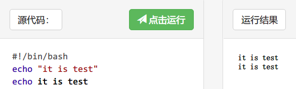
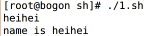

# shell编程-echo
# 一、显示普通字符串:
1. 这里的双引号完全可以省略，以下命令与上面实例效果一致：

# 二、显示转义字符

# 三、显示变量
read 命令从标准输入中读取一行,并把输入行的每个字段的值指定给 shell 变量

name 接收标准输入的变量，结果将是:

# 四、显示换行
 -e 开启转义

# 五、显示不换行
-e 开启转义 \c 不换行

# 六、显示结果定向至文件
echo "It is a test" >myfile

# 七、原样输出字符串，不进行转义或取变量(用单引号)
echo '$name\"'

输出结果：

$name\"

# 八、显示命令执行结果
echo `date`

**注意：** 这里使用的是反引号 **`**, 而不是单引号 **'**。

结果将显示当前日期

Thu Jul 24 10:08:46 CST 2014

 

来自 <[http://www.runoob.com/linux/linux-shell-echo.html](http://www.runoob.com/linux/linux-shell-echo.html)>

