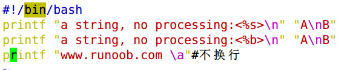
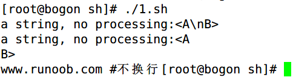

# shell编程-printf
# 一、printf命令
1. printf 由 POSIX 标准所定义，因此使用 printf 的脚本比使用 echo      移植性好。
2. printf      使用引用文本或空格分隔的参数，外面可以在 printf 中使用格式化字符串，还可以制定字符串的宽度、左右对齐方式等。默认 printf 不会像      echo 自动添加换行符，我们可以手动添加 \n。
3. printf      命令的语法：

printf format-string  [arguments...]

# 二、参数说明：
+ **format-string:** 为格式控制字符串
+ **arguments:** 为参数列表。
+ 
+ %s %c %d      %f都是格式替代符

%-10s 指一个宽度为10个字符（-表示左对齐，没有则表示右对齐），任何字符都会被显示在10个字符宽的字符内，如果不足则自动以空格填充，超过也会将内容全部显示出来。

%-4.2f 指格式化为小数，其中.2指保留2位小数。

 

# 三、printf的转义序列
| **序列** | **说明** |
| --- | --- |
| \a | 警告字符，通常为ASCII的BEL字符 |
| \b | 后退 |
| \c | 抑制（不显示）输出结果中任何结尾的换行字符（只在%b格式指示符控制下的参数字符串中有效），而且，任何留在参数里的字符、任何接下来的参数以及任何留在格式字符串中的字符，都被忽略 |
| \f | 换页（formfeed） |
| \n | 换行 |
| \r | 回车（Carriage   return） |
| \t | 水平制表符 |
| \v | 垂直制表符 |
| \\ | 一个字面上的反斜杠字符 |
| \ddd | 表示1到3位数八进制值的字符。仅在格式字符串中有效 |
| \0ddd | 表示1到3位的八进制值字符 |

**实例**

来自 <[http://www.runoob.com/linux/linux-shell-printf.html](http://www.runoob.com/linux/linux-shell-printf.html)> 

