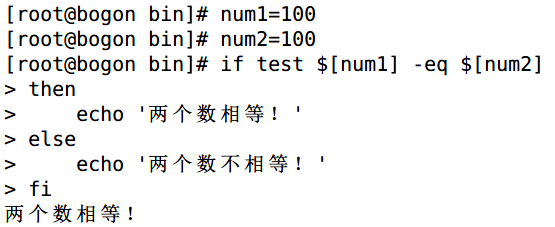
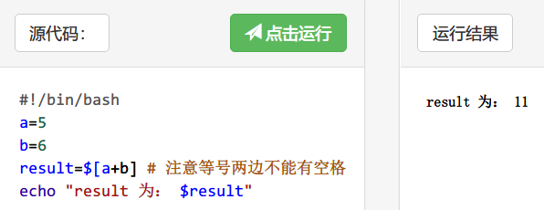
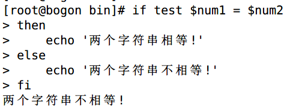
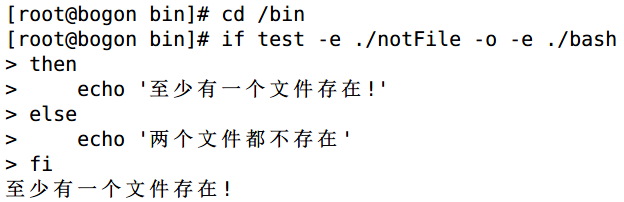

# shell编程-test

> 分类: Linux > shell
> 更新时间: 2026-01-10T23:34:57.714681+08:00

---

# 一、test 命令
Shell中的 test 命令用于检查某个条件是否成立，它可以进行数值、字符和文件三个方面的测试。

# 二、数值测试
| **参数** | **说明** |
| --- | --- |
| -eq | 等于则为真 |
| -ne | 不等于则为真 |
| -gt | 大于则为真 |
| -ge | 大于等于则为真 |
| -lt | 小于则为真 |
| -le | 小于等于则为真 |

+ 实例演示：

+ 代码中的 []      执行基本的算数运算，如：

# 三、字符串测试
| **参数** | **说明** |
| --- | --- |
| = | 等于则为真 |
| != | 不相等则为真 |
| -z 字符串 | 字符串的长度为零则为真 |
| -n 字符串 | 字符串的长度不为零则为真 |

+ 实例演示：

# 四、文件测试
| **参数** | **说明** |
| --- | --- |
| -e 文件名 | 如果文件存在则为真 |
| -r 文件名 | 如果文件存在且可读则为真 |
| -w 文件名 | 如果文件存在且可写则为真 |
| -x 文件名 | 如果文件存在且可执行则为真 |
| -s 文件名 | 如果文件存在且至少有一个字符则为真 |
| -d 文件名 | 如果文件存在且为目录则为真 |
| -f 文件名 | 如果文件存在且为普通文件则为真 |
| -c 文件名 | 如果文件存在且为字符型特殊文件则为真 |
| -b 文件名 | 如果文件存在且为块特殊文件则为真 |

+ 实例演示：

+ 另外，Shell还提供了与(      -a )、或( -o )、非( !      )三个逻辑操作符用于将测试条件连接起来，其优先级为："!"最高，"-a"次之，"-o"最低。例如：

来自 <[http://www.runoob.com/linux/linux-shell-test.html](http://www.runoob.com/linux/linux-shell-test.html)> 

