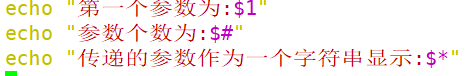
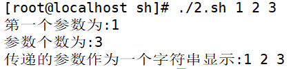

# shell编程-传递参数

> 分类: Linux > shell
> 更新时间: 2026-01-10T23:34:57.275562+08:00

---

# 一、Shell 传递参数
我们可以在执行 Shell 脚本时，向脚本传递参数，脚本内获取参数的格式为：**$n**。**n** 代表一个数字，1 为执行脚本的第一个参数，2 为执行脚本的第二个参数，以此类推……

# 二、实例
1. 以下实例我们向脚本传递三个参数，并分别输出，其中 **$0** 为执行的文件名：

#!/bin/bash

+ 为脚本设置可执行权限，并执行脚本，输出结果如下所示：

1. 另外，还有几个特殊字符用来处理参数：

| **参数处理** | **说明** |
| --- | --- |
| $# | 传递到脚本的参数个数 |
| $* | 以一个单字符串显示所有向脚本传递的参数。 如"$*"用「"」括起来的情况、以"$1   $2 … $n"的形式输出所有参数。 |
| $$ | 脚本运行的当前进程ID号 |
| $! | 后台运行的最后一个进程的ID号 |
| $@ | 与$*相同，但是使用时加引号，并在引号中返回每个参数。 如"$@"用「"」括起来的情况、以"$1"   "$2" … "$n" 的形式输出所有参数。 |
| $- | 显示Shell使用的当前选项，与[set命令](http://www.runoob.com/linux/linux-comm-set.html)功能相同。 |
| $? | 显示最后命令的退出状态。0表示没有错误，其他任何值表明有错误。 |

执行脚本，输出结果如下所示：

1. $* 与 $@ 区别：
+ 相同点：都是引用所有参数。
+ 不同点：只有在双引号中体现出来。假设在脚本运行时写了三个参数      1、2、3，，则 " * " 等价于 "1 2 3"（传递了一个参数），而 "@"      等价于 "1" "2" "3"（传递了三个参数）。

执行脚本，输出结果如下所示：

来自 <[http://www.runoob.com/linux/linux-shell-passing-arguments.html](http://www.runoob.com/linux/linux-shell-passing-arguments.html)>

