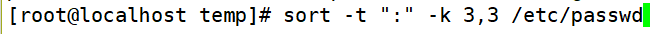

# 字符处理命令-排序统计

> 分类: Linux > shell
> 更新时间: 2026-01-10T23:34:56.307364+08:00

---

# 一、排序命令sort
1. [root@localhost ~]#      sort [选项] 文件名
2. 选项：

| -f： | 忽略大小写 |
| --- | --- |
| -n： | 以数值型进行排序，默认使用字符串型排序 |
| -r： | 反向排序 |
| -t： | 指定分隔符，默认是分隔符是制表符 |
| -k   n[,m]： | 按照指定的字段范围排序。从第n字段开始，m字段结束（默认到行尾） |

# 二、sort操作实例
1. 排序用户信息文件

1. 反向排序

1. 指定分隔符是“：”，用第三字段开头，第三字段结尾排序，就是只用第三字段排序

# 三、统计命令wc
1. [root@localhost ~]#      wc [选项] 文件名
2. 选项：

| -l：  | 只统计行数 |
| --- | --- |
| -w： | 只统计单词数 |
| -m： | 只统计字符数 |

 

 

 

 

