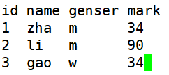

# 字符截取命令-cut
# 一、格式
1. [root@localhost ~]#      cut [选项] 文件名
2. 选项：

| -f 列号： | 提取第几列 |
| --- | --- |
| -d 分隔符： | 按照指定分隔符分割列 |

# 二、操作实例

1. 提取第二列内容

1. 提取第二第四列内容

1. 提取分割符为：的第一第三列

# 三、cut命令的局限（分隔符为空格）
[root@localhost ~]# df -h | cut -d " " -f 1,3

