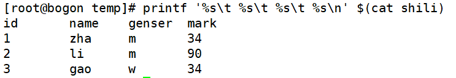

# 字符截取命令-printf命令

> 分类: Linux > shell
> 更新时间: 2026-01-10T23:34:55.983906+08:00

---

# 一、printf ’输出类型输出格式’ 输出内容
1. 输出类型：

| %ns： | 输出字符串。n是数字指代输出几个字符 |
| --- | --- |
| %ni： | 输出整数。n是数字指代输出几个数字 |
|  %m.nf： | 输出浮点数。m和n是数字，指代输出的整数位数和小数位数。如%8.2f代表共输出8位数，其中2位是小数，6位是整数。 |

1. 输出格式：

| \a:  | 输出警告声音 |
| --- | --- |
| \b: | 输出退格键，也就是Backspace键 |
| \f: | 清除屏幕 |
| \n:  | 换行 |
| \r:  | 回车，也就是Enter键 |
| \t:  | 水平输出退格键，也就是Tab键 |
| \v:  | 垂直输出退格键，也就是Tab键 |

1. 不调整输出格式其他命令内容

1. 调整格式输出

1. 在awk命令的输出中支持print和printf命令

①print：print会在每个输出之后自动加入一个换行符（Linux默认没有print命令）

②printf：printf是标准格式输出命令，并不会自动加入换行符，如果需要换行，需要手工加入换行符

 

