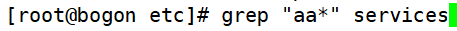
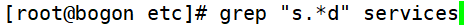
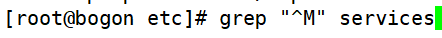
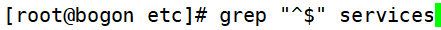
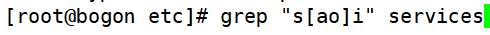
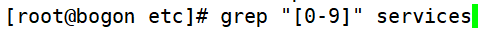
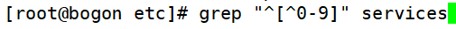

# 正则表达式

> 分类: Linux > shell
> 更新时间: 2026-01-10T23:34:55.761572+08:00

---

# 一、正则表达式与通配符
1. 正则表达式用来在**文件中**匹配符合条件的**字符串**，正则是**包含匹配**。grep、awk、sed等命令可以支持正则表达式。
2. 通配符用来匹配符合条件的**文件名**，通配符是**完全匹配**。ls、find、cp这些命令不支持正则表达式，所以只能使用shell自己的通配符来进行匹配了。

# 二、基础正则表达式
| 元字符  | 作 用 |
| --- | --- |
| *  | 前一个字符匹配0次或任意多次。 |
| .  | 匹配除了换行符外任意一个字符。 |
| ^  | 匹配行首。例如：^hello会匹配以hello开头的行。 |
| $  | 匹配行尾。例如：hello&会匹配以hello结尾的行。 |
| [] | 匹配中括号中指定的任意一个字符，只匹配一个字符。例如：[aoeiu] 匹配任意一个元音字母，[0-9] 匹配任意一位数字，  [a-z][0-9]匹配小写字和一位数字构成的两位字符。 |
| [^] | 匹配除中括号的字符以外的任意一个字符。例如：[^0-9] 匹配任意一位非数字字符，[^a-z] 表示任意一位非小写字母。 |
| \  | 转义符。用于取消讲特殊符号的含义取消。 |
| \{n\} | 表示其前面的字符恰好出现n次。例如：[0-9]\{4\} 匹配4位数字，[1][3-8][0-9]\{9\} 匹配手机号码。 |
| \{n,\} | 表示其前面的字符出现不小于n次。例如： [0-9]\{2,\}   表示两位及以上的数字。 |
| \{n,m\} | 表示其前面的字符至少出现n次，最多出现m次。例如： [az]\{6,8\} 匹配6到8位的小写字母。 |

1. “*”前一个字符匹配0次，或任意多次

①匹配所有内容，包括空白行

②匹配至少包含有一个a的行

③匹配最少包含两个连续a的字符串

④则会匹配最少包含三个连续a的字符串

1. “.” 匹配除了换行符外任意一个字符

①“s..d”会匹配在s和d这两个字母之间一定有两个字符的单词

②匹配在s和d字母之间有任意字符

1. “^”匹配行首，“$”匹配行尾

①匹配以大写“M”开头的行

②匹配以小写“n”结尾的行

③匹配空白行

1. “[]” 匹配中括号中指定的任意一个字符，只匹配一个字符

①匹配s 和i字母中，要么是a、要么是o

②匹配任意一个数字

③匹配数字开头的行

④匹配字母开头的行

1. “[^]” 匹配除中括号的字符以外的任意一个字符

①匹配不以小写字母开头的行

②匹配不以字母开头的行

1. “\” 转义符

①匹配使用“.”结尾的行

1. “\{n\}”表示其前面的字符恰好出现n次

①匹配a字母连续出现三次的字符串

②匹配包含连续的三个数字的字符串

1. “\{n,\}”表示其前面的字符出现不小于n次

①匹配最少用连续三个数字开头的行

1. “\{n,m\}”匹配其前面的字符至少出现n次，最多出现m次

①匹配在字母s和字母i之间有最少一个a，最多三个a

 

