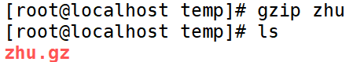
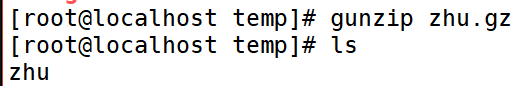
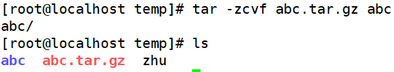
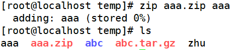
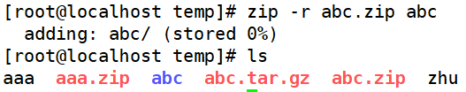
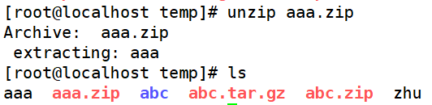
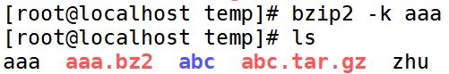
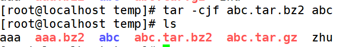
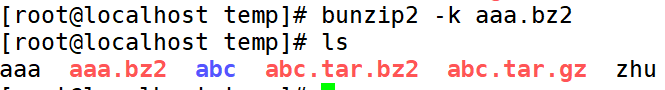
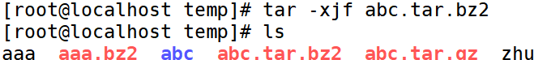

# 压缩解压命令

> 分类: Linux > 常用命令
> 更新时间: 2026-01-10T23:34:43.450001+08:00

---

| 功能 | 命令 | 选项 | 格式 |
| --- | --- | --- | --- |
| 压缩文件（①只能压缩文件， 不能压缩目录②不保留原文件） | gzip |   | .gz |
| 解压缩（不保留原文件） | gunzip |   | .gz |
| 打包目录 | tar | ①-c 打包 ②-v 显示详细信息 ③-f 指定文件名 ④-z 打包同时压缩 | .tar |
| 解压缩 | tar | ①-x解包 ②-v显示详细信息 ③-f指定解压文件 ④-z解压缩 | .tar.gz |
| 压缩文件或目录（保留原文件） | zip | -r 压缩目录 | .zip |
| 解压缩 | unzip |   | .zip |
| 压缩文件 | bzip2 | -k 产生压缩文件后保留原文件 | .bz2 |
| 解压缩 | bunzip2 |  -k 解压缩后保留原文件 | .bz2 |

# 一、压缩文件成.gz
1. 命令名称：**gzip**
2. 命令英文原意：GNU zip
3. 命令所在路径：/bin/gzip
4. 执行权限：所有用户
5. 语法：gzip[文件]
6. 功能描述：压缩文件
7. 压缩后文件格式：.gz

# 二、解压缩．gz的压缩文件
1. 命令名称：**gunzip**
2. 命令英文原意：GNU unzip
3. 命令所在路径：/bin/gunzip
4. 执行权限：所有用户
5. 语法：gunzip[压缩文件]
6. 功能描述：解压缩．gz的压缩文件
7. 范例：$gunzip boduo.gz

# 三、打包目录
1. 命令名称：**tar**
2. 命令所在路径：/bin/tar
3. 执行权限：所有用户
4. 语法：tar选项[-zcf][压缩后文件名][目录]

| -c | 打包 |
| --- | --- |
| -v | 显示详细信息 |
| -f | 指定文件名 |
| -z | 打包同时压缩 |

1. 功能描述：打包目录
2. 压缩后文件格式：.tar.gz
3. 范例：$tar -zcf      Japan.tar.gz Japan

（将目录Japan打包并压缩为.tar.gz文件）

1. tar命令解压缩语法

| -x | 解包 |
| --- | --- |
| -v | 显示详细信息 |
| -f | 指定解压文件 |
| -z | 解压缩 |

1. 范例：$tar -zxvf      Japan.tar.gz

# 四、压缩文件或目录
1. 命令名称：**zip**
2. 命令所在路径：/usr/bin/zip
3. 执行权限：所有用户
4. 语法：zip 选项[-r][压缩后文件名][文件或目录] -r 压缩目录
5. 功能描述：压缩文件或目录
6. 压缩后文件格式：zip
7. 范例：

①$ zip buduo.zip boduo（压缩文件）

②$zip -r Japan.zip Japan（压缩目录）

# 五、压缩解压命令
1. 命令名称：**unzip**
2. 命令所在路径：/usr/bin/unzip
3. 执行权限：所有用户
4. 语法：unzip[压缩文件]
5. 功能描述：解压.zip的压缩文件
6. 范例：$unzip test.zip

# 六、压缩文件
1. 命令名称：**bzip2**
2. 命令所在路径：/usr/bin/bzip2
3. 执行权限：所有用户
4. 语法：bzip2 选项 [-k] [文件] -k 产生压缩文件后保留原文件
5. 功能描述：压缩文件
6. 压缩后文件格式：.bz2
7. 范例：①$bzip2 -k boduo②$tar -cjf      Japan.tar.bz2 Japan

# 七、解压缩
1. 命令名称：**bunzip2**
2. 命令所在路径：/usr/bin/bunzip2
3. 执行权限：所有用户
4. 语法：bunzip2 选项 [-k] [压缩文件] -k 解压缩后保留原文件
5. 功能描述：解压缩
6. 范例：①$bunzip2-kboduo.bz2②$tar-XJfJapan.tar.bz2

# 八、操作示例
压缩文件成.gz的格式

解压缩.gz文件

打包文件成.tar格式

打包并压缩成.tar.gz文件格式

解压.tar.gz文件格式

压缩文件成.zip文件格式

压缩目录成.zip文件格式

解压.zip文件

压缩文件成.bz2的格式并保留原文件

目录打包压缩成.tar.bz2文件格式

解压缩.bz2压缩包

解压缩.tar.gz的文件格式

