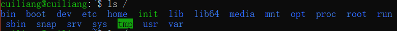
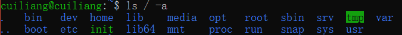
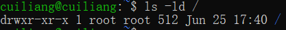

# 命令格式与ls
# 一、命令格式
格式：命令[-选项][参数]（例：ls -la /etc）

说明：

个别命令使用不遵循此格式

当有多个选项时，可以写在一起

简化选项与完整项 （-a等于--all）

# 二、命令介绍
命令名称：ls

命令英文原意：list

命令所在路径：/bin/ls

执行权限：所有用户

功能描述：显示目录文件

语法：

ls选项[-ald][文件或目录]

+ -a显示所有文件，包括隐藏文件
+ -I详细信息显示
+ -d查看目录属性

# 三、操作实例
+ 白色：表示普通文件
+ 蓝色：表示目录
+ 绿色：表示可执行文件
+ 红色：表示压缩文件
+ 浅蓝色：[链接文件](https://www.baidu.com/s?wd=%E9%93%BE%E6%8E%A5%E6%96%87%E4%BB%B6&tn=SE_PcZhidaonwhc_ngpagmjz&rsv_dl=gh_pc_zhidao)
+ 红色闪烁：表示链接的文件有问题
+ 黄色：表示设备文件
+ 灰色：表示其他文件
1. 显示/目录文件

2. 显示所有文件，包括隐藏文件（linux中.开头的文件都是隐藏文件）

3. 显示文件详细信息

+ drw-r--r--:
+ -文件类型（-二进制文件   d目录  l软链接文件）

| rw- | r-- | r-- |
| --- | --- | --- |
| u | g | o |
| u所有者 | g所属组 | o其他人 |
| r读 | w写 | x执行 |

+ 1：引用计数，记录被调用了几次
+ root root：（用户分类：所有者u、所属组g、其他人o）
+ 512 文件大小（单位字节）
+ 日期：最后修改时间
4. 人性化显示文件详细信息（显示文件大小）

5. 显示目录的详细信息

6. 显示节点号

 

