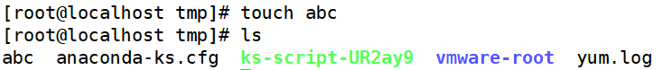
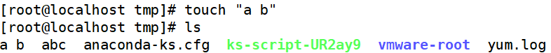
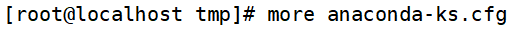
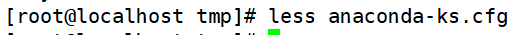
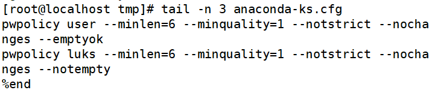
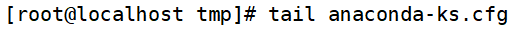
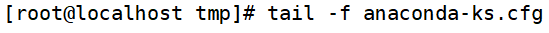

# 文件处理命令

> 分类: Linux > 常用命令
> 更新时间: 2026-01-10T23:34:42.577239+08:00

---

| 功能 | 命令 | 选项 |
| --- | --- | --- |
| 创建空文件 | touch |   |
| 显示文件内容 | cat | -n显示行号  |
| 显示文件内容（反向列示） | tac |   |
| 分页显示文件内容 | more | ①（空格）或f     翻页 ②(Enter)     换行 ③q或者Q   退出 |
| 分页显示文件内容（可向上翻页） | less | ①(空格) 或f 翻页 ②(Enter)     换行   ③q或者Q 退出 |
| 显示文件前几行 | head | -n指定行数 |
| 显示文件后几行 | tail | ①-n  指定行数 ②-f  动态显示文件末尾内容 |

# 一、创建空文件
命令名称：**touch**

命令所在路径：/bin/touch

执行权限：所有用户

语法：touch[文件名]

功能描述：创建空文件

范例：$touch       Japanlovestory.list

# 二、显示文件内容
命令名称：**cat**

命令所在路径：/bin/cat

执行权限：所有用户

语法：cat[文件名]

功能描述：显示文件内容  -n显示行号

范例：①$cat /etc/issue②$cat-n /etc/services

# 三、显示文件内容（反向列示）
命令名称：**tac**

命令所在路径：/usr/bin/tac

执行权限：所有用户

语法：tac[文件名]

功能描述：显示文件内容（反向列示）

范例：$ tac /etc/issue

# 四、分页显示文件内容
命令名称：**more**

命令所在路径：/bin/more

执行权限：所有用户

语法：more[文件名]

| （空格）或f | 翻页 |
| --- | --- |
| (Enter) | 换行 |
| q或者Q | 退出 |

功能描述：分页显示文件内容

范例：$more /etc/services

# 五、分页显示文件内容（可向上翻页）
命令名称：**less**

命令所在路径：/usr/bin/less

执行权限：所有用户

语法：less[文件名]

功能描述：分页显示文件内容（可向上翻页）

范例：$less /etc/services

# 六、显示文件前几行
命令名称：**head**

命令所在路径：/usr/bm/head

执行权限：所有用户

语法：head[文件名]

功能描述：显示文件前面几行   -n指定行数

范例：$ head-n 20       /etc/services

# 七、显示文件后几行
命令名称：**tail**

命令所在路径：/usr/bin/tail

执行权限：所有用户

语法：tail[文件名]

功能描述：显示文件后面几行

| -n | 指定行数 |
| --- | --- |
| -f | 动态显示文件末尾内容 |

范例：$tail -n 18       /etc/services

# 八、操作示例
创建一个文件

创建带空格的文件（不建议使用）

浏览短文件

浏览文件（显示行号）

反向显示文件

分页显示文件（向下翻页）

分页显示文件（向上翻页）

查看文件前几行

默认查看文件前10行

查看文件后几行

默认查看文件后10行

动态显示文件信息（日志文件实时变化）

 

