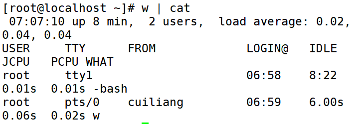

# 用户管理命令
| 功能 | 命令 |
| --- | --- |
| **添加新用户** | **useradd** |
| **设置用户密码** | **passwd** |
| **查看登录用户信息** | **who** |
| **查看登录用户详细信息** | **w** |

# 一、添加新用户
1. 命令名称：**useradd**
2. 命令所在路径：/usr/sbin/useradd
3. 执行权限：root
4. 语法：useradd 用户名
5. 功能描述：添加新用户
6. 范例：$useradd yangmi

# 二、设置用户密码
1. 命令名称：**passwd**
2. 命令所在路径：/usr/bin/passwd
3. 执行权限：所有用户
4. 语法：passwd 用户名
5. 功能描述：设置用户密码
6. 范例：$passwd yangml

# 三、查看登录用户信息
1. 命令名称：**who**
2. 命令所在路径：/usr/bin/who
3. 执行权限：所有用户
4. 语法：who
5. 功能描述：查看登录用户信息
6. 范例：$who

# 四、查看登录用户详细信息
1. 命令名称：**w**
2. 命令所在路径：/usr/bin/w
3. 执行权限：所有用户
4. 语法：W
5. 功能描述：查看登录用户详细信息
6. 范例：$w

# 五、操作示例
添加新用户名

设置用户密码

查看当前登录用户（tty本地登录、pts远程登录）

查看登录详细信息

 

 

