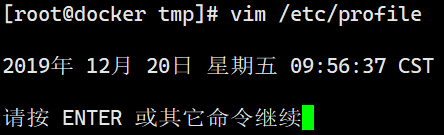
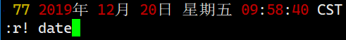

# Vim常用技巧

> 分类: Linux > 文本编辑器vim
> 更新时间: 2026-01-10T23:34:43.991222+08:00

---

## 一、vim文件冲突

+ 说明异常退出，上次编辑文件后没保存文件就被关闭了。此时可以直接输出D，删除交换文件直接进入。或者直接删除.Dockerfile.swp文件。

## 二、在指令模式下执行命令
:！命令 ，如:！date将日期显示在vim底部，:！ls列出当前目录

## 三、光标下方导入命令执行结果:
+ :r！命令

## 四、可视块操作：
### 1. 批量添加注释
按 Ctrl + v 进入列选择模式，上下键选择修改的行，然后按 I，进入列插入状态，输入#，再按下 ESC，你会看到，所有行之前都出现了一个#：

### 2. 批量删除注释
按 Ctrl + v 进入列选择模式，上下键选择修改的行，然后按del键，所有行之前的#都删除：

## 五、替换
### 1. 把空格替换为换行
:%  s/ /\r/g

### 2. 把空行删除
:g/^$/d

