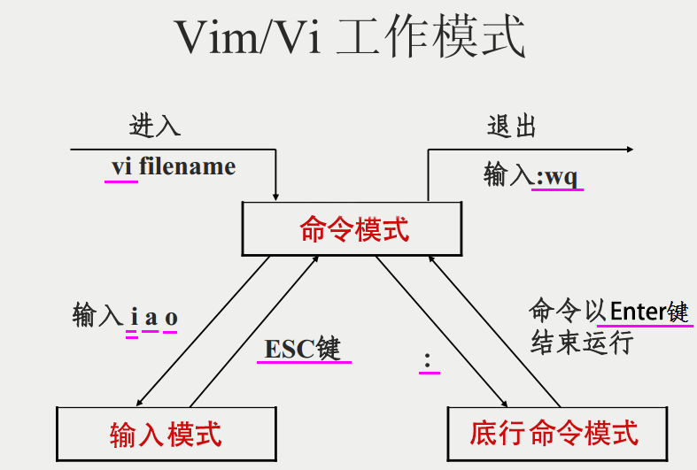

# Vim常用操作
## 一、Vim简介
Vim是一个功能强大的全屏幕文本编辑器，是Linux/UNlX上最常用的文本编辑器，它的作用是建立、编辑、显示文本文件。

**Vim****没有菜单，只有命令。**

+ **最小安装****没有****vim****编辑器，执行****yum -y install vim****安装**

## 二、Vim工作模式

+ 命令模式：VIM 的默认模式，可以用于移动游标查看内容；

+ 编辑模式：按下 "i" 等按键之后进入，可以对文本进行输入、退格等操作；

+ 底行命令模式：按下 ":" 按键之后进入，用于保存退出等操作。

## 三、翻页命令
| Ctrl+F | 下翻整页 |
| --- | --- |
| Ctrl+B | 上翻整页 |
| Ctrl+D | 下翻半页 |
| Ctrl+U | 上翻半页 |

## 四、插入命令
| 命令 | 作用 |
| --- | --- |
| a | 在光标所在字符后插入 |
| A | 在光标所在行尾插入 |
| i | 在光标所在字符前插入 |
| I | 在光标所在行行首插入 |
| o | 在光标下插入新行 |
| O | 在光标上插入新行 |

## 五、定位跳转命令
| 命令 | 作用 |
| --- | --- |
| :set   nu | 设置行号 |
| :set nonu | 取消行号 |
| gg | 到第一行 |
| G | 到最后一行 |
| nG | 到第n行 |
| :n | 到第n行 |
| $ | 移至行尾 |
| ^ | 移至行首 |
| w | 移动到下一个单词 |

## 六、删除命令
| 命令 | 作用 |
| --- | --- |
| x | 删除光标所在字符处 |
| nx | 删除光标所在处后n个字符 |
| dd | 删除光标所在行到文件末尾内容 |
| dG | 删除光标所在行到文件末尾内容 |
| D | 删除光标所在处到行尾内容 |
| :n1,n2d | 删除指定范围的行 |

## 七、复制和剪切命令
| 命令 | 作用 |
| --- | --- |
| yy | 复制当前行 |
| nyy | 复制当前行以下n行 |
| dd | 剪切当前行 |
| ndd | 剪切当前行以下n行 |
| p、P | 粘贴在当前光标所在行下或行上 |

## 八、替换和撤销命令
| 命令 | 作用 |
| --- | --- |
| r | 取代光标所在处字符 |
| R | 从光标所在处开始替换字符，按esc结束 |
| u | 取消上一步操作 |
| U | 取消所有操作 |
| Ctrl+R | 对撤销操作恢复 |

## 九、搜索和搜索替换命令
| 命令 | 作用 |
| --- | --- |
| /string | 搜索指定字符串 搜索时忽略大小写：set ic |
| n | 搜索指定字符串的下一个出现位置 |
| N | 搜索指定字符串的上一个出现位置 |
| :%s/old/new/g | 全文替换指定字符串 |
| :n1，n2s/old/new/g | 在一定范围内替换指定字符串 |
| :noh | 取消查找高亮 |

## 十、保存和退出命令
| 命令 | 作用 |
| --- | --- |
| :w | 保存修改 |
| :w   new_dilename | 另存为指定文件 |
| :wq | 保存修改并退出 |
| ZZ | 快捷键，保存修改并退出 |
| :q！ | 不保存修改退出 |
| :e! | 撤销打开文件后编辑的内容 |

