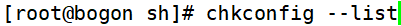

# 服务分类

> 分类: Linux > 服务管理
> 更新时间: 2026-01-10T23:34:53.278403+08:00

---

# 一、启动与自启动
1. 服务启动：就是在当前系统中让服务运行，并提供功能。
2. 服务自启动：自启动是指让服务在系统开机或重启动之后，随着系统的启动而自动启动服务。

# 二、查询已安装的服务
1. RPM包安装的服务
+ 查看服务自启动状态，可以看到所有RPM包安装的服务

1. 源码包安装的服务
+ 查看服务安装位置，一般是/usr/local/下

# 三、RPM安装服务和源码包安装服务的区别
1. RPM安装服务和源码包安装服务的区别就是安装位置的不同
2. 源码包安装在指定位置，一般是/usr/local/
3. RPM包安装在默认位置中

 

