# CA服务配置

> 分类: Linux > 服务部署
> 更新时间: 2026-01-10T23:34:58.920692+08:00

---

 

# 一、实验目的
1.  掌握CA自建、CA签署、证书吊销

# 二、实验内容
1.     CA服务器：实现证书签署请求和签发 ，同时也搭建DNS服务，实现域名解析

2.     dovecot邮件服务器：实现向CA中心请求签证。并搭建邮件服务，提供客户机访问。

3.     客户机：访问邮件服务器的邮箱服务

# 三、实验环境
| 功能 | IP | 安装软件 |
| --- | --- | --- |
| CA服务器、DNS服务器 | 192.168.10.100 | bind、bind-utils、bind-libs |
| dovecot邮件服务器 | 192.168.10.150 | postfix、dovecot |
| 客户机 | 192.168.10.200 | 邮件客户端软件mutt |

# 四、实验分析与设计思路
1.  实验思路

2.   CA自建

3.   CA签署

4.   加密交互

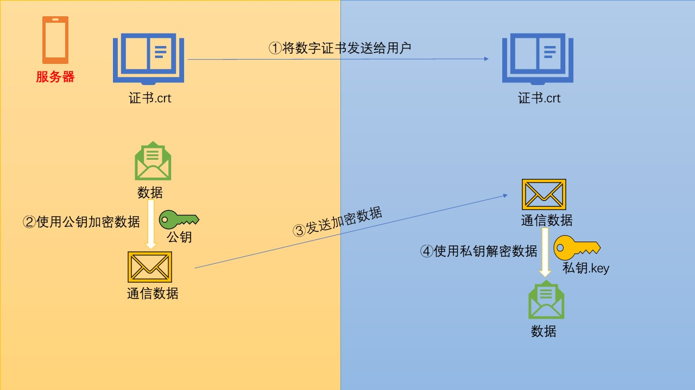

5.   证书吊销

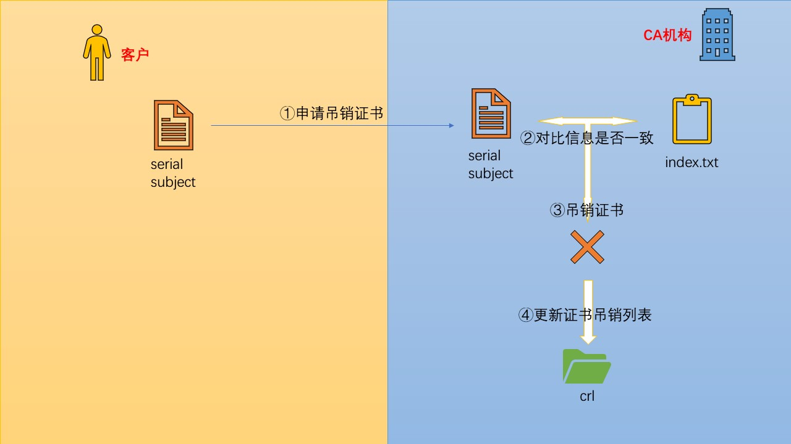

# 五、实验准备
1.   设置环境为同一网段

2.   关闭所有主机防火墙

3.   测试网络连通性

# 六、DNS服务器搭建
1.   安装软件包

2.   配置dns服务文件

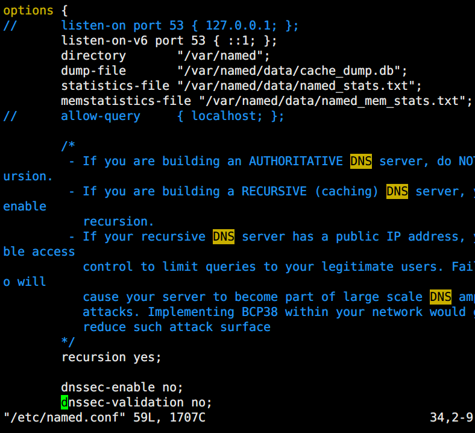

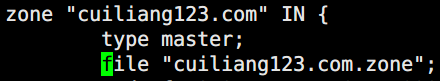

3.   开启服务

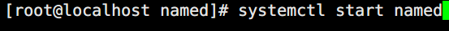

4.   验证结果

# 七、自建CA
1.   CA服务器进行生成秘钥

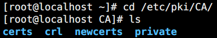

l  certs：证书存取库

l  crl：吊销列表

l  newcerts：新签署的证书

l  private：存放私钥

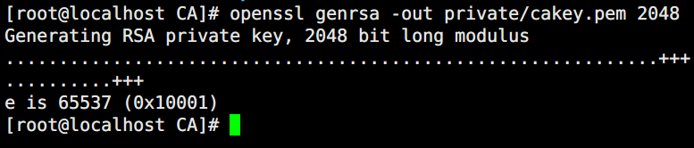

l  genrsa：用于生成 RSA 密钥对的 OpenSSL 命令。

l  -out：输出文件保存位置

l  2048:表示秘钥强度也可以使1024

2.   更改密钥权限

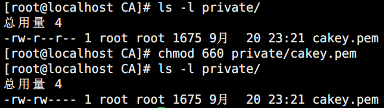

l  默认所属组和其他人有读权限，存在安全隐患，取消读权限

3.   CA方自己为自己签署根证书

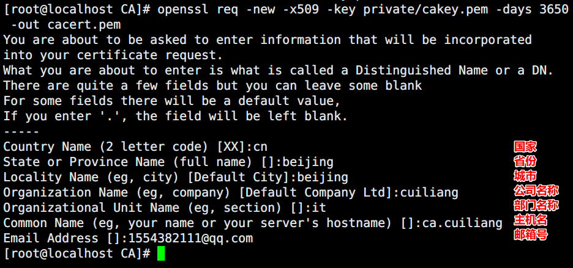

l  req：生成证书请求和生成自签名证书

l  -new：生成新证书签署请求

l  -x509：专用CA生成自签证书

l  -key：生成请求时用到的私钥文件

l  -days：证书的有效期

l  -out /path ：证书的保存路径

4.   创建数据库索引文件以及序列号文件

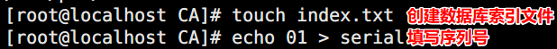

l  01表示生成的第一个证书id为01

l  index.txt用来存放相应序号对应的证书记录

# 八、CA签署
1.   请求方构建自己的私钥

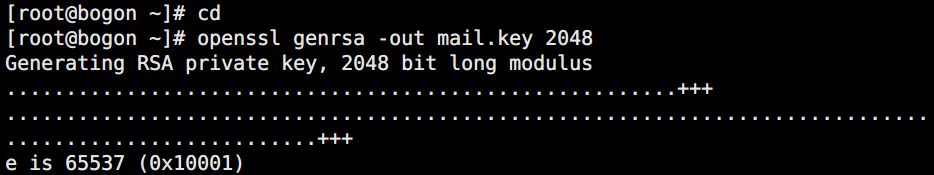

l  genrsa：用于生成 RSA 密钥对的 OpenSSL 命令。

l  -out：输出文件

l  2048:表示秘钥强度也可以使1024

2.   更改密钥权限

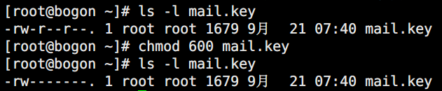

l  默认所属组和其他人有读权限，存在安全隐患，取消读权限

3.   提取公钥并生成证书申请请求文件

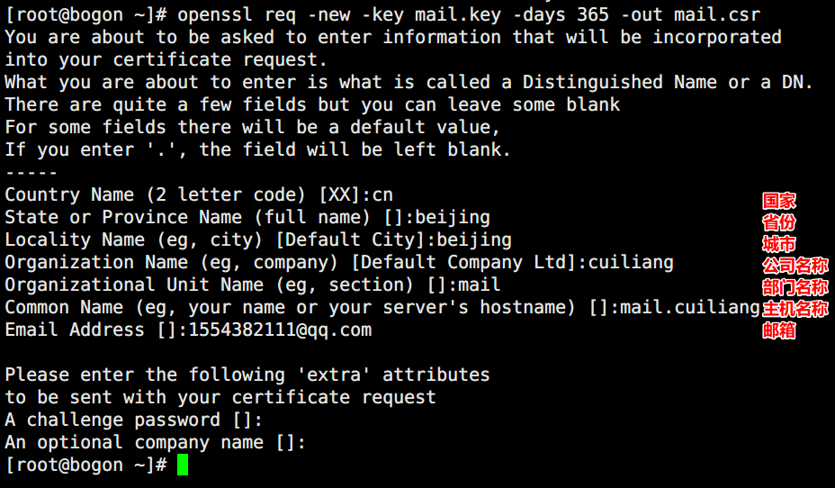

l  req：生成证书请求和生成自签名证书

l  -new：生成新证书签署请求

l  -key：生成请求时用到的私钥文件

l  -days：证书的有效期

l  -out /path ：证书的保存路径

4.   将证书申请请求文件发往CA方，让其签署

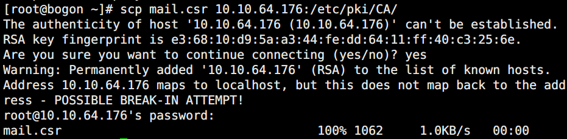

l  scp命令格式：scp 文件路径 接收方ip:路径

5.   查看自己的序列号和数据序列文件

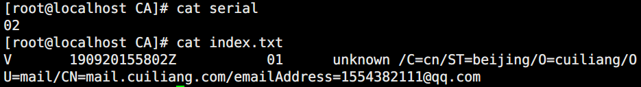

6.   CA服务器端查看请求方的证书请求文件并签署

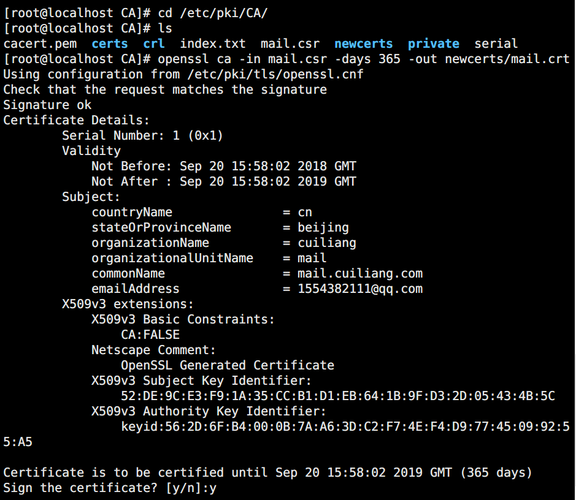

l  ca：签署证书

l  -in：证书请求签署文件

l  -out：签发后的证书文件

l  -days：证书有效天数

7.   将已经签署的证书发还给请求方

8.   请求方验证证书内容，将其证书放置在自己的SSL会话对应的配置文件目录即可发布证书。

# 九、邮件服务搭建与验证
1.   安装相关软件包

2.   配置相关文件

3.  证书和邮件服务的私钥移动到上述指定的位置，并将之前的旧证书删除

4.   开启服务

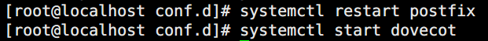

5.   客户端安装软件包

6.   客户端进行相关配置

l  mkdir /root/.mutt

l  cd /root/.mutt

l  vim muttrc

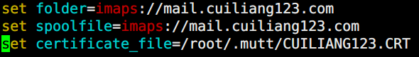

7.   进行验证

# 十、证书吊销
1.   在客户端获取要吊销的证书的serial 与subject信息

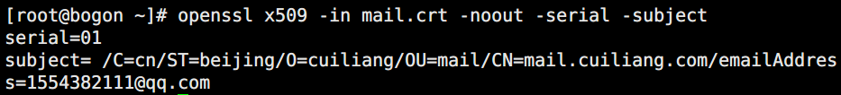

2.   在CA上，根据客户提交的serial与subject信息，对比检验是否与index.txt文件中的信息一致，一致吊销证书

3.   证书吊销

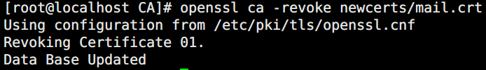

4.   生成吊销证书的编号（第一次吊销）

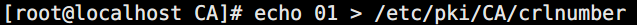

5.   更新证书吊销列表

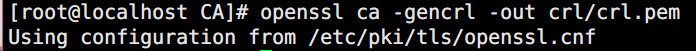

6.   查看吊销文件

# 十一、        实验总结
1.   CA自建证书与CA签署证书中的国家、省份、城市、公司名称必须一致，否则无法通过

