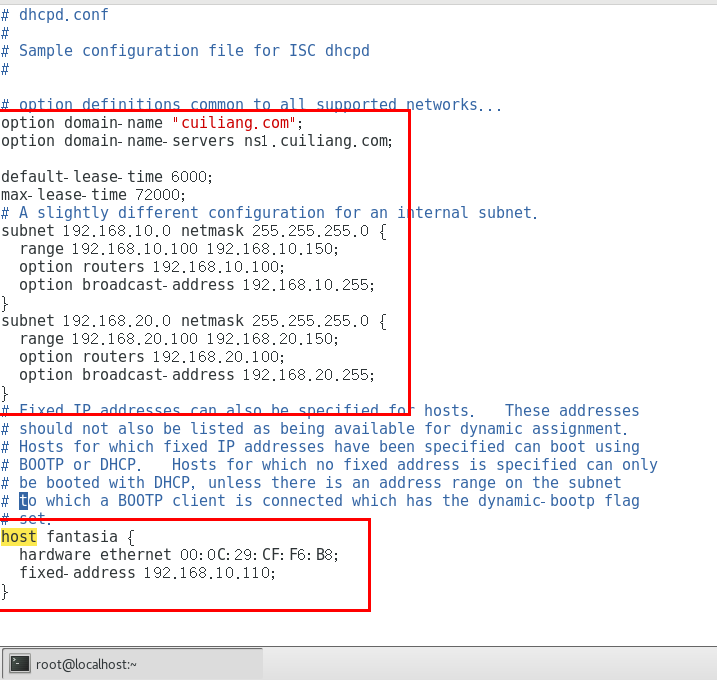
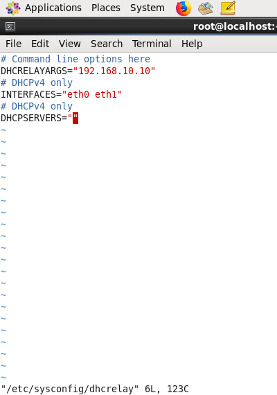
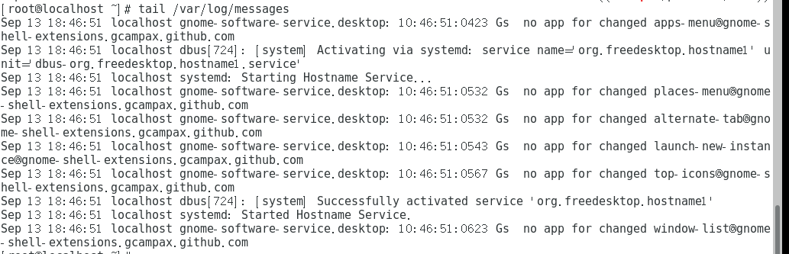
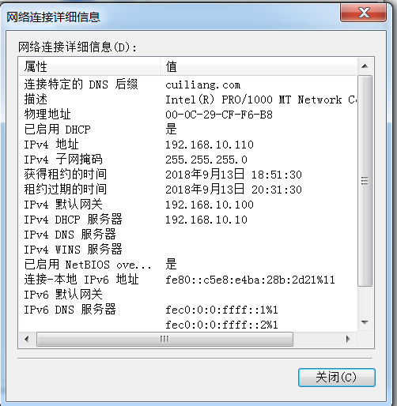
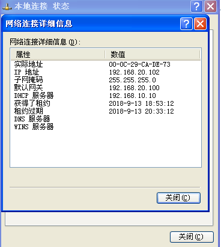

# DHCP中继服务配置

> 分类: Linux > 服务部署
> 更新时间: 2026-01-10T23:34:58.151789+08:00

---

# 一、实验目的
1.  掌握跨网段DHCP服务器中继的基本配置

# 二、实验内容
1.  DHCP服务器对应主机IP为192.168.10.10

2.  网段1为192.168.10.0/24；

网段2为192.168.20.0/24

3.  每个用户默认租约为6000秒，最长为72000秒

4.  要分配的IP只有192.168.10.100到192.168.10.150；

以及192.168.10.100到192.168.10.150

5.  有一台windows电脑，设置其主机IP固定为192.168.10.111

# 三、实验环境与准备
1.  centos7主机一台作为DHCP服务器

2.  centos6主机一台作为DHCP中继服务器

3.  10网段客户机：1台windows7客户机、1台centos7客户机

4.  20网段客户机：1台windowsxp客户机、1台centos6客户机，

# 四、实验分析与设计思路
1.   网络拓扑图

2.   实验思路

# 五、实验准备
1.  设置两个不同网段

2.  关闭所有主机防火墙

3.  指定DHCP服务器地址

4.  指定DHCP中继器地址

5.  开启中继模式

6.  测试网段连通

①  Ping同一网段

②  Ping不同网段

# 六、实验过程
1.  安装DHCP相关软件

2.  配置DHCP文件

①  配置DHCP服务文件

②  配置DHCP中继文件

3.  启动DHCP相关服务

①  启动DHCP服务

②  启动DHCP中继服务

# 七、实验结果及分析
1.  查看服务器端口信息

2.  查看服务器日志信息

3.  查看客户机IP信息

①  10网段centos7

②  10网段windows7

③  20网段centos6

④  20网段windowsxp

 

# 八、总结
1.  本次实验的前提是不同网段通过中继可以通信，使用中继模式需要开启核心转发功能  echo "1" > /proc/sys/net/ipv4/ip_forward

2.  中继DHCP配置文件中， DHCRELAYARGS字段输入的是DHCP服务器的ip地址

3.  开启中继的命令为dhcrelay DHCP服务器的ip地址

