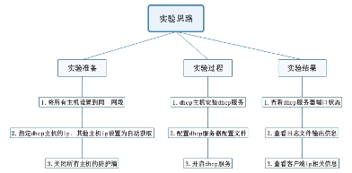
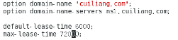
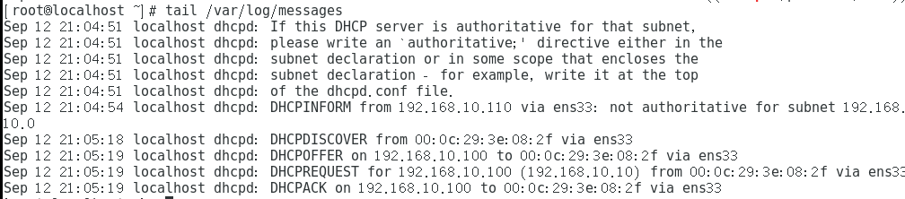
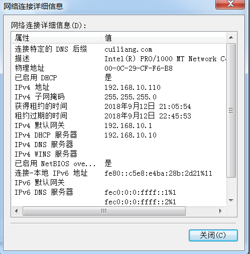
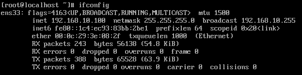

# DHCP服务配置

> 分类: Linux > 服务部署
> 更新时间: 2026-01-10T23:34:58.042145+08:00

---

****

# 一、 实验目的
1.掌握DHCP服务器的基本配置

# 二、实验内容
1. dhcp服务器对应主机ip为192.168.10.10

2. 内部网段为192.168.10.0/24

3. 每个用户默认租约为6000秒，最长为72000秒

4. 要分配的ip只有192.168.10.100到192.168.10.150

5. 有一台windows电脑，设置其主机ip固定为192.168.10.110

# 三、实验环境与准备
1. centos7主机一台作为dhcp服务器

2. 1台centos7客户机，1台centos6客户机，1台windows客户机

3. 6台电脑连接到同一局域网

# 四、实验分析与设计思路

# 五、主要实验过程
1. 实验准备

① dhcp主机ip配置

② 其他客户机设置

2. 实验过程

①dhcp主机安装dhcp服务

②配置dhcp文件

③启动dhcp服务

# 六、实验结果及分析
**   **①查看服务器端口信息

②查看服务器日志信息

③查看客户机ip信息

# 七、总结
   在本次实验中，实验过程很顺利，一次性做出了正确的结果，本次实验的关键在于/etc/dhcp/dhcpd.conf文件的配置。

