# DNS服务配置

> 分类: Linux > 服务部署
> 更新时间: 2026-01-10T23:34:58.260466+08:00

---

****

# 一、实验目的
1.  掌握缓存DNS服务、主DNS服务器、正向解析、反向解析、主从解析、子域授权、DNS转发器、访问控制、bind视图的相关操作

# 二、实验内容
1.  搭建一台缓存DNS服务器。

2.  搭建一台主DNS服务器，实现正向反向解析。

3.  搭建一台子域DNS服务器。

4.  搭建一台DNS转发器。

5.  实现访问控制、bind视图。

# 三、实验环境
1.  主DNS服务器mini centos7 ip为192.168.10.30

2.  从DNS服务器centos6 ip为192.168.10.20

3.  子域DNS服务器centos7克隆1 ip为192.168.10.10

4.  缓存DNS服务器有两块网卡，ip地址分别为192.168.10.100、10.10.64.225，并开启路由转发功能

5.  客户机1mini centos6 ip为192.168.10.40

6.  客户机2mini centos6克隆1 ip为10.10.64.212

# 四、实验分析与设计思路
1.   网络拓扑图

2.   实验思路

# 五、实验准备
1.   关闭所有主机防火墙

2.   测试网络连通性

3.   安装相关软件包

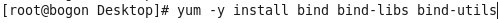

# 六、正向解析
1.   配置主DNS服务器主配置文件

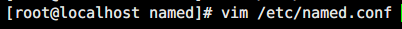

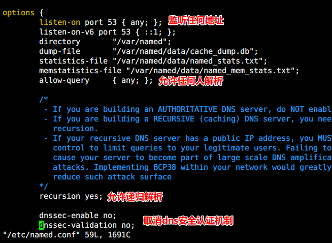

2.   配置主DNS服务器子配置文件

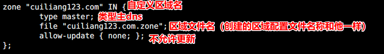

3.   配置主DNS服务器区域配置文件

4.   检查配置文件语法正确性

5.   开启服务

6.   查看端口状态

7.   客户机使用dig命令验证

# 七、反向解析
1.   配置主DNS服务器子配置文件

2.   配置主DNS服务器反向解析区域配置文件

3.   客户机使用dig命令验证

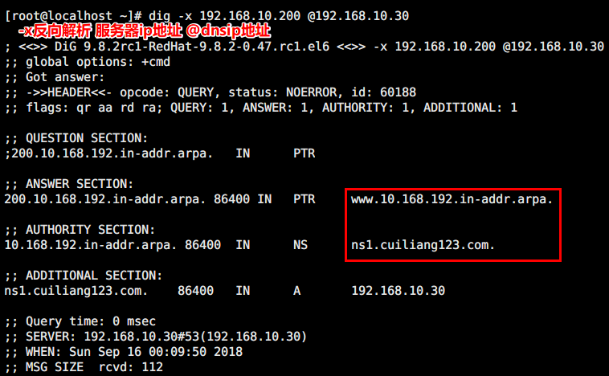

# 八、主从解析
1.   配置从DNS服务器主配置文件

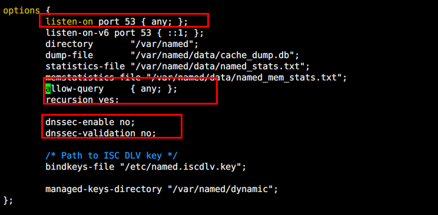

2.   配置从DNS服务器子配置文件

3.   配置主DNS服务器区域配置文件

4.   客户机使用dig命令验证

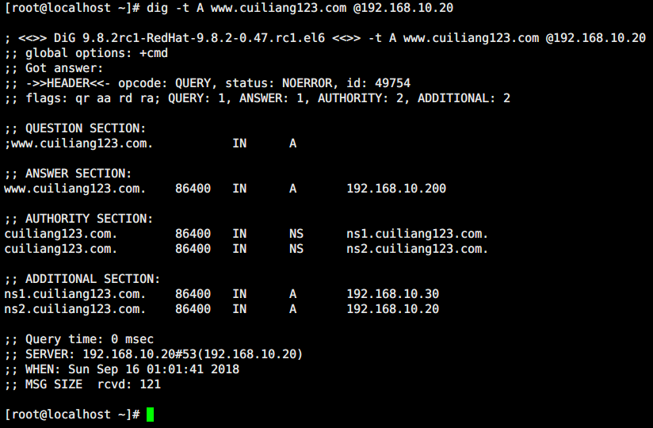

# 九、子域授权
1.   配置主DNS服务器区域配置文件

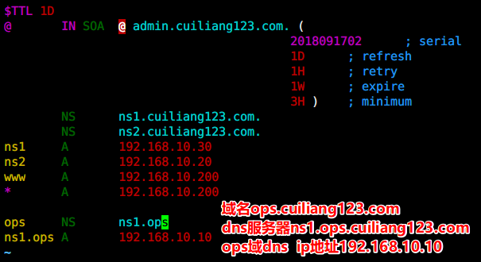

2.   配置子域DNS服务器子配置文件

3.   配置子域DNS服务器区域配置文件

4.   客户机使用dig命令验证

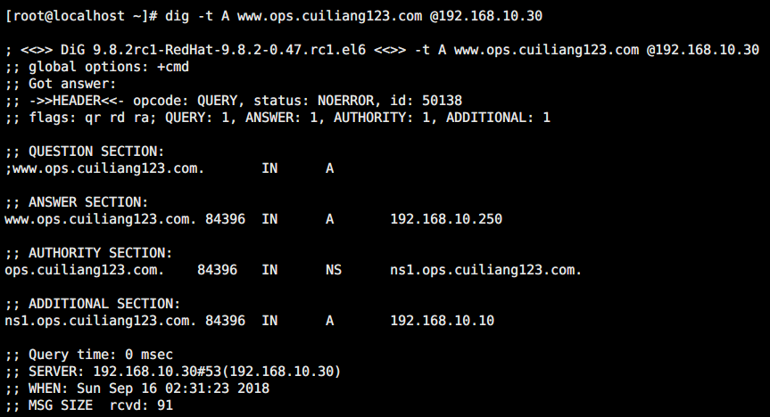

l  父域服务器可以解析子域，子域服务器不能解析父域

# 十、DNS转发器
1.   配置DNS转发器主配置文件（设置为缓存DNS服务器）

2.   配置主DNS服务器主配置文件

3.   配置子域DNS服务器子配置文件

4.   客户机使用dig命令验证

# 十一、        访问控制
1.   配置主DNS服务器主配置文件

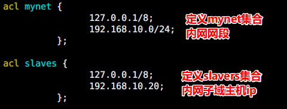

2.   客户机使用dig命令验证

①   默认允许任何主机递归，外网主机可以使用DNS递归查询

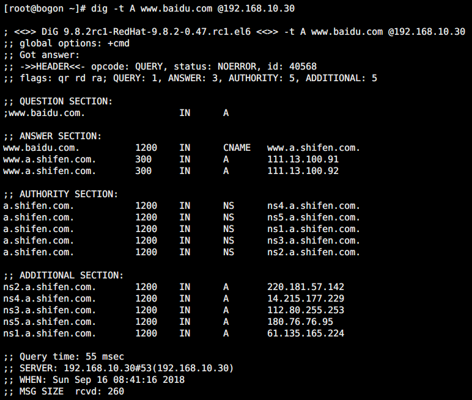

②   设置ACL后，内网主机仍然可以递归，外网主机不能递归

# 十二、        Bind视图
1.   配置主DNS服务器主配置文件（剪切根部分zone文件）

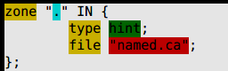

2.   配置主DNS服务器子配置文件

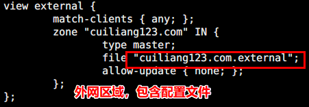

3.   配置主DNS服务器区域配置文件

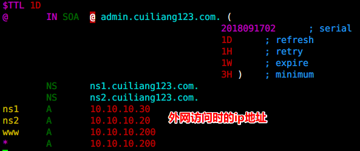

4.   客户机使用dig命令验证

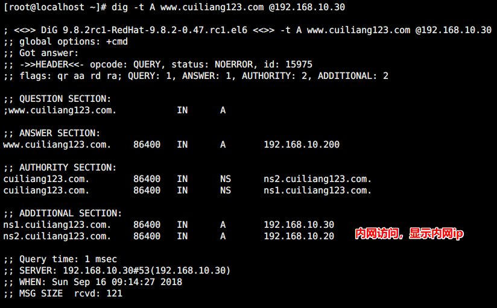

# 十三、        实验总结
## 1.   中继路由配置

