# HTTP服务配置
 

# 一、实验目的
1.  掌握缓存DNS服务、主DNS服务器的搭建

# 二、实验内容
1.  搭建一台缓存DNS服务器。

2.  搭建一台主DNS服务器。

# 三、实验环境
1.  缓存DNS服务器centos6对应主机ip为10.10.64.226

2.  主DNS服务器centos7对应主机ip为10.10.64.225

# 四、实验分析与设计思路
1.   网络拓扑图

2.   实验思路

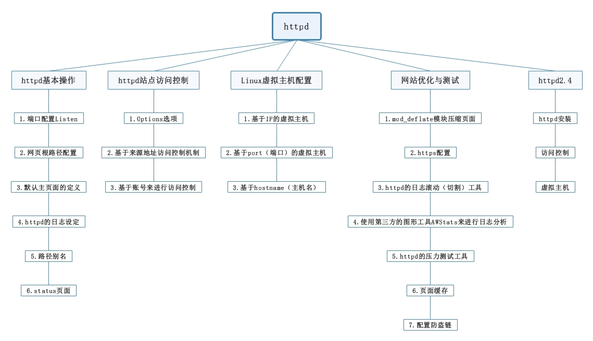

# 五、实验准备
1.  设置环境为同一网段，连接公网，DHCP获取ip

2.  关闭所有主机防火墙

3.  测试网络连通性

# 六、httpd基本操作
1.   端口、主机名配置

①   端口可以有多个，但前后要保持一致

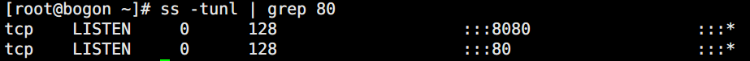

②   主机名只能有一个

2.   网站根路径配置

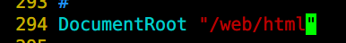

3.   主页面配置

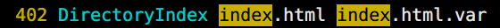

4.   日志配置

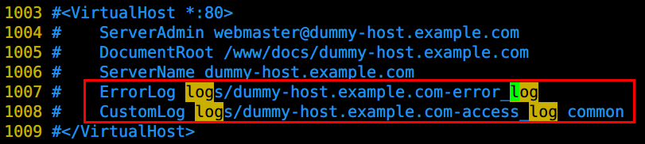

5.   路径别名

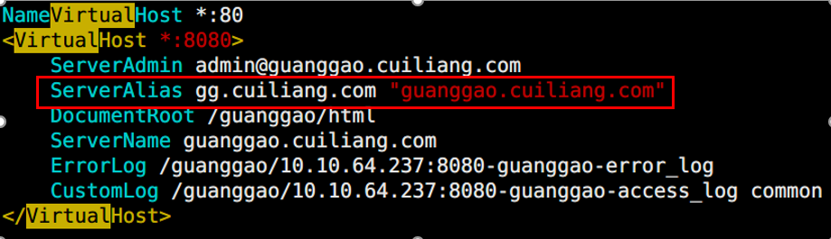

# 七、httpd站点访问控制
1.   options选项

l  Indexes 是设定是否允许在目录下面没有index.html 的时候显示目录

l  FollowSymLinks 决定是否可以通过符号连接跨越DocumentRoot

l  Indexes效果对比

|   | Indexes |
| :---: | --- |
| 开启 | 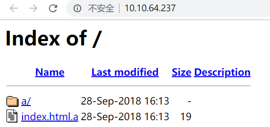 |
| 关闭 | 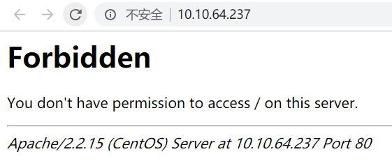 |

l  FollowSymLinks效果对比

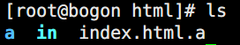

|   | FollowSymLinks |
| :---: | --- |
| 开启 | 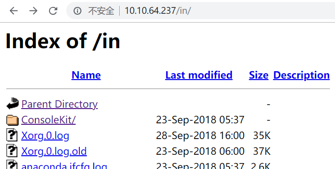 |
| 关闭 | 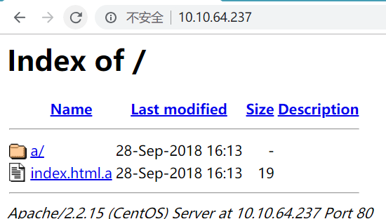 |

2.   来源地址访问控制

l  所有人都不可以，除了……

Order allow,deny

Allow from 

l  所有人都可以，除了……

          Order deny,allow

       Deny from

3.   账号访问控制

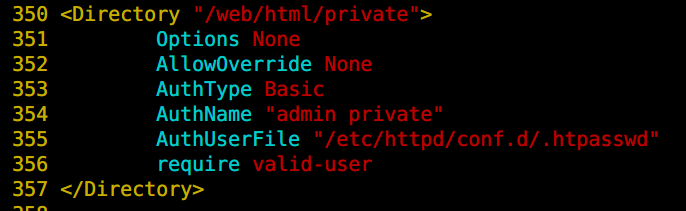

# 八、Linux虚拟主机配置
1.   基于ip虚拟主机

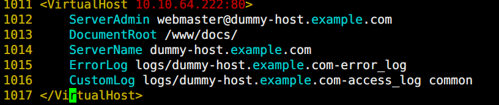

2.   基于端口虚拟主机

3.   基于主机名虚拟主机

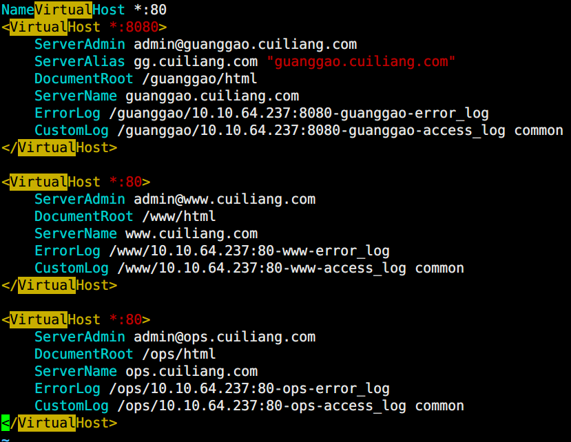

# 九、网站优化与测试
1.   mod_deflate模块压缩页面

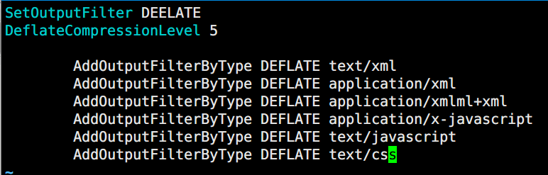

2.   https配置

①   自建CA

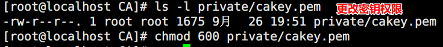

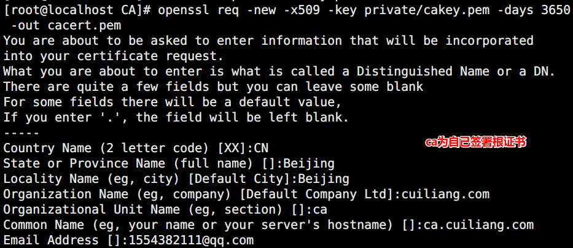

②   进行CA签名，获得证书

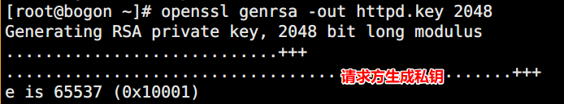

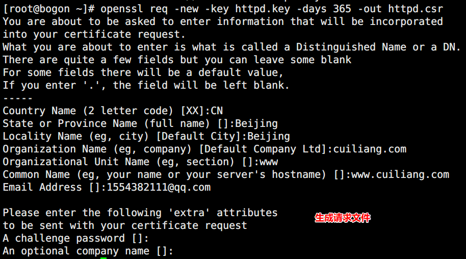

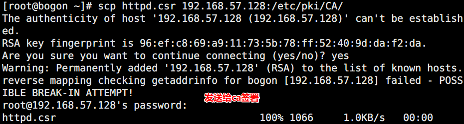

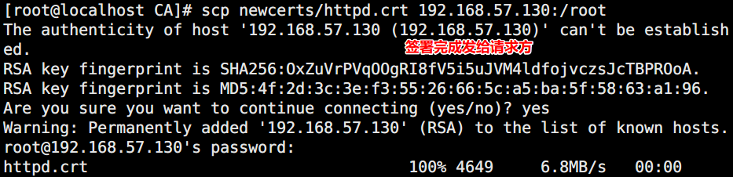

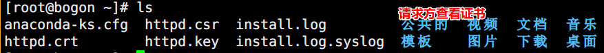

③   配置ssl

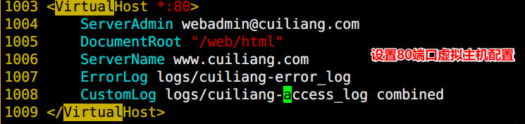

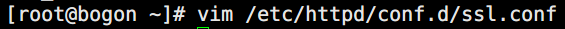

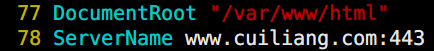

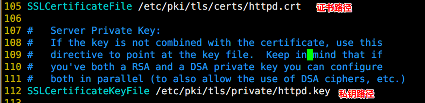

④   抓包工具模拟颁发证书

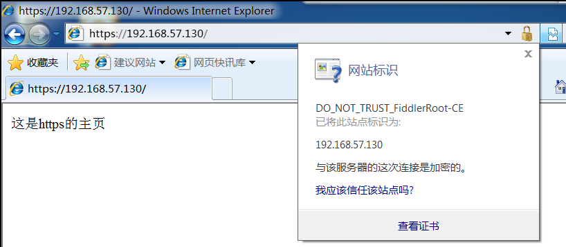

3.   httpd的日志滚动（切割）工具

①   编译安装cronolog

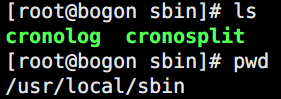

②   虚拟主机配置日志文件

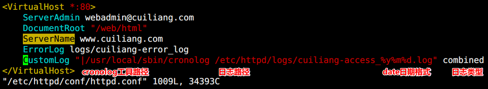

③   启动服务查看日志

④   更改日期，模拟第二天访问

4.   使用第三方的图形工具AWStats来进行日志分析

①   解压并查看相关配置文件信息

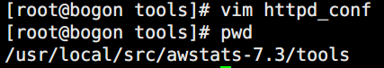

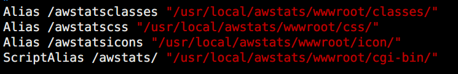

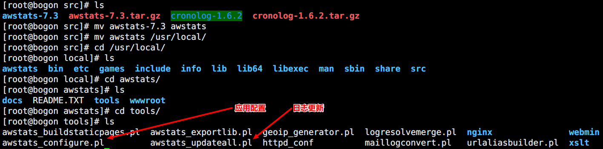

②   添加执行权限

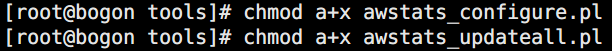

③   执行预配置脚本

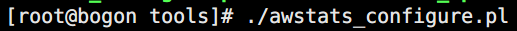

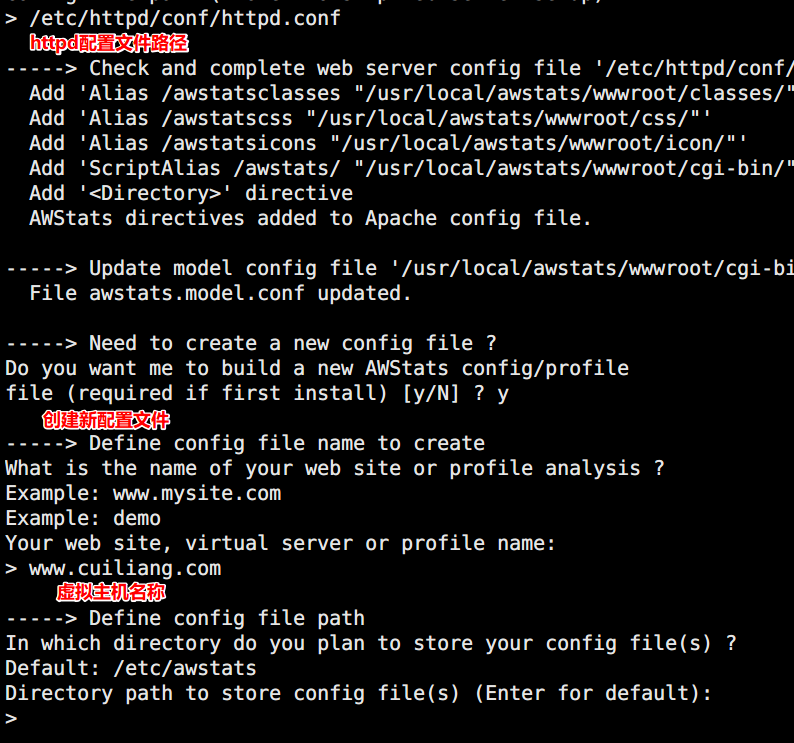

④   修改配置文件

http://localhost/awstats/awstats.pl?config=log.com

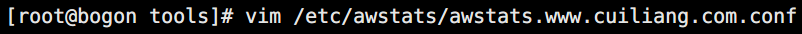

⑤   执行日志统计分析

⑥   浏览器访问分析工具

⑦   编写周期性计划任务，每5分钟读取刷新一次日志

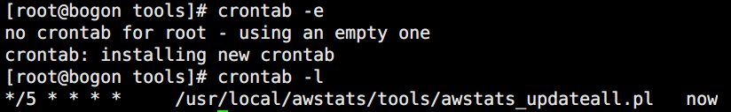

**在****IE****中打开：**[**http://192.168.1.124/awstats/awstats.pl?config=jzyuan.cn**](http://192.168.1.124/awstats/awstats.pl?config=jzyuan.cn)** ****报****error****：**

**You don't have permission to access /awstats/awstats.pl on this server.**

<Directory "/usr/local/awstats/wwwroot">

    Options None

    AllowOverride None

    Order allow,deny

    Allow from all

</Directory>

 

5.   httpd的压力测试工具

①   命令格式ab [opithon] URL（-n：总请求数 -c：模拟并发数 -k：以持久连接模式测试）

②   测试自建服务器

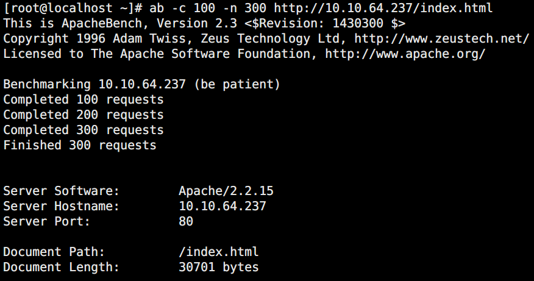

6.   Status页面

①   status页面作用：便于分析httpd服务器的进程状况、负载状况，方便管理员进行web服务器的管理和监控。

②   status页面定义方式：使用location容器进行定义，可以在中心主机，也可以在虚拟主机中进行定义。

7.   页面缓存

①   查看expires模块是否开启

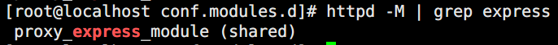

②   缓存定义在<IfModule></IfModule> 容器中（作用范围是全局）

③   访问站点，查看缓存信息

④   访问图片，查看缓存信息

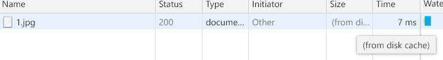

⑤   加入gif图片，查看缓存信息

8.   配置防盗链

①   查看rewrite模块是否开启

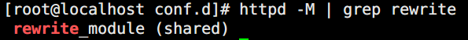

②   编写规则

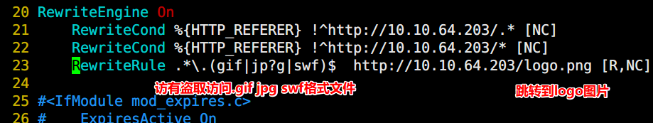

③   访问测试

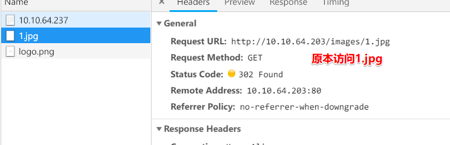

9.   隐藏版本号

①   默认显示详细信息，存在安全隐患

②   配置文件，隐藏版本号

l  语法：ServerTokens Major| Minor| Minimal| ProductOnly| Full   （默认为Full）

l  放在最外面，是全局设置

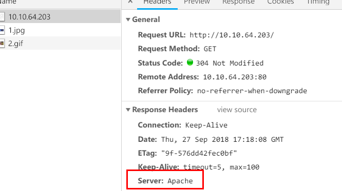

# 十、Httpd2.4新特性
1.   Httpd2.4安装

①   Centos7自带httpd2.4

②   Centso6需要源代码编译安装

l  安装httpd的依赖库程序和安装环境、编译工具

yum -y install pcre-devel openssl-devel perl gcc gcc-c++

l  编译1.4或以上版本的apr和apr-utils（编译到指定位置，防止和原版本的apr冲突）

./configure --prefix=/usr/local/apr && make && make install

./configure --prefix=/usr/local/apr-util --with-apr=/usr/local/apr/ && make && make install

./configure --prefix=/usr/local/apache --sysconf=/etc/httpd24 --enable-ssl --enable-cgi --enable-rewrite --with-zlib --with-pcre --with-apr=/usr/local/apr --with-apr-util=/usr/local/apr-util/ --enable-modules=most --enable-mpms-shared=all --with-mpm=prefork && make && make install

l  需要自行创建httpd的程序用户

useradd -r httpd      rm -rf /etc/httpd

l  相关配置文件路径

l  相关程序路径

l  脚本启停文件需自己编写，可从httpd服务指令文件拷贝进行自定义修改即可

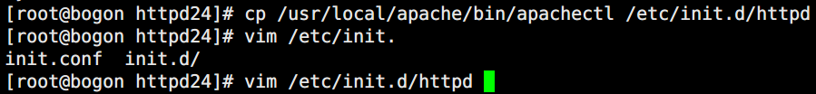 

     

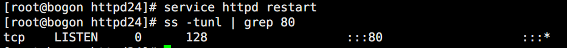

l  自定义环境变量，全局使用相关指令

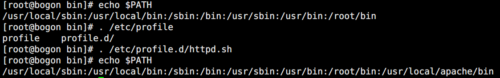

l  查看主页

2.   基本操作

①   更改MPM模型

l  MPM是apache的多道处理模块，用于定义apache对客户端请求的处理方式.在linux中apache常用的三种MPM模型分别是prefork、worker和event。默认prefork

l  改为event后查看进程信息

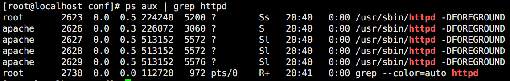

3.   访问控制

l  必须出现在Directory容器中

|   | 允许 | 拒绝 |
| --- | --- | --- |
| 所有 | Require all granted | Require all denied |
| 指定IP或网段 | Require ip xxx.xxx.xxx.xxx/xx | Require not ip xxx.xxx.xxx.xxx/xx |
| 特定主机 | Require host HOSTNAME | Require not host HOSTNAME |

 

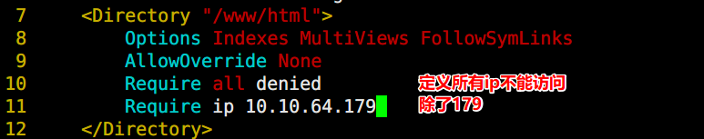

4.   虚拟主机

l  虚拟主机不再需要控制主配置文件的NameVirtualHost开关，

l  但需要额外注意包含关系  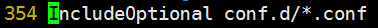

①   创建虚拟主机配置文件

②   编辑虚拟主机配置文件

 

