# LAMP搭建

> 分类: Linux > 服务部署
> 更新时间: 2026-01-10T23:34:59.375822+08:00

---

## 源码部署
### 实验内容
1.  搭建一个Discuz论坛。

2.  搭建一个phpMyAdmin工具。

### 实验环境
1.  LAMP服务器centos6对应主机ip为10.10.64.203

2.  客户机win10对应主机ip为10.10.64.197

### 实验分析与设计思路
1.   实验思路

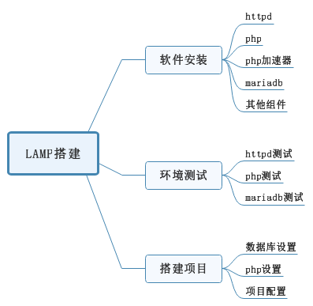

### 实验准备
1.   设置环境为同一网段，连接公网，DHCP获取ip

2.   关闭所有主机防火墙

3.   测试网络连通性

4.   搭建网络YUM仓库

### 软件安装
1.   Httpd安装

①   卸载自带httpd程序

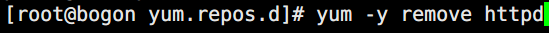

②   安装httpd的依赖库程序和安装环境、编译工具

2.   Php安装

3.   Php加速器安装

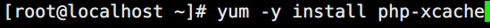

4.   Mariadb安装

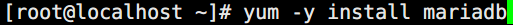

5.   其他组件安装

### 环境测试
1.   Httpd测试

①   开启主机名

②   编写测试页

③   访问测试

2.   Php测试

①   查看php和httpd的勾连

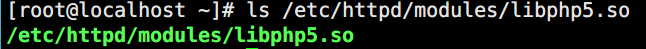

②   修改httpd主配置文件，让索引页支持php

③   编写PHP测试页，验证php和httpd的勾连

④   浏览器验证

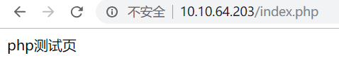

3.   Mariadb测试

①   修改主配置文件

②   启动mariadb服务

③   修改数据库账号密码

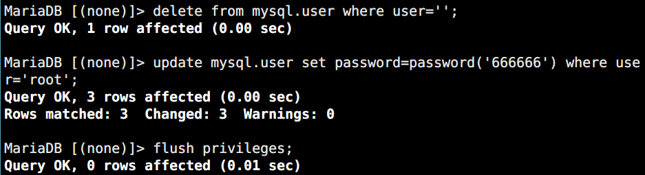

④   编写数据库测试页

⑤   访问验证

### 项目上线
1.   数据库设置

①   创建论坛数据表

②   创建论坛管理员用户

2.   Php设置

①   配置php主文件，使其支持短格式选项

 

3.   项目配置

①   论坛项目配置

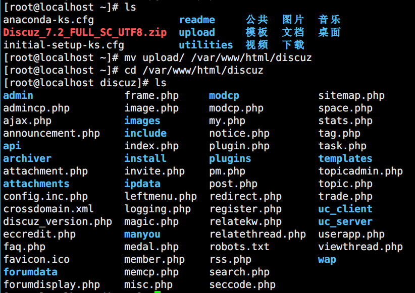

②   部署phpmyadmin

l  修改cookie随机数

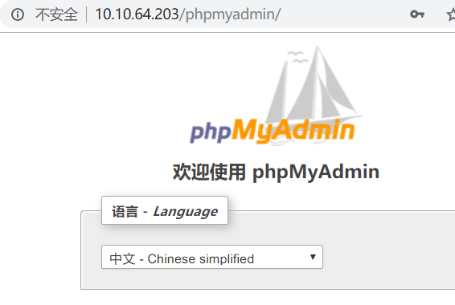

## yum部署

### 实验内容
1.  搭建一个Discuz论坛。

2.  搭建一个phpMyAdmin工具。

### 实验环境
1.  LAMP服务器centos7对应主机ip为10.10.64.203

2.  客户机win10对应主机ip为10.10.64.197

### 实验分析与设计思路
1.   实验思路

### 实验准备
1.   设置环境为同一网段，连接公网，DHCP获取ip

2.   关闭所有主机防火墙

3.   测试网络连通性

4.   搭建网络YUM仓库

### 软件安装
1.   Httpd安装

2.   Php安装

3.   Php加速器安装

4.   Mariadb安装

5.   其他组件安装

yum -y install mariadb-server mariadb php php-mysql mysql-devel php-mysql php-gd libjpeg* php-imap php-ldap php-odbc php-pear php-xml php-xmlrpc php-mbstring php-mcrypt php-bcmath php-mhash libmcrypt

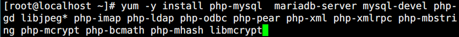

### 环境测试
1.   Httpd测试

①   开启主机名

②   编写测试页

③   访问测试

2.   Php测试

①   查看php和httpd的勾连

②   修改httpd主配置文件，让索引页支持php

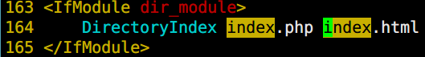

③   编写PHP测试页，验证php和httpd的勾连

④   浏览器验证

3.   Mariadb测试

①   修改主配置文件

②   启动mariadb服务

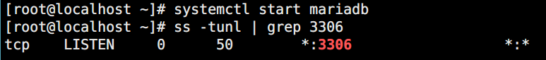

③   修改数据库账号密码

④   编写数据库测试页

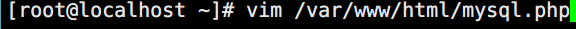

⑤   访问验证

### 项目上线
1.   数据库设置

①   创建论坛数据表

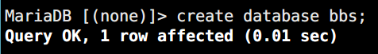

②   创建论坛管理员用户

2.   Php设置

①   配置php主文件，使其支持短格式选项

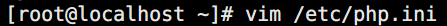

 

3.   项目配置

①   论坛项目配置

②   部署phpmyadmin

l  修改cookie随机数

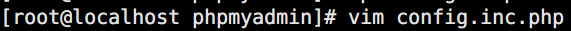

