# NFS服务器配置

# 一、实验目的
1.  掌握缓存DNS服务配置

# 二、实验内容
1.  构建两台web服务器，搭建基于LAMP架构的Discuz论坛，客户随机访问两台web服务器内容完全一致

# 三、实验环境
1.  Web1服务器centos7对应主机ip为10.10.64.193

2.  Web2服务器centos7对应主机ip为10.10.64.192

3.  Nfs、数据库服务器centos7对应主机ip为10.10.64.190

# 四、实验分析与设计思路
1.   网络拓扑图

2.   实验思路

# 五、实验准备
1.   设置环境为同一网段，连接公网，DHCP获取ip

2.   关闭所有主机防火墙

3.   测试网络连通性

# 六、软件安装
1.   Web1服务器安装httpd、php、其他组件

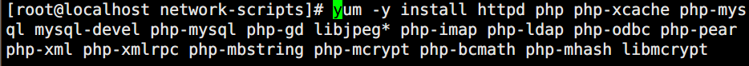

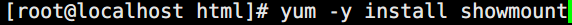

2.   Web2服务器安装httpd、php、其他组件

3.   nsf、数据库服务器安装mysql、nfs、其他组件

# 七、lamp架构搭建测试
1.   Httpd测试

①   开启主机名

 

②   编写测试页

③   访问测试

## 2.   Php测试
①   查看php和httpd的勾连

②   修改httpd主配置文件，让索引页支持php

③   编写PHP测试页，验证php和httpd的勾连

④   浏览器验证

## 3.   Mysql测试
①   修改主配置文件

②   启动mariadb服务

③   删除用户名为空的账号

④   修改数据库用户密码

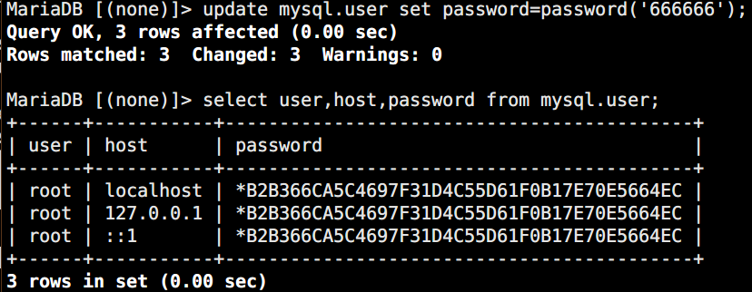

⑤   授权远程登录用户

⑥   Web服务器连接测试

⑦   编写数据库测试页

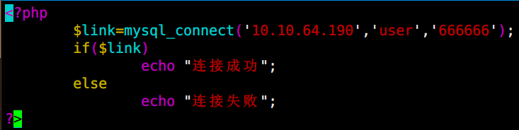

⑧   访问验证

# 八、Nfs搭建配置
## 1.   Nfs部署
①   启动服务

②   编辑/etc/exports配置文件

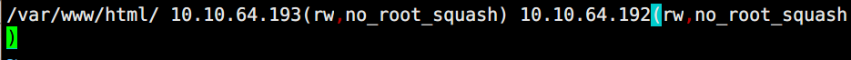

l  ①rw    指定的主机可读、可写

l  ②ro    指定的主机仅可读

l  ③async  异步访问 （这个选项可以改进性能，如果没有完全关闭NFS守护进程重启NFS服务器，可能会造成数据丢失，可不加）

l  ④root_squash：挤压root用户权限（默认开启的选项）

l  ⑤all_squash：挤压所有用户权限

③   创建nfs目录

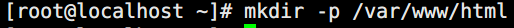

④   Web服务器端查询是否可以挂载

⑤   Web服务器挂载nfs目录

⑥   Web服务器验证

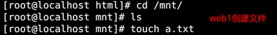

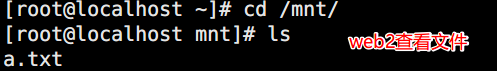

⑦   设置开机自动挂载

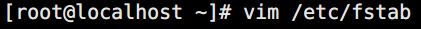

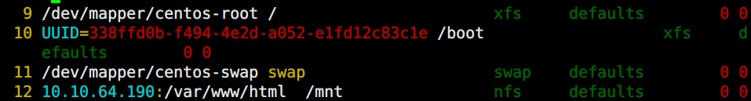

## 2.   修改web网站文件路径
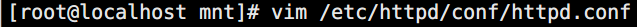

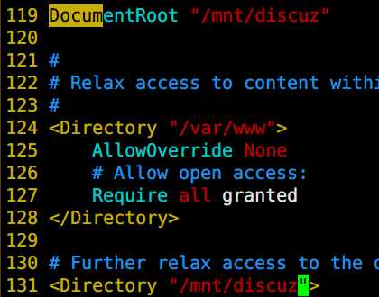

# 九、项目上线
## 1.   数据库配置
①   创建论坛数据表

②   创建论坛管理员用户

## 2.   php配置
①   配置php配置文件，使其支持短格式选项

## 3.   论坛其他相关配置

## 4.   进行验证

