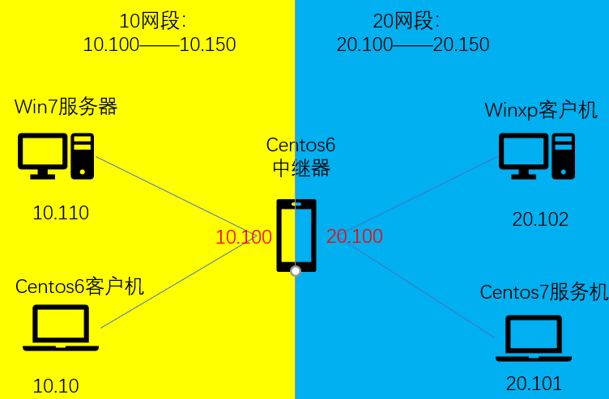
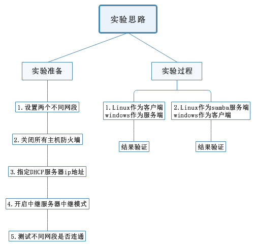
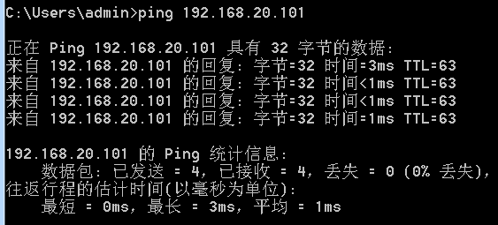
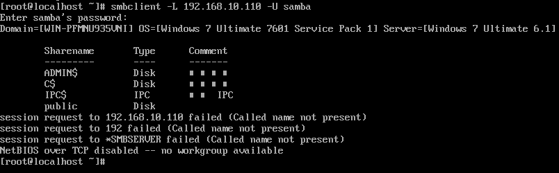
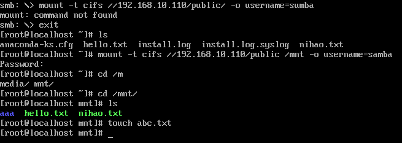
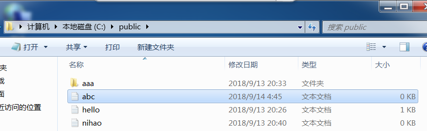
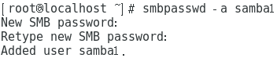
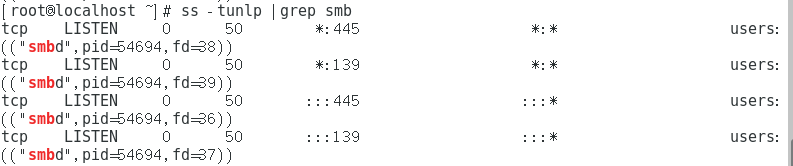
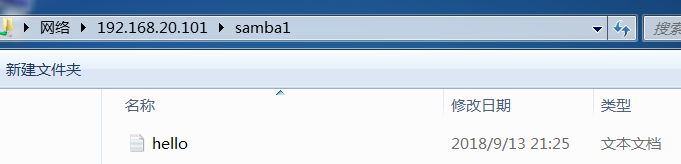

# SAMBA服务配置

> 分类: Linux > 服务部署
> 更新时间: 2026-01-10T23:34:58.486448+08:00

---

****

# 一、实验目的
1.  掌握跨网段SAMBA服务器中继的基本配置

# 二、实验内容
1.  内部网段1为192.168.10.0/24；内部网段2为192.168.20.0/24

2.  网段一：SAMBA服务器对应win7主机ip为192.168.10.110，

SAMBA客户机对应centos6主机ip为192.168.10.10

3.  网段二：SAMBA服务器对应centos7主机ip为192.168.20.101，

SAMBA客户机对应windowsxp主机ip为192.168.20.102

4.  进行正常的共享传输操作

# 三、实验环境与准备
1.  网段一：win7主机作为SAMBA服务器，

centos6主机作为SAMBA客户机

2.  网段二：centos7主机作为SAMBA服务器，

windowsxp主机作为SAMBA客户机

3.  一台centos6中继服务器，连通两个网段

# 四、实验分析与设计思路
1.   网络拓扑图

2.   实验思路

# 五、实验准备
1.  设置两个不同网段

2.  关闭所有主机防火墙

3.  设置相关服务器IP地址

4.  指定中继器服务器地址

5.  开启中继模式

6.  测试网段连通

①  Ping同一网段

②  Ping不同网段

# 六、实验过程及结果
1.    Linux作为客户端，windows作为服务端

①   安装文件传输系统

②   安装samba客户端

③   Windows新建用户设置密码

④   Windwos设置文件共享

⑤   Centos6客户机探测有哪些可以共享的目录

⑥   客户端通过命令行访问共享目录

⑦   通过命令行上传下载文件

⑧   挂载共享目录到当前centos7客户机

2.    Linux作为服务端，windows作为客户端

①    安装samba服务端

②    创建共享用户

③    创建共享用户密码

④    启动samba服务

⑤    查看端口状态

⑥    Windows客户端访问共享目录

⑦    添加一个共享目录

⑧    设置临时用户权限

# 七、总结
1.  本次实验的重点在于配置文件的设置，以及用户权限的设置。

