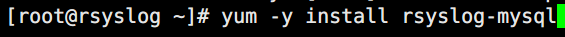
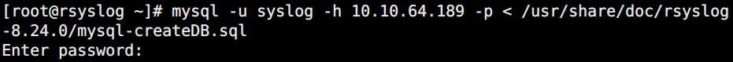
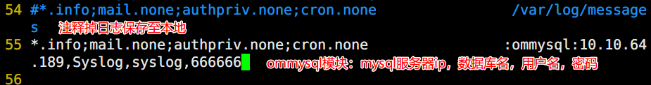
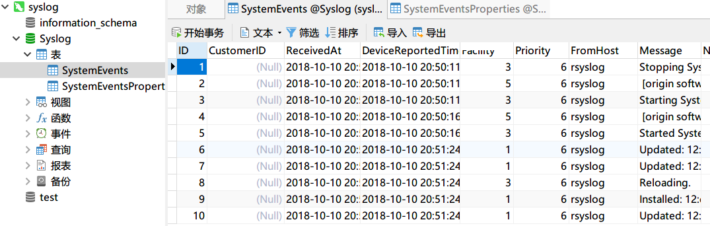
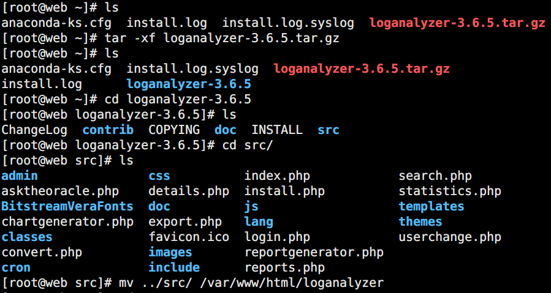
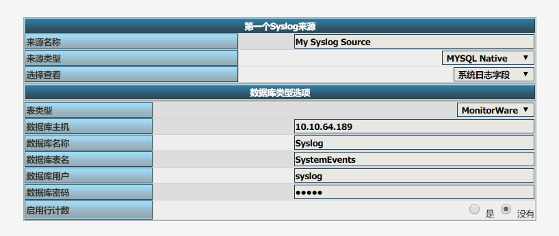
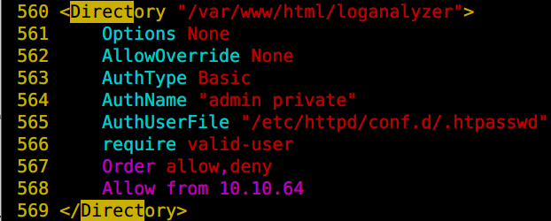
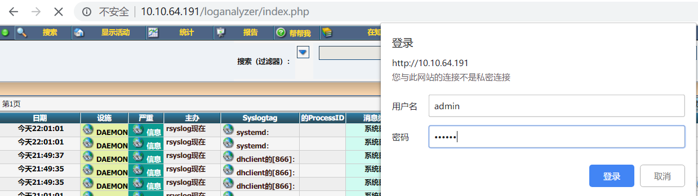
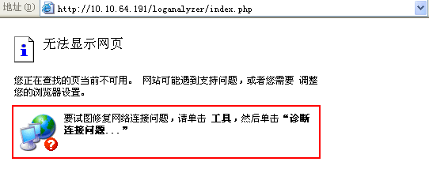

# rsyslog服务配置
# 一、实验目的
1.  掌握缓存RSYSLOG服务的相关配置

# 二、实验内容
1.  搭建一台RSYSLOG服务器。

2.  搭建一台mysql服务器。

3.  搭建一台web服务器。

4.  搭建一台测试服务器。

# 三、实验环境
1.  RSYSLOG服务器centos7对应主机ip为10.10.64.192

2.  mysql服务器centos7对应主机ip为10.10.64.189

3.  web服务器centos6对应主机ip为10.10.64.191

4.  测试服务器centos7对应主机ip为10.10.64.188

# 四、实验分析与设计思路
1.   网络拓扑图


2.   实验思路


# 五、实验准备
1.   设置环境为同一网段，连接公网，DHCP获取ip

2.   关闭所有主机防火墙

3.   测试网络连通性

# 六、服务单独记录
1. 安装软件包

```bash
[root@rsyslog ~]# dnf -y install rsyslog
```

2. 配置sshd主配置文件

```bash
[root@rsyslog ~]# vim /etc/ssh/sshd_config
# 注释原本的authpriv，使用自定义local
37 #SyslogFacility AUTHPRIV
38 SyslogFacility local2
```

3. 配置rsyslog主配置文件

```bash
[root@rsyslog ~]# vim /etc/rsyslog.conf
# 指定local2的日志写入/var/log/sshd.log文件中
66 local2.*                                                /var/log/sshd.log
```

4. 重启服务

```bash
[root@rsyslog ~]# systemctl restart sshd
[root@rsyslog ~]# systemctl restart rsyslog
```

5. 操作验证

```bash
[root@rsyslog ~]# cat /var/log/sshd.log
Oct 24 22:38:15 rsyslog sshd[64483]: Server listening on 0.0.0.0 port 22.
Oct 24 22:38:15 rsyslog sshd[64483]: Server listening on :: port 22.
Oct 24 22:38:58 rsyslog sshd[64780]: Failed password for root from 192.168.10.21 port 47972 ssh2
Oct 24 22:39:02 rsyslog sshd[64780]: Accepted password for root from 192.168.10.21 port 47972 ssh2
```

# 七、单独rsyslog服务器
1.   rsyslog服务器端操作

+ 修改配置rsyslog主配置文件

```bash
[root@rsyslog ~]# vim /etc/rsyslog.conf
# rsyslog服务开启TCP、UDP514端口监听
19 module(load="imudp") # needs to be done just once
20 input(type="imudp" port="514")
21 
22 # Provides TCP syslog reception
23 # for parameters see http://www.rsyslog.com/doc/imtcp.html
24 module(load="imtcp") # needs to be done just once
25 input(type="imtcp" port="514")
```

+ 重启rsyslog服务

```bash
[root@rsyslog ~]# systemctl restart rsyslog
```

+ 查看端口监听情况

```bash
[root@logstash ~]# ss -tunlp
Netid        State         Recv-Q        Send-Q               Local Address:Port               Peer Address:Port        Process                                    
udp          UNCONN        0             0                        127.0.0.1:323                     0.0.0.0:*            users:(("chronyd",pid=782,fd=5))          
udp          UNCONN        0             0                          0.0.0.0:514                     0.0.0.0:*            users:(("rsyslogd",pid=1922,fd=4))        
udp          UNCONN        0             0                            [::1]:323                        [::]:*            users:(("chronyd",pid=782,fd=6))          
udp          UNCONN        0             0                             [::]:514                        [::]:*            users:(("rsyslogd",pid=1922,fd=5))        
tcp          LISTEN        0             128                        0.0.0.0:22                      0.0.0.0:*            users:(("sshd",pid=777,fd=3))             
tcp          LISTEN        0             25                         0.0.0.0:514                     0.0.0.0:*            users:(("rsyslogd",pid=1922,fd=6))        
tcp          LISTEN        0             128                           [::]:22                         [::]:*            users:(("sshd",pid=777,fd=4))             
tcp          LISTEN        0             25                            [::]:514                        [::]:*            users:(("rsyslogd",pid=1922,fd=7))
```

2. 客户端操作配置rsyslog
+ 修改配置rsyslog主配置文件

```bash
[root@tiaoban ~]# vim /etc/rsyslog.conf
# 默认日志记录在/var/log/messages下，改为发送到rsyslog服务器
46 #*.info;mail.none;authpriv.none;cron.none                /var/log/messages
47 *.info;mail.none;authpriv.none;cron.none                @192.168.10.21
```

+ 重启rsyslog服务

```bash
[root@tiaoban ~]# systemctl restart rsyslog
```

3. 操作验证
+ rsyslog服务端记录了客户端的日志

```bash
Oct 24 22:50:06 tiaoban systemd[1]: nginx.service: Unit cannot be reloaded because it is inactive.
Oct 24 22:50:07 tiaoban systemd[1]: Started /usr/bin/systemctl start man-db-cache-update.
Oct 24 22:50:07 tiaoban systemd[1]: Starting man-db-cache-update.service...
Oct 24 22:50:07 tiaoban systemd[1]: Reloading.
Oct 24 22:50:08 tiaoban systemd[1]: man-db-cache-update.service: Succeeded.
Oct 24 22:50:08 tiaoban systemd[1]: Started man-db-cache-update.service.
Oct 24 22:50:08 tiaoban systemd[1]: run-reac9ba8499ab4b4e8e10b421f8400204.service: Succeeded.
```

# 八、数据库方式存储日志
1.   在rsyslog服务器上指定和数据库连接的模块




2.   mysql服务器创建用户并进行授权


3.   mysql主配置文件中跳过域名解析


4.   将数据库的模板库导入数据库服务器中




5.   配置rsyslog主配置文件添加连接MySQL数据库的模块




6.   操作验证



# 九、安装loganalyzer图形化工具
1.   rsyslog服务器上搭建PHP和HTTP


2.   配置httpd和php，解析PHP和连接MySQL测试


3.   将loganalyzer程序包进行解压



4.   通过浏览器进行安装Loganalyzer





5.   设置账号和ip访问控制








