# tomcat服务配置

> 分类: Linux > 服务部署
> 更新时间: 2026-01-10T23:34:59.258866+08:00

---

# 一、实验目的
1.  掌握tomcat服务的搭建

# 二、实验内容
1.  搭建一台缓存tomcat服务器。

# 三、实验环境
1.  tomcat服务器centos7对应主机ip为10.10.64.178

2.  客户机win7对应主机ip为10.10.64.227

# 四、环境搭建
1.   安装jdk

①  yum安装

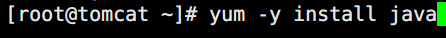

       ②  rpm安装

              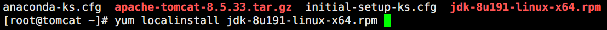

2.   安装tomcat

3.   配置环境变量

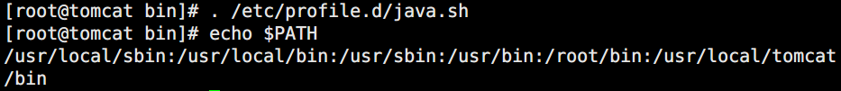

4.   检查配置文件语法

5.   启动服务

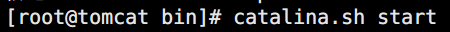

6.   访问验证

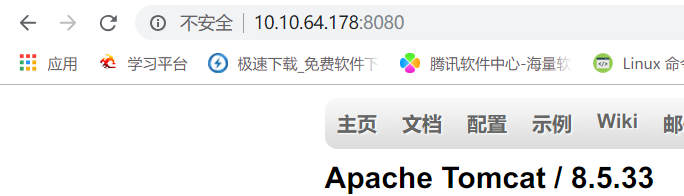

7.   查看文件树

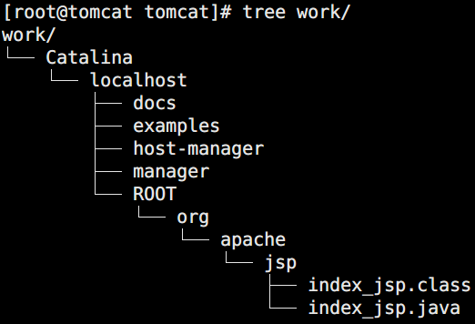

# 五、部署第一个web应用
1.   在webapps文件夹下创建项目目录

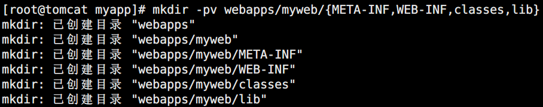

2.   在项目文件夹下编写测试页

3.   访问测试

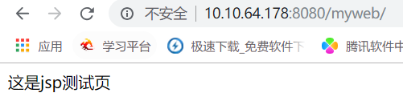

4.   查看work文件树

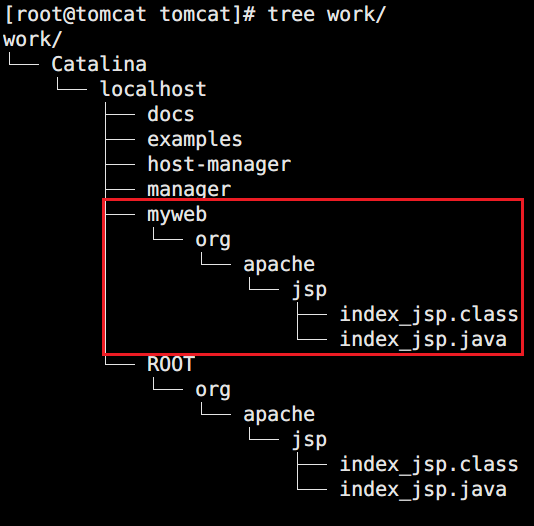

# 六、其他配置
1.   显示服务管理员页面

①  编辑webapps管理功能配置文件

       

②  注释掉ip地址限制

       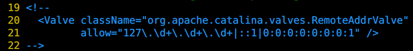

③  编辑用户认证配置文件

       

④  添加账号密码信息

       

⑤  访问验证

       

2.   显示虚拟主机管理页面

①  编辑虚拟主机管理功能配置文件

        

②  注释掉ip地址限制

        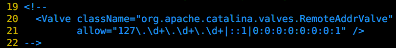

③  编辑用户认证配置文件

        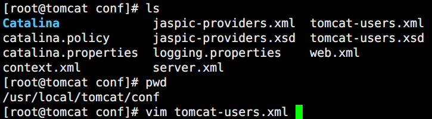

④  添加账号密码信息

       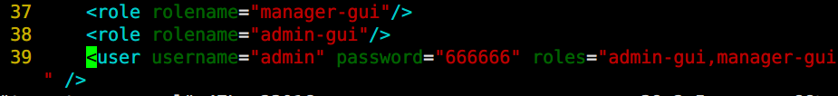

⑤  访问验证

       

3.   修改端口号

①  编辑主配置文件

       

②  修改端口号

       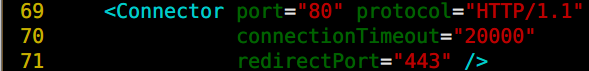

③  访问验证

       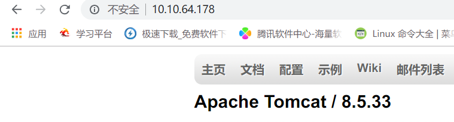

4.   https连接

①  使用keytool为tomcat生成密钥

             

              -genkey 表示生成密钥

-alias 指定密钥别名，这里是tomcat

-keyalg 指定密钥算法，这里是RSA

-keystore 指定密钥文件存储位置和文件名

-validity 指定有效期，单位天，这里是36000天

②  修改端口号

             

③  修改https配置

       

④  抓包工具给客户端信任根证书

       

⑤  访问验证

             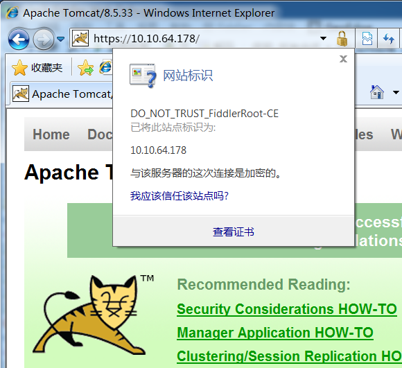

5.   定义虚拟主机

①  修改主配置文件host区域

       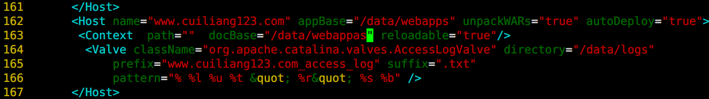

name="www.cuiliang123.com" （网站名称）

appBase="/data/webapps" （web路径）

unpackWARs="true" （支持WAR包）

autoDeploy="true"（支持热部署）

docBase="/data/webapps" （web路径）

directory="/data/logs" （日志路径）

prefix="www.cuiliang123.com_access_log" suffix=".txt"（日志名称）

pattern="% %l %u %t &quot; %r&quot; %s %b" （日志格式）

②  创建对应的文件夹

       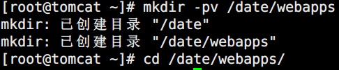

③  创建web应用

       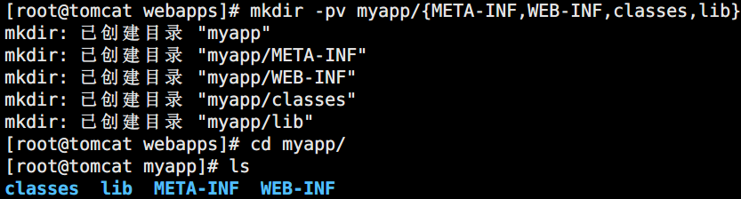

       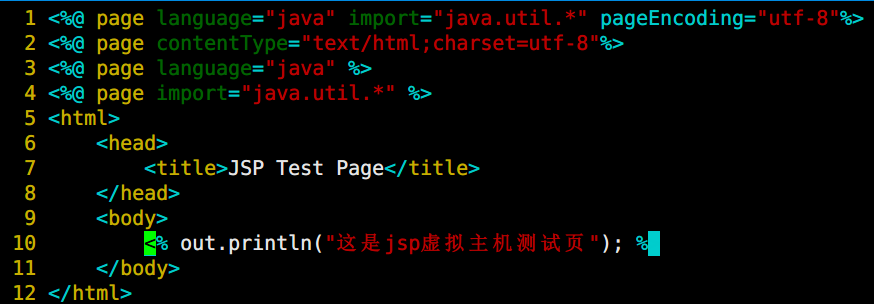

④  访问验证

       

⑤  查看日志

       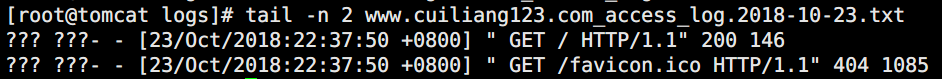

6.   定义默认web应用

①  修改主配置文件host区域

      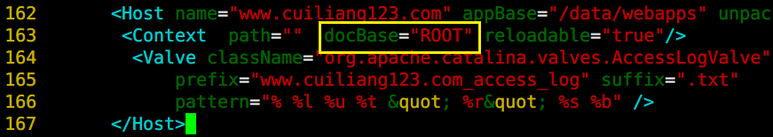

②  创建ROOT文件夹,并将项目移动至ROOT文件夹中

      

③  访问验证

      

7.   定义别名访问

①  修改主配置文件host区域，定义别名

       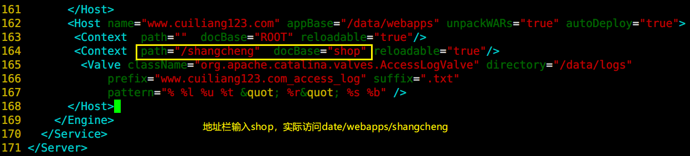

②  创建shangcheng文件夹,并将项目移动至shangcheng文件夹中

       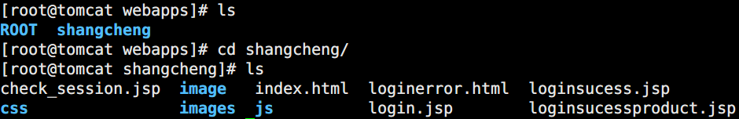

③  创建链接文件

       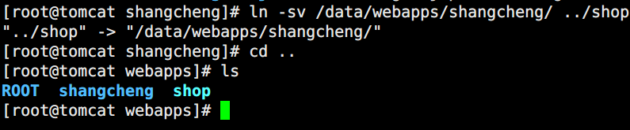

④  访问验证

       

8.   设置访问控制

①  在host区域定义访问控制类

       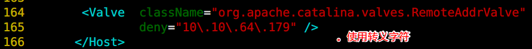

②  访问验证

       

9.   搭建项目勾连数据库

①  查看lib中是否有支持数据库的jar包

       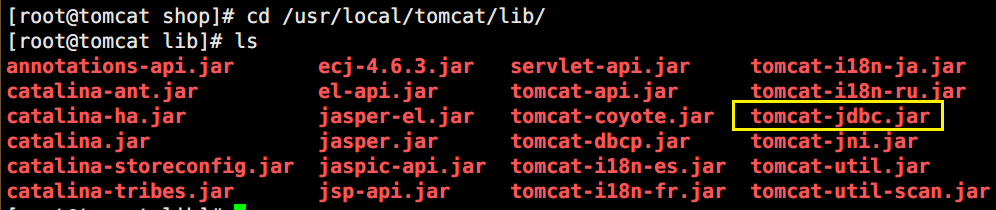

②  在数据库服务器中创建相应表及账号授权

③  jdbc文件中配置数据库

       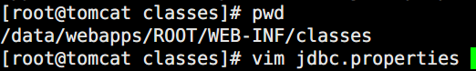

       

④  访问验证

       

# 七、LNMT架构
1.   实现动静分离

①  修改nginx服务器配置文件

       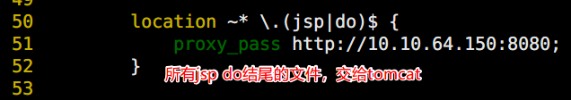

②  访问静态资源

       

③  访问动态资源

       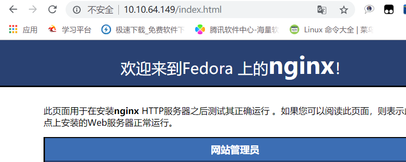

2.   通过URL重写，默认访问index.jsp

①  修改nginx服务器配置文件

       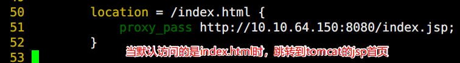

②  访问测试

       

3.   Nginx调度tomcat

①  修改nginx服务器配置文件

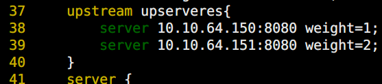

       ②  访问测试

# 八、LAMT架构
1.   使用apache虚拟主机，基于proxy_module模块代理

①  查看是否安装proxy_module模块

       

②  Apache服务器子文件配置

       

       

③  访问测试

       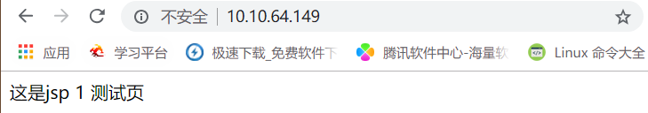

      

