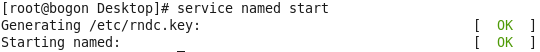
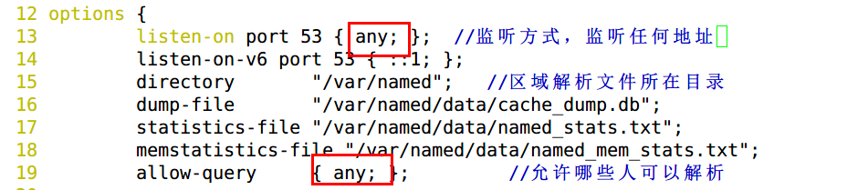
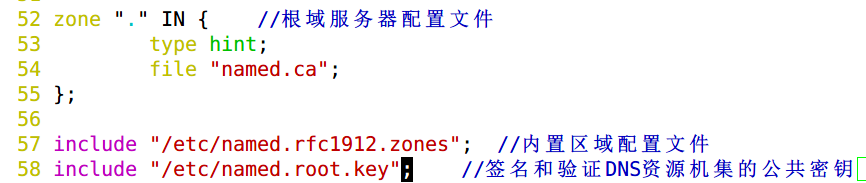
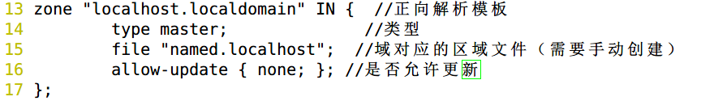

# 主DNS及DNS缓存服务配置

> 分类: Linux > 服务部署
> 更新时间: 2026-01-10T23:34:58.370837+08:00

---

 

****

# 一、实验目的
1.  掌握缓存DNS服务、主DNS服务器的搭建

# 二、实验内容
1.  搭建一台缓存DNS服务器。

2.  搭建一台主DNS服务器。

# 三、实验环境
1.  缓存DNS服务器centos6对应主机ip为10.10.64.226

2.  主DNS服务器centos7对应主机ip为10.10.64.225

3.  客户机win7对应主机ip为10.10.64.227

# 四、实验分析与设计思路
1.   网络拓扑图

2.   实验思路

# 五、实验准备
1.   设置环境为同一网段，连接公网，DHCP获取ip

2.   关闭所有主机防火墙

3.   测试网络连通性

# 六、实验过程
1.   安装相关软件包

2.   配置centos6缓存DNS主配置文件

3.   配置centos7主DNS主配置文件

4.   配置centos7子配置文件

5.   配置centos7区域配置文件

6.   开启服务

①   开启缓存dns服务

 

# 七、实验结果
1.   查看端口状态

①   查看缓存dns服务器状态

②    

2.   验证缓存DNS服务

①   设置win7主机dns服务器

②   使用命令验证

③   设置centos7dns服务器

④  使用dig 命令

⑤  使用nslookup命令

3.   验证主DNS服务

# 八、实验总结
1.   主配置文件（/etc/named.conf）

## 2.   子配置文件（/etc/named.rfc1912.zones）

## 3.   区域配置文件（/var/named/named.localhost）

①  TTL：缓存的默认生存周期

②  @：当前域（/etc/named.rfc1912.zones文件中定义的域）

③  IN：互联网

④  SOA：一个区域解析库的授权记录，必须要为解析库第一条记录

⑤  rname.invalid：管理员邮箱

⑥  NS：表明当前区域的DNS服务器

⑦  A记录：ipv4正向解析（FQDN ----> IP）

⑧  AAAA：ipv6正向解析（FQDN ----> IPV6）

⑨  PTR：IP ----> FQDN

⑩  CNAME：别名记录

⑪  MX：邮件交换器

## 4.   复制配置文件时用cp-p命令复制属性

 

