# 负载均衡代理haproxy

> 分类: Linux > 服务部署
> 更新时间: 2026-01-10T23:34:59.730915+08:00

---

# haproxy简介
## HAProxy是什么
HAProxy是一个免费的负载均衡软件，可以运行于大部分主流的Linux操作系统上。

HAProxy提供了L4(TCP)和L7(HTTP)两种负载均衡能力，具备丰富的功能。HAProxy的社区非常活跃，版本更新快速（最新稳定版1.7.2于2017/01/13推出）。最关键的是，HAProxy具备媲美商用负载均衡器的性能和稳定性。

## HAProxy的核心功能
+ 负载均衡：L4和L7两种模式，支持RR/静态RR/LC/IP Hash/URI Hash/URL_PARAM Hash/HTTP_HEADER Hash等丰富的负载均衡算法
+ 健康检查：支持TCP和HTTP两种健康检查模式
+ 会话保持：对于未实现会话共享的应用集群，可通过Insert Cookie/Rewrite Cookie/Prefix Cookie，以及上述的多种Hash方式实现会话保持
+ SSL：HAProxy可以解析HTTPS协议，并能够将请求解密为HTTP后向后端传输
+ HTTP请求重写与重定向
+ 监控与统计：HAProxy提供了基于Web的统计信息页面，展现健康状态和流量数据。基于此功能，使用者可以开发监控程序来监控HAProxy的状态

## HAProxy的**性能**
+ 采用单线程、事件驱动、非阻塞模型，减少上下文切换的消耗，能在1ms内处理数百个请求。并且每个会话只占用数KB的内存。
+ 大量精细的性能优化，如O(1)复杂度的事件检查器、延迟更新技术、Single-buffereing、Zero-copy forwarding等等，这些技术使得HAProxy在中等负载下只占用极低的CPU资源。
+ HAProxy大量利用操作系统本身的功能特性，使得其在处理请求时能发挥极高的性能，通常情况下，HAProxy自身只占用15%的处理时间，剩余的85%都是在系统内核层完成的。
+ HAProxy作者在8年前（2009）年使用1.4版本进行了一次测试，单个HAProxy进程的处理能力突破了10万请求/秒，并轻松占满了10Gbps的网络带宽。

## HAProxy的**稳定性**
作为建议以单进程模式运行的程序，HAProxy对稳定性的要求是十分严苛的。按照作者的说法，HAProxy在13年间从未出现过一个会导致其崩溃的BUG，HAProxy一旦成功启动，除非操作系统或硬件故障，否则就不会崩溃

HAProxy的大部分工作都是在操作系统内核完成的，所以HAProxy的稳定性主要依赖于操作系统，作者建议使用2.6或3.x的Linux内核，对sysctls参数进行精细的优化，并且确保主机有足够的内存。这样HAProxy就能够持续满负载稳定运行数年之久。

# Haproxy基本使用
## 安装部署
```bash
[root@tiaoban ~]# yum -y install haproxy
```

## 基本配置
```bash
[root@tiaoban ~]# vim /etc/haproxy/haproxy.cfg

# 配置前端
67 frontend main
68     bind *:80  # 前端监听端口
69     acl url_static       path_beg       -i /static /images /javascript /stylesheets
70     acl url_static       path_end       -i .jpg .gif .png .css .js
71 
72     use_backend static          if url_static
73     default_backend             app # 代理后端名称

# 配置后端
85 backend app # 后端服务名称
86     balance     roundrobin
87     server  app1 127.0.0.1:5001 check # 后端服务地址
88     server  app2 127.0.0.1:5002 check # 后端服务地址
89     server  app3 127.0.0.1:5003 check # 后端服务地址
```

## 启动服务查看端口
```bash
# 检查配置文件是否正确
[root@tiaoban ~]# haproxy -c -f /etc/haproxy/haproxy.cfg
Configuration file is valid
[root@tiaoban ~]# systemctl start haproxy
[root@tiaoban ~]# ss -tunlp | grep 80
tcp   LISTEN 0      128          0.0.0.0:80         0.0.0.0:*    users:(("haproxy",pid=29475,fd=7))
```

## 访问验证
```bash
[root@tiaoban ~]# curl 127.0.0.1:80
Hello MyApp | Version: v1 | <a href="hostname.html">Pod Name</a>
[root@tiaoban ~]# curl 127.0.0.1:80
Hello MyApp | Version: v2 | <a href="hostname.html">Pod Name</a>
[root@tiaoban ~]# curl 127.0.0.1:80
Hello MyApp | Version: v3 | <a href="hostname.html">Pod Name</a>
```

# 全局配置
## 默认全局配置


## 其他全局配置
| nbproc <number> | 指定启动的haproxy守护进程的个数，不加此选项默认一个 |
| --- | --- |
| ulimit -n | 设定每个进程能打开的最大文件句柄数（相当于ulimit -n） |
| spread-check <0..50> | 在haproxy后端有很多服务器场景，在精确的时间间隔后统一对众多服务器进行状态检查，会集中消耗大量带宽 |
| debug | 开启调试功能 |


# 代理配置
## Balance（调度算法，在后端设置）
| roundrobin | 动态轮询 | 可加权，属于动态调整的方式，后端服务器不能超过4128台 |
| --- | --- | --- |
| static-rr | 静态轮询 | 可加权，属于静态算法，后台服务器无上限 |
| leastconn | 最少连接数 | 新的连接请求派发至最少连接数目的后端服务器。属于动态算法，仅仅适用于长连接会话 |
| source | 源地址hash | hash-type：①map-based：取模法--->静态<br/>          ②consistent：一致性hash--->动态 |
| **uri** | 对URI的左半部分（“问题”标记之前）做hash运算 | 基于URI进行绑定调度。也支持hash-type |
| url_param | 根据url中指定的参数值进行调度，把值做hash计算 | 也支持hash-type<br/>  |
| hdr（<name>） | 根据请求报文中的header进行调度 | 包括（user_agent，referer,hostname），也支持hash-type。 |


<font style="color:white;">       </font>① 源地址hash

              

+ 访问测试

              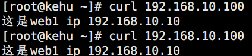

       ③ uri（uri与web服务器绑定）

              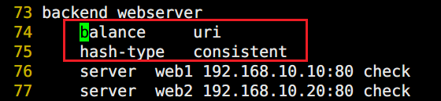

+ 访问资源为test1时


+ 访问资源为test3时

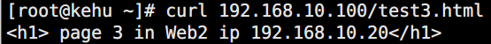


       ④ hdr（根据请求报文头部，例如浏览器类型调度）

              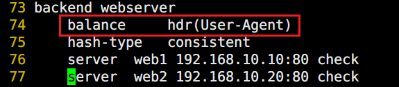

+ Google浏览器访问


+ IE浏览器访问


## Bind（绑定监听地址）
① 绑定8080端口

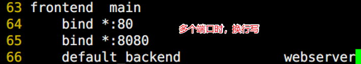

       ② 访问8080端口


## 使用备用服务器
① 添加备用服务器

       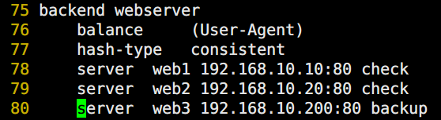

l  停止web1服务

       

l  停止web2服务


l  启动web1服务


## cookie（会话绑定、持久连接）
① 添加备用服务器

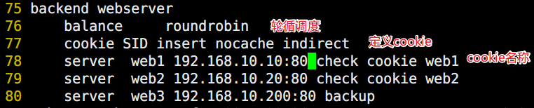

l  访问测试

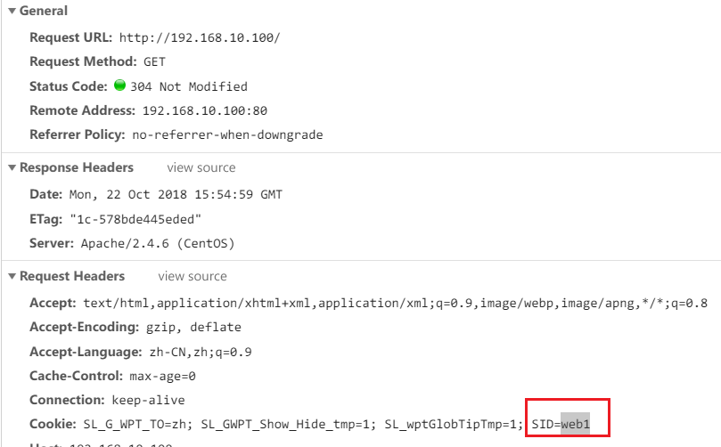

## 加权轮循调度
① 添加备用服务器

       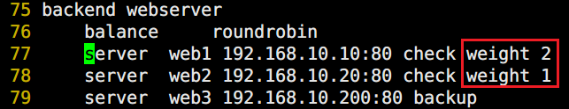

l  访问测试


# 其他配置
## Haproxy日志记录
1.   记录haproxy日志

①  查看haproxy日志记录local号


②  修改日志配置文件


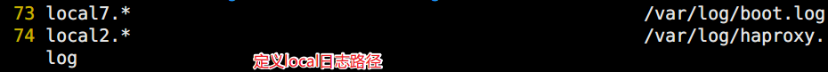

③  重启服务查看日志


2.   将前端客户的访问地址发给后端web服务器记录日志

①  默认后端服务器记录haproxy服务器地址信息

       

②  修改haproxy配置文件

       

③  修改web服务器日志格式

       

④  访问查看日志

       

 

## 启用haproxy的状态监控页
修改haproxy主配置文件

```bash
listen admin_stats
        bind    *:8080    #监听的ip端口号
        stats   enable
        stats   refresh 30s   #统计页面自动刷新时间
        stats   uri /admin    #访问的uri   ip:8080/admin
        stats   realm haproxy
        stats   auth admin:admin  #认证用户名和密码
        stats   hide-version   #隐藏HAProxy的版本号
        stats   admin if TRUE   #管理界面，如果认证成功了，可通过webui管理节点
```

访问验证

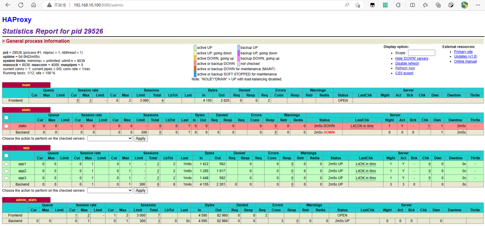

