# 高可用集群keepalived

> 分类: Linux > 服务部署
> 更新时间: 2026-01-10T23:34:59.618596+08:00

---

# Keepalived 简要介绍
Keepalived 是一种高性能的服务器高可用或热备解决方案， Keepalived 可以用来防止服务器单点故障的发生，通过配合 Nginx 可以实现 web 前端服务的高可用。

Keepalived 以 VRRP 协议为实现基础，用 VRRP 协议来实现高可用性(HA)。 VRRP(Virtual RouterRedundancy Protocol)协议是用于实现路由器冗余的协议， VRRP 协议将两台或多台路由器设备虚拟成一个设备，对外提供虚拟路由器 IP(一个或多个)，而在路由器组内部，如果实际拥有这个对外 IP 的路由器如果工作正常的话就是 MASTER，或者是通过算法选举产生， MASTER 实现针对虚拟路由器 IP 的各种网络功能，如 ARP 请求， ICMP，以及数据的转发等；其他设备不拥有该虚拟 IP，状态是 BACKUP，除了接收 MASTER 的VRRP 状态通告信息外，不执行对外的网络功能。当主机失效时， BACKUP 将接管原先 MASTER 的网络功能。VRRP 协议使用多播数据来传输 VRRP 数据， VRRP 数据使用特殊的虚拟源 MAC 地址发送数据而不是自身网卡的 MAC 地址， VRRP 运行时只有 MASTER 路由器定时发送 VRRP 通告信息，表示 MASTER 工作正常以及虚拟路由器 IP(组)， BACKUP 只接收 VRRP 数据，不发送数据，如果一定时间内没有接收到 MASTER 的通告信息，各 BACKUP 将宣告自己成为 MASTER，发送通告信息，重新进行 MASTER 选举状态。

# 实验准备
## 环境准备
1.   设置两个不同网段，关闭防火墙，设置路由

2.   调度器开启中继模式

3.   Web服务器安装httpd，并编写测试页

4.   外网客户机访问测试页

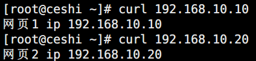

5.   安装ipvsadm软件包

6.   装载LVS模块

## 时间同步
1.   安装软件包

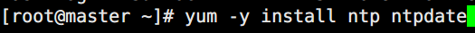

2.   将网络时间同步到ntf服务器

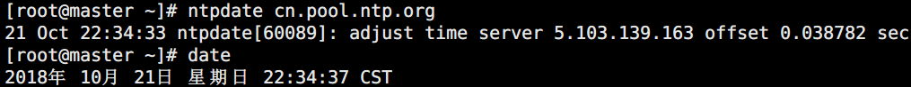

3.   将系统时间写入硬件时间

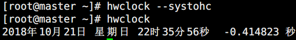

4.   修改ntp服务主配置文件

5.   开启服务查看端口

6.   其他主机同步ntp服务器时间

# 漂移IP设置

## 部署配置
1.   软件包安装

2.   修改主调度器配置文件

3.   修改备调度器配置文件

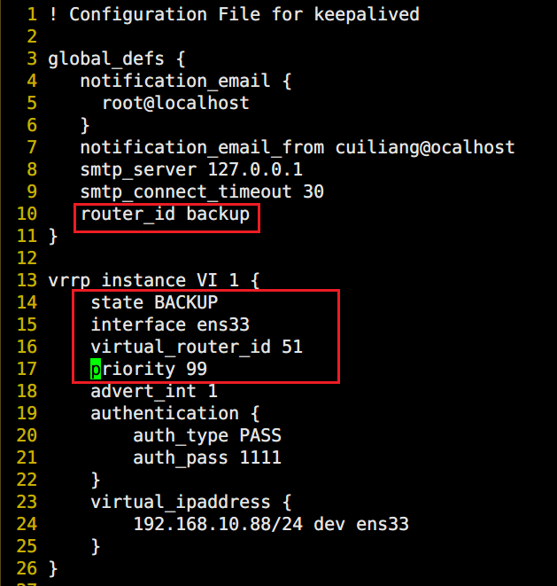

4.   启动服务，查看结果

5.   停止主调度器，查看结果

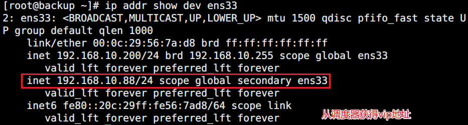

## 手动开启keepalived日志
1.   修改Keepalived日志配置文件

-S 3定义日志facility ID号

2.   修改rsyslog配置文件

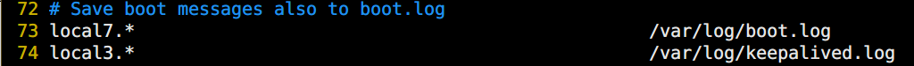

3.   验证测试

## 编写脚本，热切换主备节点
1.   在Keepalived主配置文件中定义切换脚本

2.   在主配置文件的vrrp实例中调用脚本

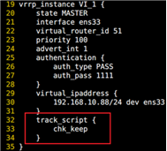

3.   备节点同样配置

4.   创建文件验证结果

# 实现双主模型
1.   修改原主服务器配置文件，增加备实例

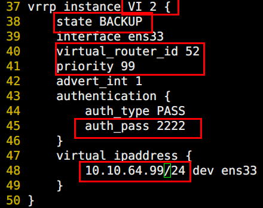

2.   修改原从服务器配置文件，增加主实例

3.   将切换脚本放到主实例中，进行调用

4.   重启服务验证

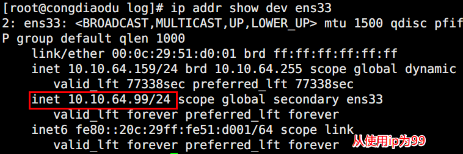

①和备节点进行交叉，双方都属于一主一备，通过优先级进行控制（这样就形成了双主模型）。

         ②在新的instance中使用不同的漂移IP

        ③优先级定义准确

        ④ID号不要重合

# 实现双主模型（LVS-DR）
1.   两个后端web服务器运行自动配置网卡和内核脚本

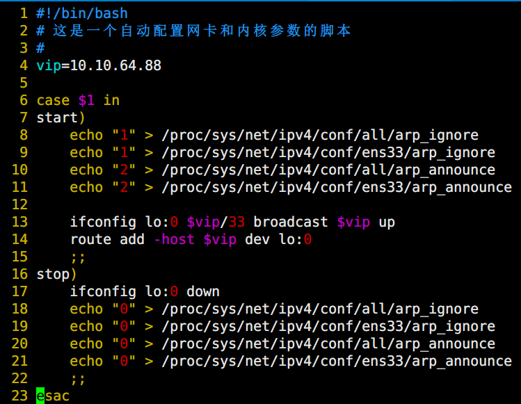

2.   主备调度器安装ipvsadm

3.   配置主备调度器

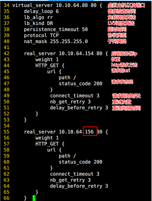

4.   查看虚拟ip

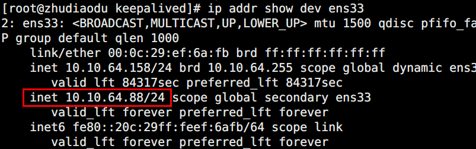

5.   验证操作

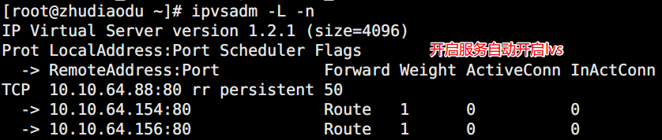

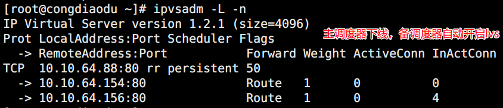

# 配置nginx高可用集群
**参见如下链接**

[**https://blog.csdn.net/l1028386804/article/details/72801492**](https://blog.csdn.net/l1028386804/article/details/72801492)

