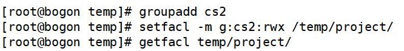
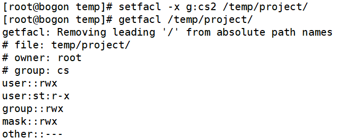
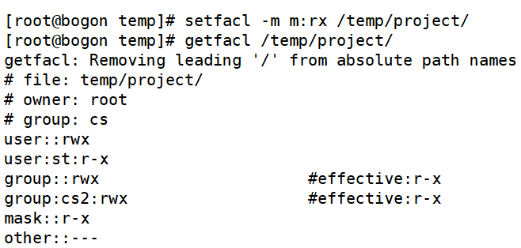
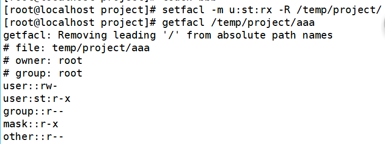

# ACL权限

> 分类: Linux > 权限管理
> 更新时间: 2026-01-10T23:34:45.643187+08:00

---

# 一、ACL权限简介

+ 忽略所有者、所属组、其他人权限，直接给指定的用户指定目录分配指定的权限

# 二、分区ACL权限
1. 查看分区ACL权限是否开启（默认开启）

[root@localhost~]#dumpe2fs -h /dev/sda3

+ dumpe2fs命令是查询指定分区详细文件系统信息的命令
+ 选项：-h 仅显示超级块中信息，而不显示磁盘块组的详细信息
1. 临时开启分区ACL权限

[root@localhos~]#mount -o remount,acl /

+ 重新挂载根分区，并挂载cal权限
1. 永久开启分区ACL权限

[root@localhost~]#vi /etc/fstab

UUID=c2ca6f57-b15c-43ea-bca0-f239083bd2 /ext4 defaults,acl 1 1（defaultsa后加入acl）

[root@localhost~]#mount -o remount / 

+ 重新挂载文件系统或重启系统，使修改生效

# 三、ACL权限查看
1. 查看ACL命令

# 四、ACL权限设定
1. 设定ACL权限命令

| -m | 设定ACL权限 |
| --- | --- |
| -x | 删除指定的ACL权限 |
| -b | 删除所有的ACL权限 |
| -d | 设定默认ACL权限 |
| -k | 删除默认ACL权限 |
| -R | 递归设定ACL权限 |

1. 给用户组设定ACL权限

1. 操作实例
+ 新建用户并加入组

+ 更改目录所有者、所属组

+ 设置目录权限

+ 查看目录权限信息

+ 给st用户设置ACL权限rx

+ 查看ACL权限

+ 给用户组设定ACL权限

# 五、删除ACL权限
1. 删除指定用户的ACL权限

1. 删除指定用户组的ACL权限

1. 删除文件的所有的ACL权限

# 六、最大有效权限mask
1. mask是用来指定最大有效权限的。如果我给用户赋予了ACL权限，是需要和mask的权限“相与”才能得到用户的真正权限

| A | B | and |
| --- | --- | --- |
| r | r | r |
| r | - | - |
| - | r | - |
| - | - | - |

1. 修改mask最大权限

# 七、递归ACL权限
1. 递归是父目录在设定ACL权限时，所有的子文件和子目录也会拥有相同的ACL权限。
2. setfacl- m u：用户名：权限 -R 目录名
3. 递归设置ACL权限

# 八、默认ACL权限
1. 默认ACL权限的作用是如果给父目录设定了默认ACL权限，那么父目录中所有新建的子文件都会继承父目录的ACL权限。
2. setfacl -m d: u:用户名：权限文件名
3. 设置默认ACL权限

 

 

#  
