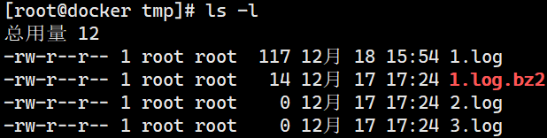

# 文件基本权限
# 一、文件权限查看

 

1. 文件角色分类

| rw- | r-- | r— |
| --- | --- | --- |
| u | g | o |
| 所有者 | 所属组 | 其他人 |

1. 文件权限对应关系

| 代表字符 | 代表数字 | 权限 | 对文件的含义 | 对目录的含义 |
| :---: | :---: | :---: | :---: | :---: |
| r | 4 | 读权限 | 可以查看文件 内容 | 可以列出目录中 的内容 |
| w | 2 | 写权限 | 可以修改文件 内容 | 可以在目录中创 建、删除文件 |
| x | 1 | 执行权限 | 可以执行文件 | 可以进入目录 |

# 二、文件权限更改
1. 命令名称：  chmod
2. 执行权限：  所有用户
3. 功能描述：  改变文件或目录权限
4. 语法：              
+ 第一种方法      chmod          [{ugoa}{+-=}{rwx}]      [文件或目录]
+  第二种方法           chmod   -R    [mode=421]          [文件或目录]    
5. 选项：-R 递归修改（就是将嵌套在很多文件夹中的文件权限修改了，如果没有这个，只能到指定的文件夹下进行修改）
6. 范例：              
+ chmod     777          /etc/hurenxiang        

将hurenxiang这个文件夹权限改为对所有用户可读，可写，可执行

+ chmod     775          /etc/caiyao                     

将caiyao这个文件夹权限改为其他用户不可读

 

 

