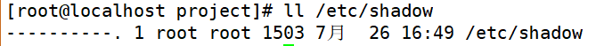
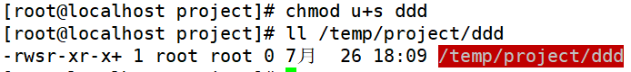
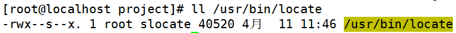
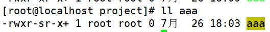
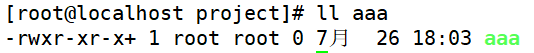
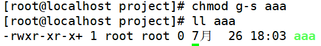

# 文件特殊权限-SetUID
# 一、SetUID的功能
1. 只有可以执行的二进制程序才能设定SUID权限
2. 命令执行者要对该程序拥有x（执行）权限
3. 命令执行者在执行该程序时获得该程序文件属主的身份（在执行程序的过程中灵魂附体为文件的属主）
4. SetUID权限只在该程序执行过程中有效，也就是说身份改变只在程序执行过程中有效
5. passwd命令拥有SetUID权限，所以普通可以修改自己的密码

 

1. cat命令没有SetUID权限，所以普通用户不能查看/etc/shadow文件内容

# 二、设定SetUID的方法
1. chmod 4755文件名（4代表SUID）

2. chmod u+s文件名

# 三、取消setlJID的方法
1. chmod 755文件名

2. chmod u-s文件名

# 四、危险的SetUlD
1. 关键目录应严格控制写权限。比如"/"、"/usr"等
2. 用户的密码设置要严格遵守密码三原则
3. 对系统中默认应该具有SetUID权限的文件作一列表，定时检查有没有这之外的文件被设置了SetUID权限

# 五、SetGID针对文件的作用
1. 只有可执行的二进制程序才能设置SGID权限
2. 命令执行者要对该程序拥有x（执行）权限
3. 命令执行在执行程序的时候，组身份升级为该程序文件的属组
4. SetGID权限同样只在该程序执行过程中有效，也就是说组身份改变只在程序执行过程中有效

1. /usr/bin/locate是可执行二进制程序，可以赋予SGID
2. 执行用户lamp对/usr/bin/locate命令拥有执行权限
3. 执行/usr/bin/locate命令时，组身份会升级为slocate组，而slocate组对/var/lib/mlocatemlocate.db数据库拥有r权限，所以普通用户可以使用locate命令查询mlocate.db数据库
4. 命令结束，lamp用户的组身份返回为lamp组

# 六、SetGID针对目录的作用
1. 普通用户必须对此目录拥有r和x权限，才能进入此目录
2. 普通用户在此目录中的有效组会变成此目录的属组
3. 若普通用户对此目录拥有w权限时，新建的文件的默认属组是这个目录的属组

# 七、设定SetGID
1. chmod 2755文件名(2代表SGID)

2. chmod g+s文件名

# 八、取消SetGID
1. chmod 755 文件名

2. chmod g-s 文件名

 

