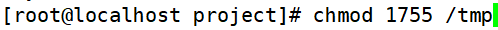
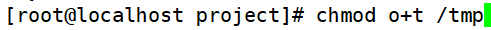
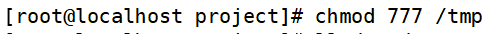
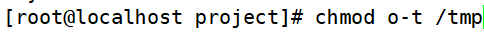

# 文件特殊权限-Sticky BIT
# 一、SBIT粘着位作用
1. 粘着位目前只对目录有效
2. 普通用户对该目录拥有w和x权限，即普通用户可以在此目录拥有写入权限
3. 如果没有粘着位，因为普通用户拥有w权限，所以可以删除此目录下所有文件，包括其他用户建立的文件。一但赋予了粘着位，除了root可以删除所有文件，普通用户就算拥有w权限，也只能删除自己建立的文件，但是不能删除其他用户建立的文件

# 二、设置与取消粘着位
1. 设置粘着位
+ chmod 1755 目录名

+ chmod o+t 目录名

1. 取消粘着位
+ chmod 777 目录名

+ chmod 0-t 目录名

